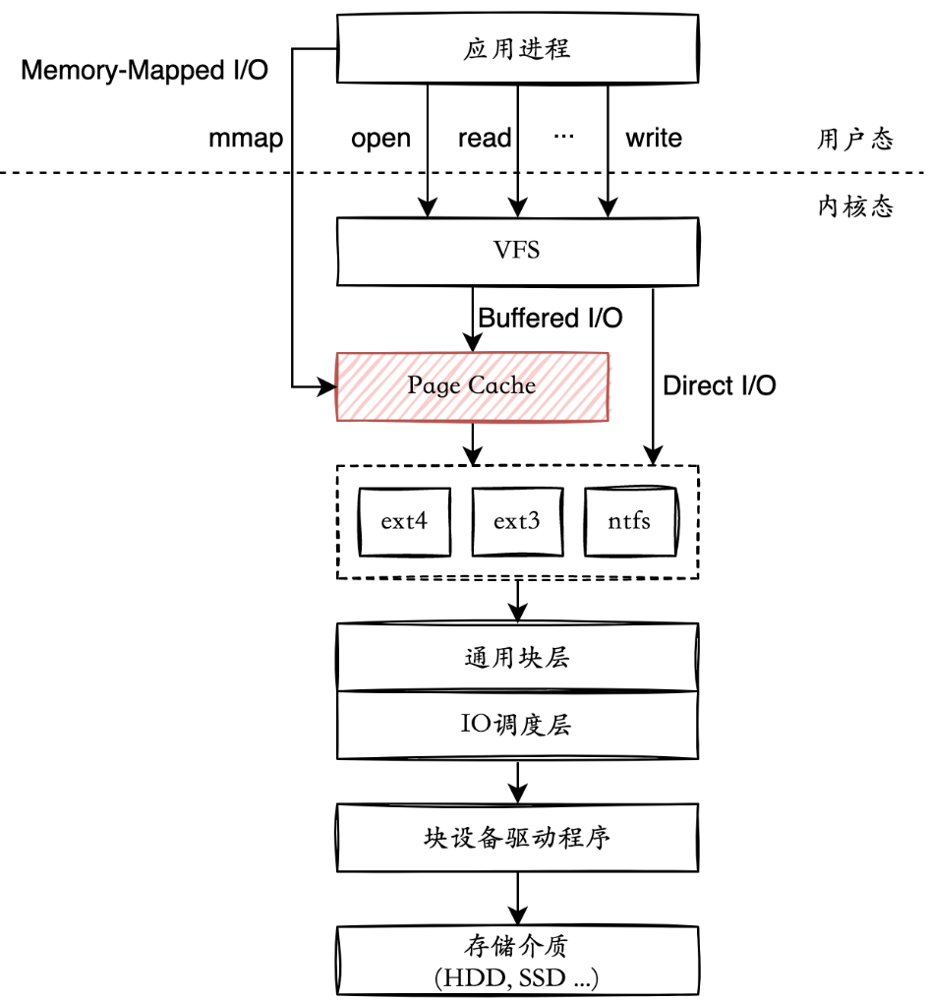
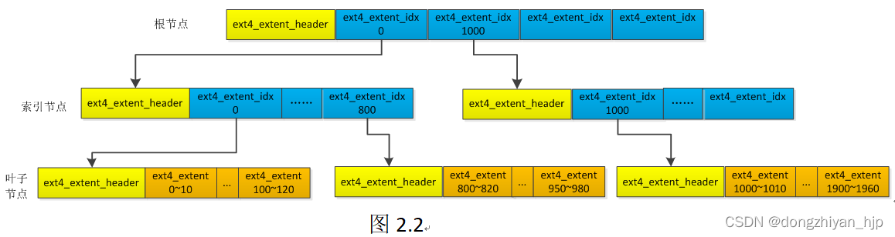
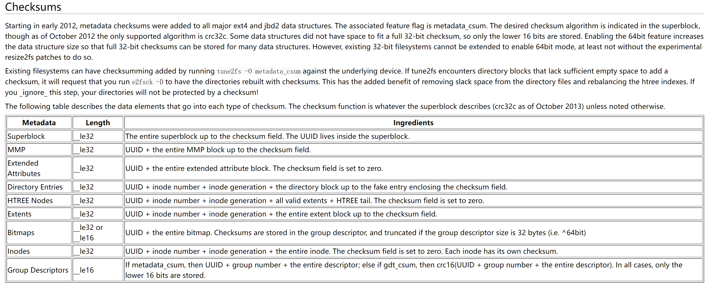

# ext4 jbd2

https://github.com/yuoo655/ext4_rs

https://github.com/yuoo655/jbd2_rs


# ext4 与 ext2/ext3 区别
| 功能                     | ext2 | ext3 | ext4 |
|-------------------------|------|------|------|
| 日志记录                | ❌    | ✅   | ✅   |
| 目录索引                | ❌    | ✅   | ✅   |
| 在线扩容                | ❌    | ✅   | ✅   |
| 在线碎片整理            | ❌    | ❌   | ✅   |
| 校验和                  | ❌    | ❌   | ✅   |
| 是否采用extent          | ❌    | ❌   | ✅   |
| 无限数量的子目录        | ❌    | ❌   | ✅   |
| 预分配                  | ❌    | ❌   | ✅   |
...

# ext4支持状态
| 操作         |支持情况| 
|--------------|------|
| mount        | ✅   |
| open         | ✅   |
| lsdir        | ✅   |
| mkdir        | ✅   |
| read_file    | ✅   |
| read_link    | ✅   |
| create_file  | ✅   |
| write_file   | ✅   |
| link         | ✅   |
| umount       | ❌   |
| file_remove  | ❌   |
| dir_remove   | ❌   |

# jbd2支持状态
| 操作                | 支持情况 |
|---------------------|----------|
| load_journal        | ✅       |
| journal_start       | ✅       |
| transaction_start   | ✅       |
| write_transaction   | ✅       |
| transaction_stop    | ✅       |
| journal_stop        | ✅       |
| recover             | ✅       |
| revoke block        | ❌       |
| checksum            | ❌       |
...

# 独立组件




```rust
pub trait BlockDevice: Send + Sync + Any + Debug {
    fn read_offset(&self, offset: usize) -> Vec<u8>;
    fn write_offset(&self, offset: usize, data: &[u8]);
}

pub trait Jbd2: Send + Sync + Any + Debug {
    fn load_journal(&mut self);
    fn journal_start(&mut self);
    fn transaction_start(&mut self);
    fn write_transaction(&mut self, block_id: usize, block_data: Vec<u8>);
    fn transaction_stop(&mut self);
    fn journal_stop(&mut self);
    fn recover(&mut self);
}
```
# 打开文件

从挂载点开始ext4_dir_find_entry遍历目录来,对比文件名,找到目标文件，提取direntry中的inode号，这一步也就是查找文件路径到文件inode的过程。

```rust
fn ext4_generic_open(path){
    loop {
        ext4_dir_find_entry(path)

        if is_goal {
            file.inode = dir_search_result.dentry.inode;
            return Ok(EOK);
        }
    }
}
```

# 读文件

由于ext4默认所有文件都使用extent。extent记录了文件逻辑块号对应磁盘存储的物理块号。读取文件的过程就是寻找文件所有extent的过程。找到extent之后便可从extent中获取物理块号读出数据

```rust
pub struct Ext4Inode {
    ...
    pub block: [u32; 15],
    ...
}
```



```rust

    pub fn ext4_file_read(&self, ext4_file: &mut Ext4File) -> Vec<u8> {

        ...

        ext4_find_all_extent(&inode_ref, &mut extents);

        // 遍历extents向量，对每个extent，计算它的物理块号，然后调用read_block函数来读取数据块
        for extent in extents {
            let block_data = inode_ref.fs().block_device.read_offset(block_num as usize * BLOCK_SIZE);
            file_data.extend(block_data);
        }

        file_data
    }
```

# 创建文件

- alloc inode
- init inode
- link

分配inode
```rust
r = ext4_fs_alloc_inode(&mut child_inode_ref, ftype);
```

寻找inode位图找到第一个可用的位
```rust
ext4_bmap_bit_find_clr(data, 0, inodes_in_bg, &mut idx_in_bg);
ext4_bmap_bit_set(&mut raw_data, idx_in_bg);
```

设置相应的inode计数
```rust 
/* Modify filesystem counters */
bg.set_free_inodes_count(&super_block, free_inodes);
/* Increment used directories counter */
if is_dir {
    used_dirs += 1;
    bg.set_used_dirs_count(&super_block, used_dirs);
}
/* Decrease unused inodes count */
bg.set_itable_unused(&super_block, unused);
/* Update superblock */
super_block.decrease_free_inodes_count();
```

init inode设置inode基础信息
```rust
...
inode.ext4_inode_set_mode(mode);
inode.ext4_inode_set_links_cnt(0);
...
```

init inode extent 信息
```rust
pub fn ext4_extent_tree_init(inode_ref: &mut Ext4Inode) {
    /* Initialize extent root header */
    let mut header = unsafe { *ext4_inode_get_extent_header(inode_ref) };
    ext4_extent_header_set_depth(&mut header, 0);
    ext4_extent_header_set_entries_count(&mut header, 0);
    ext4_extent_header_set_generation(&mut header, 0);
    ext4_extent_header_set_magic(&mut header, EXT4_EXTENT_MAGIC);
    ext4_extent_header_set_max_entries_count(&mut header, 4 as u16);
}
```

再接着link inode号到文件名,目录项，父目录，首先找到父目录的目录项，再把当前文件的目录项添加到父目录项的尾部。
```rust
ext4_link::<Hal>(&mp,&root_inode,&mut child_inode_ref,path,name_len,false){

    ext4_dir_find_entry::<A>(&parent_inode, &path, len as u32, &mut dir_search_result);

    /* Add entry to parent directory */
    ext4_dir_add_entry::<A>(parent_inode, child_inode, path, len);

}
```

# 写文件

查找文件逻辑块对应的物理块，如果没有对应物理块则分配一个物理块。
```rust
    pub fn ext4_file_write(&self, ext4_file: &mut Ext4File, data: &[u8], size: usize) {
        ...
        let mut size = size;
        while size >= block_size {
            while iblk_idx < iblock_last {
                if iblk_idx < ifile_blocks {
                    ext4_fs_append_inode_dblk(&mut inode_ref, &mut (iblk_idx as u32), &mut fblk);
                }

                iblk_idx += 1;

                ...
            }
            size -= block_size;
        }

        for i in 0..fblock_count {
            ...
            self.block_device
                .write_offset(offset, &data[idx..(idx + BLOCK_SIZE as usize)]);
        }
        ...
        inode_ref.write_back_inode();
    }
```

分配物理块同样要从block bitmap中查询, 当分配完物理块后，就可以填写extent信息了。再把记录了逻辑块和物理块对应信息的extent插入extent树中。最后在相应的物理块中写入数据。
```rust
ext4_balloc_alloc_block()
ext4_ext_insert_extent()
```

# checksum
创建文件，写入文件都涉及对meta data的修改。所有meta data都有crc检验信息。修改元数据后，需设置校验信息，然后写入磁盘


```rust
例
pub fn sync_inode_to_disk_with_csum(
    &mut self,
    block_device: Arc<dyn BlockDevice>,
    super_block: &Ext4Superblock,
    inode_id: u32,
) -> Result<()> {
    self.set_inode_checksum(super_block, inode_id);
    self.sync_inode_to_disk(block_device, super_block, inode_id)
}
```