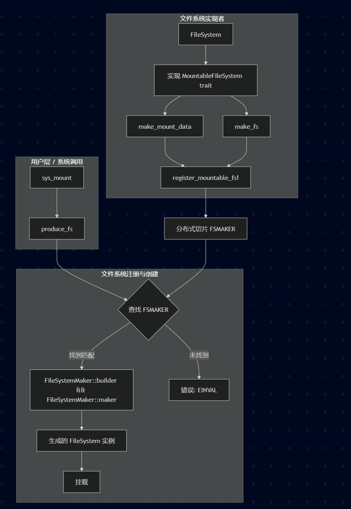

:::{note}
本文作者: 庄凯烨

Email: <sparkhhhhhhhhhh@outlook.com>
:::

# 设计

## 流程说明:

- 用户通过 `sys_mount` 系统调用请求挂载一个文件系统。

- `sys_mount` 调用 `produce_fs` 函数，传入文件系统类型、原始挂载数据和源路径。

- `produce_fs` 遍历全局的 `FSMAKER` 数组，查找与请求的文件系统类型名称匹配的 FileSystemMaker。

- 如果找到，首先调用 `maker.builder`（它内部会调用具体文件系统的 `make_mount_data` 方法）来处理原始数据，生成一个可选的 `mount_data` 对象。

- 接着，调用 `maker.build`（它内部会调用具体文件系统的 `make_fs` 方法），并传入上一步生成的 mount_data，从而创建出文件系统实例。

- 成功创建的文件系统实例（`Arc<dyn FileSystem>`）被返回并用于后续的挂载操作。

- 如果找不到对应的文件系统类型，则返回错误。

- 具体的文件系统（例如`RamFS`）通过实现```MountableFileSystem trait```，并使用 ```register_mountable_fs!``` 宏，将自身的创建逻辑注册到 `FSMAKER` 中。

## 其他

目前 DragonOS 支持挂载的文件系统包括 `ramfs`、`ext4` 和 `vfat`。在 DragonOS 中挂载硬盘文件时，要注意：
- 由于系统暂时无法直接查看硬盘的文件系统类型，在挂载前需要提前明确目标分区所使用的文件系统类型。
- 挂载操作需要指定对应的硬盘设备名称（位于 /dev 下）。
- 这些硬盘设备文件来源于通过修改 `tools/run-qemu.sh` 启动脚本，将制作好的硬盘镜像文件传入系统。virtio 硬盘设备命名示例如 `vda1`、`vdb1`，硬盘在 DragonOS 内的设备名称是根据 `run-qemu.sh` 中镜像传入的顺序自动分配（a，b，c等等）的，其中的数字表示分区号。

所以目前需要挂载硬盘的话，可以更改`test-mount-ext4`执行程序，将指定的硬盘文件以对应的文件系统格式进行挂载，以下为挂载实例


```Rust
use core::ffi::{c_char, c_void};
use libc::{mount, MS_BIND};
use std::fs;
use std::path::Path;

fn main() {
    let ext4_path = Path::new("mnt/ext4");
    let dir = fs::create_dir_all(ext4_path);
    if dir.is_err() {
        panic!("mkdir /mnt/ext4 fail.");
    }

    // 硬盘名称，由传入顺序决定
    let source = b"/dev/vdb1\0".as_ptr() as *const c_char;
    let target = b"/mnt/ext4\0".as_ptr() as *const c_char;
    // 文件系统类型
    let fstype = b"ext4\0".as_ptr() as *const c_char;
    let flags = MS_BIND;
    let data = std::ptr::null() as *const c_void;
    let _ = unsafe { mount(source, target, fstype, flags, data) };

    println!("Mount successfully!");
}
```