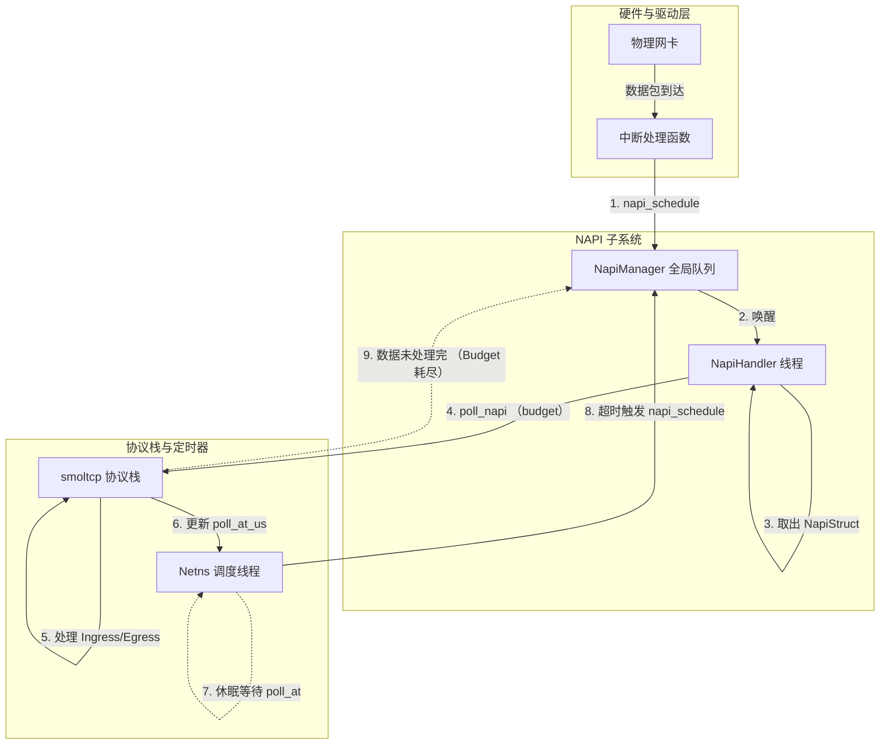

# DragonOS NAPI 与 NetNamespace Poll 机制设计说明

本文档对 DragonOS 当前网络子系统中的 NAPI（New API）机制与 NetNamespace 轮询调度机制的设计与实现进行说明。

## 1. 机制概览

DragonOS 的网络包处理采用 **"事件驱动 (Event-Driven) + 精确定时 (Precise Timing)"** 的混合驱动模型。系统通过独立的内核线程来分别处理"硬件中断触发的收包任务"和"协议栈定时任务"，实现了对网络流量的高效响应与 CPU 资源的合理调度。

核心设计包含两个主要部分：
1.  **NAPI 子系统**：负责高吞吐量的网络包收发处理，采用"有界轮询 (Bounded Polling)" 机制。
2.  **NetNamespace 调度器**：负责管理协议栈的时间事件（如 TCP 重传），充当精确定时器。

## 2. 核心组件设计

### 2.1 NAPI 子系统 (`kernel/src/driver/net/napi.rs`)

NAPI 是 DragonOS 网络驱动层的核心收包机制。

*   **NapiStruct**:
    每个支持 NAPI 的网卡接口（`Iface`）都绑定一个 `NapiStruct` 结构体。它维护了 NAPI 实例的状态（如 `SCHED` 调度位）和权重（`weight`）。
    *   **Weight (权重)**: 定义了单次调度周期内该接口允许处理的最大数据包数量（Budget），防止单网卡独占 CPU。

*   **全局 NAPI 管理器 (Global NapiManager)**:
    *   目前实现为单例（`GLOBAL_NAPI_MANAGER`）。
    *   维护一个全局的 `napi_list` 待处理队列。
    *   提供 `napi_schedule()` 接口：供网卡中断处理函数调用，将 NAPI 实例加入队列并唤醒处理线程。

*   **NAPI 处理线程 (`napi_handler`)**:
    *   这是一个专用的内核线程，并在系统启动时初始化。
    *   **工作逻辑**：不断从 `napi_list` 取出被调度的 NAPI 实例，调用其 `poll()` 方法。
    *   **循环调度**：如果 `poll()` 返回 `true`（表示 Budget 用尽但仍有数据），线程会将该实例重新放回队列尾部，等待下一轮调度。

### 2.2 NetNamespace 调度器 (`kernel/src/process/namespace/net_namespace.rs`)

每个网络命名空间（NetNamespace）拥有一个独立的轮询线程（`netns_poll`），在当前设计中，它主要承担 **"定时器"** 和 **"兜底调度器"** 的角色。

*   **精确定时**:
    该线程维护了命名空间内所有网卡的 `poll_at_us`（下一次需要处理的时间点）。它会计算出最近的截止时间（Deadline）并进行精确休眠（`wait_event_timeout`）。

*   **超时触发**:
    当休眠超时（即协议栈定时事件到达，如 TCP RTO）时，该线程**不会**直接处理数据包，而是调用 `napi_schedule()`，将任务分发给 NAPI 线程执行。这保证了繁重的协议栈处理逻辑统一由 NAPI 线程承担。

### 2.3 有界轮询 (Bounded Polling)

在 `kernel/src/driver/net/mod.rs` 中实现了适配 NAPI 的轮询接口 `poll_napi(budget)`。

*   **逻辑**：
    1.  调用 `smoltcp` 的 `poll_ingress_single` 处理接收队列，循环次数受 `budget` 限制。
    2.  执行一次 `poll_egress` 推进发送队列。
    3.  更新 `poll_at_us` 时间戳，供 NetNamespace 调度器参考。
*   **特性**：保证了每次调度的执行时间是可控的，避免了长时关中断或线程饿死。

## 3. 工作流程图解

当前系统的网络处理数据流与控制流如下：

## 4. 当前实现现状

截至当前版本，DragonOS 的网络机制具有以下实现特征：

1.  **单队列 NAPI 管理**：
    *   目前的 `NapiManager` 是全局唯一的，所有 CPU 共享同一个待处理队列。
    *   尚未实现 Linux 风格的 Per-CPU NAPI 队列（代码中留有 TODO）。

2.  **线程模型**：
    *   `napi_handler`：负责具体的包处理和协议栈推进，是计算密集型线程。
    *   `netns_poll`：负责时间管理和事件分发，是 IO/Sleep 密集型线程。

3.  **驱动支持**：
    *   Virtio-Net、Veth、Loopback 等驱动已接入此机制，在中断或发包时主动调用 `napi_schedule`。

4.  **Smoltcp 适配**：
    *   通过 `IfaceCommon` 对 `smoltcp` 进行了封装，将无界的 `poll()` 转化为适配 NAPI 的有界 `poll_napi()`。
