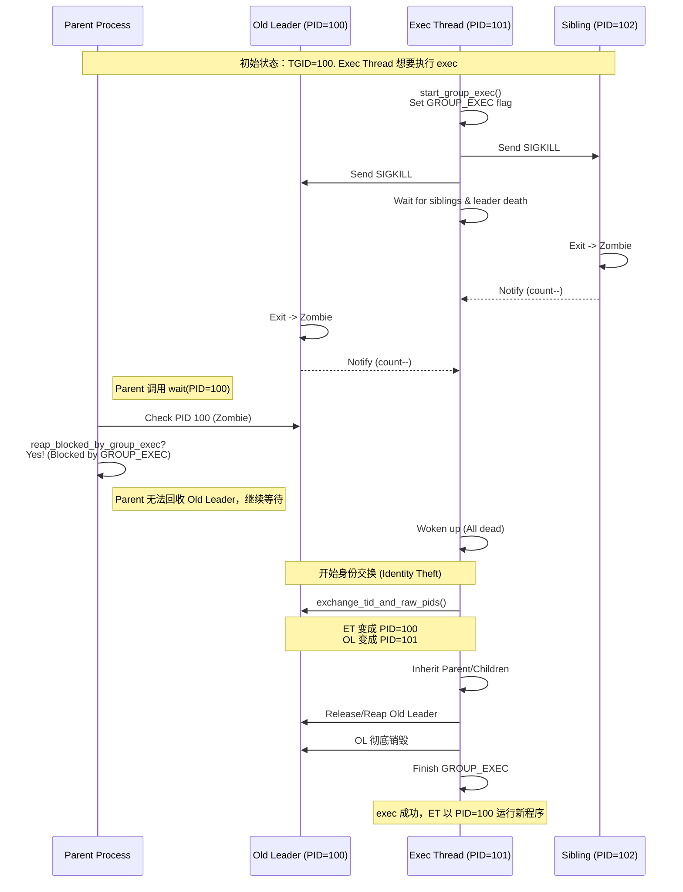

# DragonOS 多线程 Exec (De-thread) 机制原理

:::{note}

Author: longjin <longjin@dragonos.org>
 
:::

## 1. 概述

在 POSIX 标准中，`execve` 系统调用用于执行一个新的程序，替换当前进程的镜像。对于多线程程序（Thread Group），POSIX 要求 `exec` 成功后：
1.  **PID 保持不变**：进程的 PID（在内核中通常指 TGID，即 Thread Group ID）必须保持不变。
2.  **单线程化**：原进程组中的所有其他线程都必须被终止，仅保留执行 `exec` 的那个线程（它将成为新的单线程进程）。

如果执行 `exec` 的是线程组的 Leader（主线程），事情相对简单：它只需杀掉其他线程即可。但如果执行 `exec` 的是一个普通线程（非 Leader），情况就变得复杂：**它必须“变身”为 Leader，接管原 Leader 的 PID，并清理掉原 Leader**。这个过程被称为“去线程化”（De-thread）。

本文档详细描述 DragonOS 内核中 `de_thread` 的实现原理、流程及并发控制机制。

## 2. 核心挑战

1.  **身份窃取 (Identity Theft)**：执行 `exec` 的非 Leader 线程（以下简称 **Exec-Thread**）必须在内核层面交换身份，使得它在用户态和父进程看来，拥有原 Leader 的 PID。
2.  **并发互斥**：
    -   同一进程组内可能有两个线程同时调用 `exec`，或者一个调 `exec` 一个调 `exit_group`。必须保证只有一个能成功开始。
    -   在身份交换的临界区（Critical Section），进程的状态是不稳定的，必须防止父进程通过 `wait` 系统调用看到并回收处于中间状态的旧 Leader。
3.  **资源继承与清理**：Exec-Thread 需要继承原 Leader 的父子进程关系、子进程列表等，同时负责回收旧 Leader 占用的资源。

## 3. 实现机制

DragonOS 参考了 Linux 内核的设计，但在具体实现上结合了 Rust 的所有权和并发安全特性。

### 3.1 关键数据结构

在 `SigHand`（信号处理结构，由线程组共享）中，引入了以下字段来管理状态：

-   `SignalFlags::GROUP_EXEC`：标志位。表示当前线程组正在进行去线程化操作。
-   `group_exec_task`: `Weak<ProcessControlBlock>`。指向正在执行 `exec` 的那个线程。
-   `group_exec_wait_queue`: `WaitQueue`。用于等待组内其他线程退出。
-   `group_exec_notify_count`: `isize`。需要等待退出的线程计数（用于唤醒等待队列）。

### 3.2 核心流程 (`de_thread`)

`de_thread` 函数位于 `kernel/src/process/exec.rs`，是实现该逻辑的核心。

#### 阶段一：发起与互斥
1.  **加锁并互斥**：调用 `sighand.start_group_exec()`。若 `GROUP_EXEC` 或 `GROUP_EXIT` 已被设置，则返回 `EAGAIN`，保证与并发 `exec`/`exit_group` 互斥。
2.  **设置执行者**：记录当前线程到 `group_exec_task`，并清空 `group_exec_notify_count`。
3.  **单线程快路径**：若线程组为空（仅自己），直接设置 `exit_signal = SIGCHLD` 并结束去线程化流程。

#### 阶段二：终止兄弟线程
1.  **构建清理列表**：遍历线程组，收集所有仍存活且未处于退出路径的线程（包括旧 Leader）。
2.  **发送信号**：向清理列表中的线程逐个发送 `SIGKILL`。
3.  **设置计数**：将清理列表长度写入 `group_exec_notify_count`，用于线程退出时唤醒等待队列。

#### 阶段三：等待同步
1.  **进入等待**：在 `group_exec_wait_queue` 上以 killable 方式睡眠。
2.  **唤醒条件**：
    -   遍历 `group_tasks`，确认除当前线程以外已无存活线程；
    -   若当前不是 Leader，还需确保旧 Leader 已经进入 `Zombie` 或 `Dead` 状态；
    -   若收到 fatal signal 或等待被打断，则返回 `EAGAIN`。
    -   *注：其他线程在退出路径（`exit_notify`）中会递减计数并唤醒等待队列；若执行者异常退出，也会在该路径中清理 `GROUP_EXEC` 标志。*

#### 阶段四：身份交换 (Identity Theft)
*仅当 Exec-Thread 不是 Leader 时执行*

1.  **PID/TID 交换**：调用 `ProcessManager::exchange_tid_and_raw_pids`。
    -   在全局进程表中交换两者的 PID 映射关系，并交换 PCB 内部的 TID/PID 字段。
    -   **结果**：Exec-Thread 获得原 TGID，Old-Leader 获得临时 PID。
2.  **信号语义调整**：
    -   新 Leader（Exec-Thread）的 `exit_signal` 设为 `SIGCHLD`；
    -   Old-Leader 的 `exit_signal` 设为 `INVALID`，避免被当作普通子进程处理。
3.  **结构调整**：将 Exec-Thread 设为新的 `group_leader`，并清空两侧 `group_tasks`（去线程化后仅剩一个线程）。
4.  **关系继承**：
    -   **子进程**：将 Old-Leader 的 `children` 列表整体迁移到 Exec-Thread 下；
    -   **父进程**：Exec-Thread 继承 Old-Leader 的 `parent`/`real_parent`，并更新 `fork_parent` 为自身。

#### 阶段五：资源清理
1.  **回收旧 Leader**：若 Old-Leader 已是 Zombie 或 Dead，Exec-Thread 直接将其标记为 Dead 并释放 PID 资源。
2.  **完成**：无论成功/失败，最终都会清除 `GROUP_EXEC` 标志并唤醒等待者。

### 3.3 并发保护：防止父进程误回收

这是实现中最微妙的部分。

**问题场景**：
在阶段三和阶段四之间，Old-Leader 已经收到 SIGKILL 并退出变成 Zombie 状态。此时，如果父进程调用 `wait()`，它可能会发现 Old-Leader (PID=TGID) 是 Zombie，于是将其回收。
如果父进程在 Exec-Thread 完成 PID 交换**之前**回收了 Old-Leader，那么 Exec-Thread 就无法窃取该 PID（因为该 PID 对应的进程已经消失了），或者导致逻辑混乱。

**解决方案**：
在 `kernel/src/process/exit.rs` 的 `do_wait` 逻辑中，增加了一个检查函数 `reap_blocked_by_group_exec`：

```rust
fn reap_blocked_by_group_exec(child_pcb: &Arc<ProcessControlBlock>) -> bool {
    // 如果子进程是 Leader，且标记了 GROUP_EXEC，
    // 且执行 exec 的不是它自己，那么说明它正在等待被“篡位”，父进程不能回收它。
    if !child_pcb.is_thread_group_leader() {
        return false;
    }
    if !child_pcb.sighand().flags_contains(SignalFlags::GROUP_EXEC) {
        return false;
    }
    let exec_task = child_pcb.sighand().group_exec_task();
    exec_task
        .as_ref()
        .map(|t| !Arc::ptr_eq(t, child_pcb))
        .unwrap_or(true)
}
```

这个检查确保了即使 Old-Leader 变成 Zombie，只要 `GROUP_EXEC` 标志还在且 `exec_task` 不是它，父进程就无法回收它。这为 Exec-Thread 安全地进行 PID/TID 交换提供了保护伞。

## 4. 流程图



## 5. 参考资料

-   **Linux Kernel Source**: `fs/exec.c` (`de_thread` function)
-   **DragonOS Source**:
    -   `kernel/src/process/exec.rs`
    -   `kernel/src/process/exit.rs`
    -   `kernel/src/ipc/sighand.rs`
