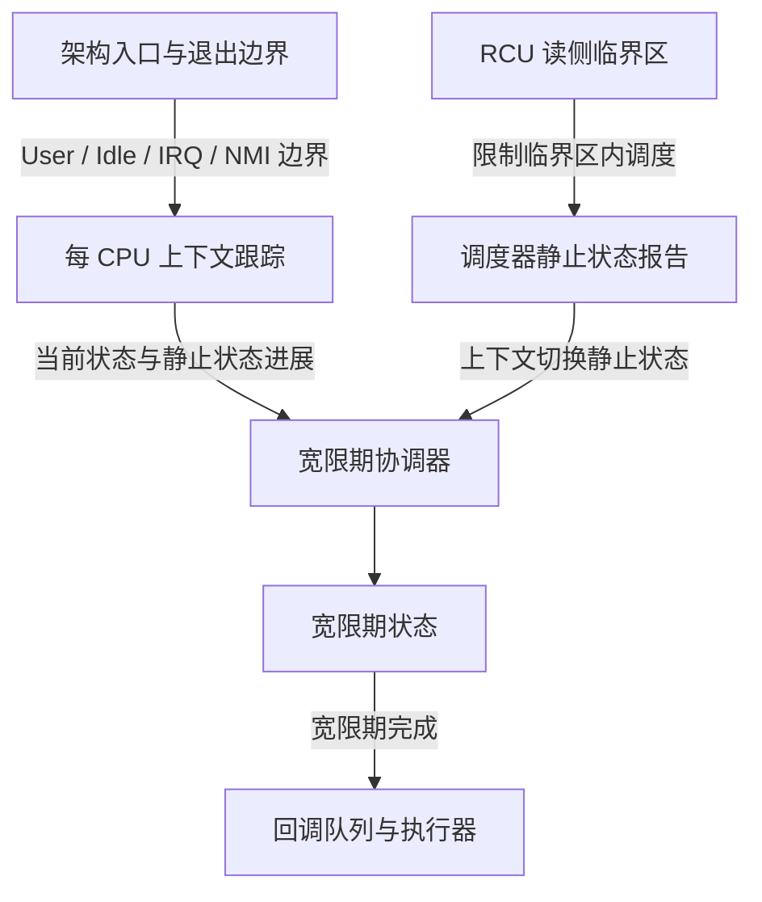
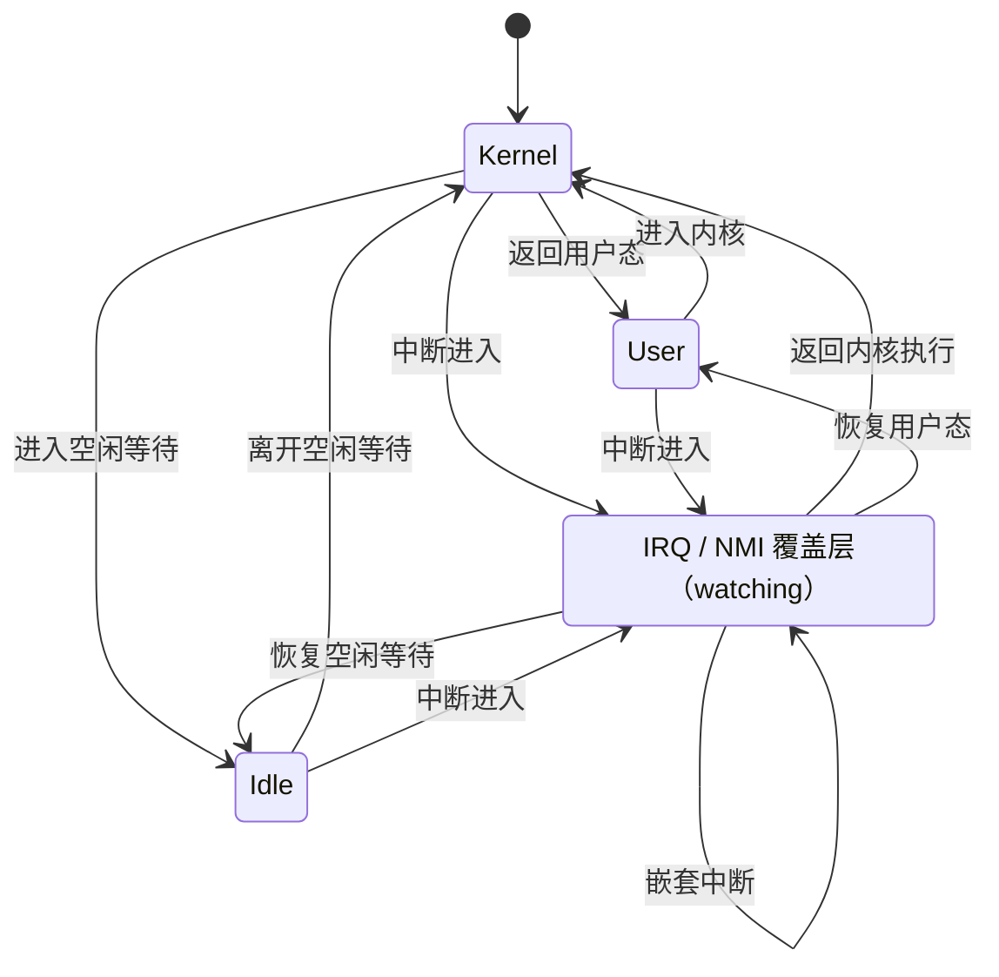
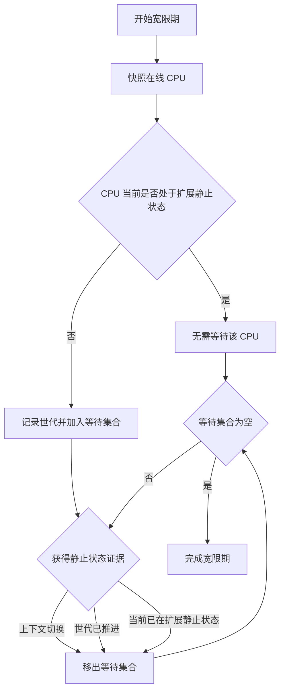
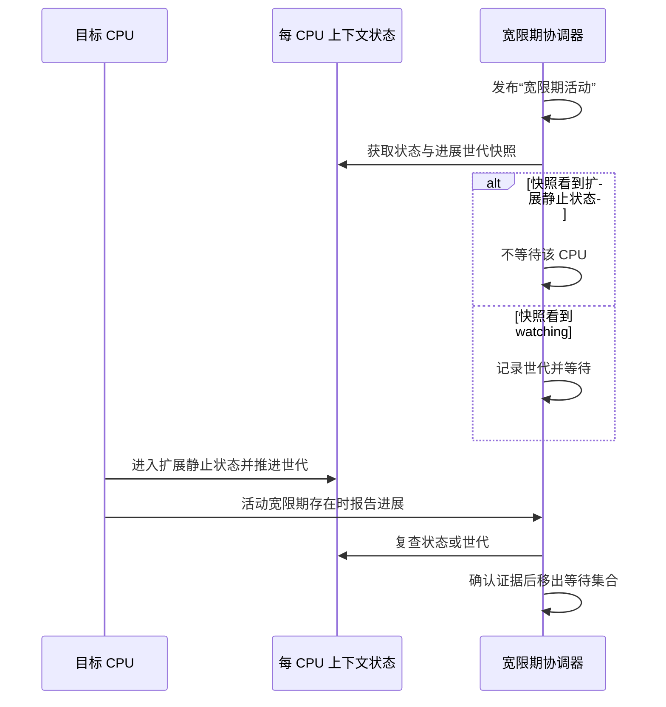

# DragonOS RCU 架构

## 1. RCU 解决什么问题

RCU（Read-Copy Update）的目标是在读多写少的共享数据上，让读者以很低的成本访问旧版本或新版本，同时保证旧版本只会在所有既有读者都不再使用它之后被回收。

一次典型更新分为三个阶段：

1. 更新者构造新版本，并以原子方式发布；
2. 系统等待一个宽限期，确保发布前已经存在的读侧临界区全部结束；
3. 宽限期结束后执行回调，回收旧版本或完成延迟操作。

RCU 不保证读者一定看到最新版本。它保证读者看到的版本在整个读侧临界区内仍然有效，并为更新者提供安全回收旧版本的时机。

## 2. DragonOS RCU 的整体结构

DragonOS 当前采用适合非抢占式内核读侧临界区的轻量设计。系统由读侧保护、CPU 上下文跟踪、宽限期协调和回调处理四部分组成。

各层职责如下：

- **读侧保护**：标识读侧临界区，并保证普通非抢占式读者不会在临界区中被调度走。
- **上下文跟踪**：维护每个 CPU 当前是否可能运行普通 RCU 读者，以及该 CPU 是否穿过了静止状态。
- **调度器集成**：把可靠的上下文切换作为静止状态来源之一。
- **宽限期协调**：在宽限期开始时确定需要等待的 CPU，并收集它们后续的静止状态证据。
- **回调处理**：按照宽限期世代组织回调，只在对应宽限期完成后执行。

上下文跟踪不管理回调，宽限期状态不理解架构入口细节，架构代码也不参与宽限期判定。这样的分层避免同一状态在多个子系统中重复维护。

## 3. Watching 与扩展静止状态

RCU 判断 CPU 是否需要被某个宽限期等待，关键不是 CPU 是否正在执行指令，而是它是否可能正在运行普通 RCU 读侧临界区。

DragonOS 将 CPU 上下文分为三种基础状态：

- **Kernel**：CPU 可能运行普通 RCU 读者，称为 RCU watching；
- **User**：CPU 正在用户态，不能运行内核 RCU 读者，属于扩展静止状态；
- **Idle**：CPU 正在空闲等待，不能运行普通 RCU 读者，属于扩展静止状态。

IRQ 和 NMI 是覆盖在基础状态上的临时执行层。它们执行内核代码，因此覆盖期间 CPU 必须视为 watching；只有最外层中断退出后，CPU 才能恢复被打断的 User 或 Idle 扩展静止状态。

需要长期保持的状态不变量是：

- Kernel 或任意 IRQ/NMI 覆盖层中，CPU 必须是 watching；
- User 或 Idle 只有在不存在 IRQ/NMI 覆盖层时才属于扩展静止状态；
- 进入和退出必须严格配对，只有最外层覆盖退出才允许改变 watching 状态；
- 进入内核后必须先恢复 watching，之后才能运行普通内核逻辑；
- 离开内核前必须先完成所有普通内核工作，最后才能停止 watching。

## 4. 静止状态与进展世代

静止状态（Quiescent State，QS）表示某个 CPU 在该时刻不可能仍处于更早开始的普通 RCU 读侧临界区中。上下文切换、进入 User 和进入 Idle 都能提供这种证据。

每个 CPU 维护自己的静止状态进展世代。CPU 每次从 watching 穿过边界进入扩展静止状态时，世代都会向前推进。宽限期协调器只关心以下两个问题：

1. 宽限期开始时，CPU 是否已经处于扩展静止状态；
2. 如果当时仍然 watching，它的进展世代之后是否发生变化。

这使宽限期不需要持续观察 CPU 的每次活动，也不需要把高频上下文转换都写入全局共享状态。

## 5. 宽限期如何判断完成

宽限期开始时，协调器对在线 CPU 做一次一致性快照：

- 已经处于 User 或 Idle 的 CPU 不加入等待集合；
- 仍然 watching 的 CPU 加入等待集合，同时记录其静止状态世代；
- CPU 后续报告可靠的调度静止状态，或其上下文世代发生变化时，从等待集合移除；
- 等待集合为空时，宽限期完成。

宽限期的正确性依赖两类证明：

- **当前状态证明**：快照时 CPU 已在扩展静止状态，因此它不可能持有更早的普通 RCU 读侧临界区；
- **状态进展证明**：快照时 CPU 仍然 watching，但之后穿过了静止状态，因此快照前存在的读侧临界区已经结束。

两类证明缺一不可。只记录“返回过用户态”无法识别宽限期开始前已经处于用户态的 CPU；只观察当前状态又会遗漏已经穿过静止状态并重新进入内核的 CPU。

## 6. 快照与状态转换的并发闭环

CPU 进入扩展静止状态与宽限期开始可能同时发生。设计必须保证无论两者的先后顺序如何，协调器最终都能获得静止状态证据。

并发协议满足以下闭环：

- CPU 先进入扩展静止状态时，后续宽限期快照必须能观察到新状态或新世代；
- 宽限期先发布并记录 watching CPU 时，CPU 后续进入扩展静止状态必须触发进展检查；
- 快照与转换重叠时，协调器只能看到转换前或转换后的完整状态，并通过复查消除临界窗口；
- 用于减少无效报告的提示信息只能作为性能过滤，宽限期等待集合始终是正确性的唯一依据。

状态发布、快照和宽限期发布之间必须形成全序可证明的握手。若未来要放宽内存序，必须先给出覆盖所有架构的 happens-before 证明，不能仅凭单次压力测试判断安全。

## 7. 回调生命周期

回调在提交时绑定到一个尚未完成的宽限期世代。其生命周期如下：

需要保持的原则是：

- 回调不得早于目标宽限期完成；
- 同一执行通道中的回调顺序必须稳定；
- 上下文转换路径只负责报告进展，不直接执行任意回调；
- 回调执行与上下文状态机解耦，避免在 IRQ-off、Idle 边界或非 watching 状态中运行未知逻辑。

## 8. 架构接入原则

各 CPU 架构只负责在可靠的入口和退出边界通知通用 RCU 层：

- 从用户态进入内核时，必须在任何可能使用普通 RCU 的内核逻辑之前恢复 watching；
- 返回用户态时，必须在所有退出工作完成之后停止 watching；
- 进入空闲等待时停止 watching，唤醒并恢复普通内核执行前恢复 watching；
- IRQ/NMI 入口建立 watching 覆盖层，最外层退出按实际返回目标恢复基础状态；
- 嵌套深度和返回目标必须来自真实入口上下文，不能根据当前任务类型或调度策略推测。

架构层不保存第二份 RCU 上下文状态，也不解析通用状态的内部表示。这样可以让 x86_64、RISC-V 及未来架构共享同一套状态语义和宽限期算法。

## 9. 性能与安全约束

RCU 的价值依赖读侧和高频上下文路径足够轻量。DragonOS RCU 遵循以下约束：

- 普通读侧临界区不获取全局锁；
- 每 CPU 上下文转换优先只修改本 CPU 状态；
- 普通 IRQ 嵌套和不产生静止状态的转换不进入宽限期全局慢路径；
- 只有可能推进活动宽限期时才参与全局协调；
- 高频状态按 CPU 隔离，避免不同 CPU 修改同一缓存行；
- 上下文状态转换不分配内存，不执行回调；
- 非法状态转换、嵌套计数错误和非 watching 读侧访问必须可诊断，不能通过静默修正状态掩盖调用错误。

这些约束同时服务于性能和正确性：减少共享写入可以降低缓存争用，职责单一的状态机也更容易审计并发边界。

## 10. 当前设计边界

DragonOS 当前 RCU 面向普通非抢占式内核读者。以下能力不属于这套基础架构：

- 抢占式 RCU 读者跟踪；
- Tree RCU 的层级聚合结构；
- 强制静止状态和 stall detector；
- CPU hotplug 的完整 RCU 生命周期协议；
- Tasks RCU、SRCU 等其他 RCU 类型；
- tick/nohz、虚拟化时间记账等与上下文跟踪相邻但职责不同的功能。

通用模型预留了可嵌套 NMI 的状态语义，但只有具备可返回 NMI 入口并完成延迟进展协议的架构，才能宣称完成 NMI 集成。尚未具备完整入口的架构应保持明确的未支持状态，不能用不可达 hook 代替真实实现。

后续扩展应围绕明确需求增加能力，并继续保持“架构边界、上下文状态、宽限期协调、回调执行”四层职责分离，避免为了接近 Linux Tree RCU 的形态而引入当前没有消费者的复杂度。
