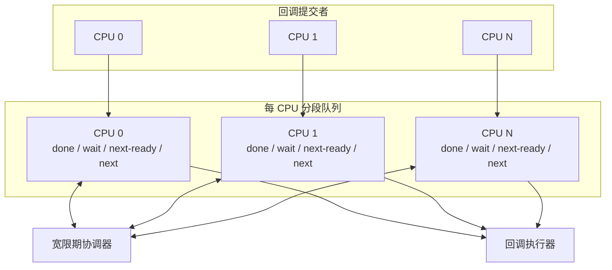
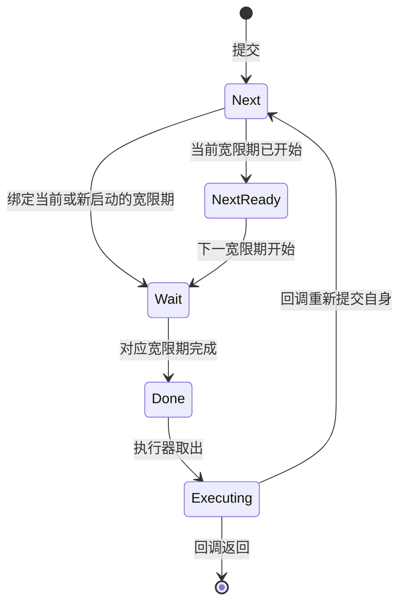
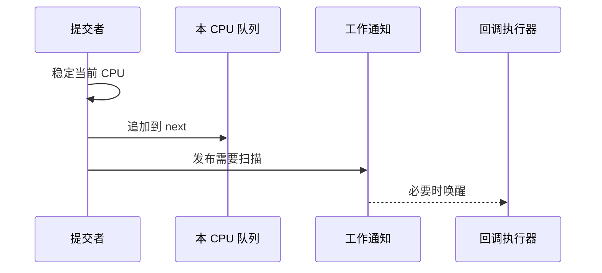
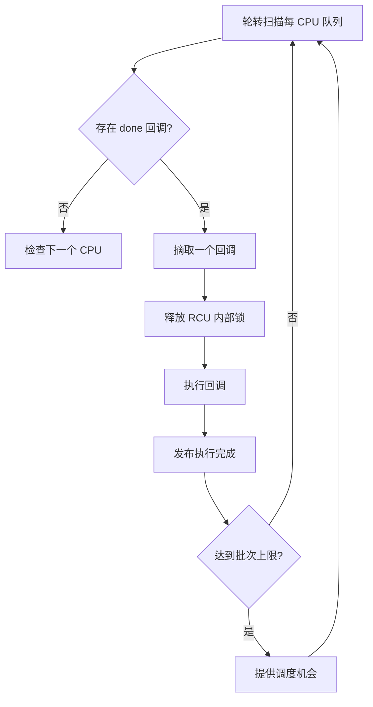
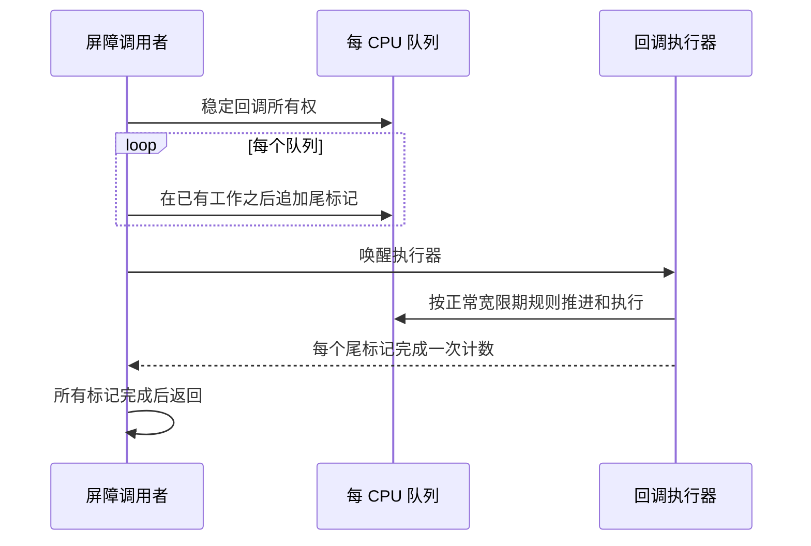
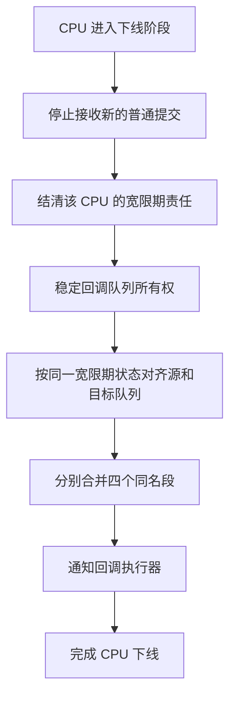
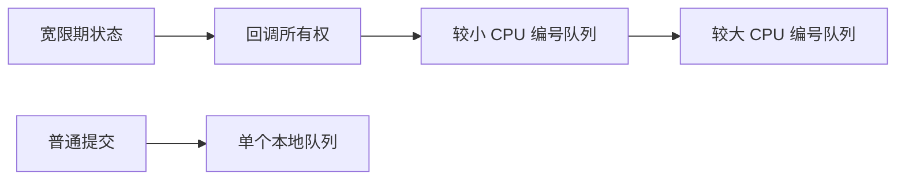

# RCU 分段回调队列

## 1. 设计目标

RCU 回调用于把资源释放等延迟操作安排到宽限期之后执行。一个可扩展的回调系统需要同时满足两类要求：

- 提交回调是高频操作，不应让所有 CPU 持续争用同一把全局锁；
- 回调只有在它所依赖的宽限期结束后才能执行，屏障和 CPU 生命周期变化也不能破坏这一语义。

DragonOS 使用每 CPU 分段队列组织回调。每个 CPU 在自己的局部队列中提交工作，宽限期协调器以“段”为单位推进回调状态，执行器则以有界批次消费已经就绪的回调。

这套设计借鉴 Linux RCU 分段回调链表的核心思想，但与 DragonOS 当前的宽限期模型相匹配：保留单一宽限期协调器和单一回调执行器，不引入多级 RCU 层级、回调卸载或额外执行通道。

## 2. 为什么需要分段

最直接的回调队列是一条全局链表：提交者把回调加入链表，宽限期结束后再扫描链表，找出可以执行的节点。这种模型简单，但存在两个问题：

1. 所有 CPU 的提交都会竞争全局队列；
2. 宽限期变化时，需要逐个检查或更新回调的目标世代。

分段队列将“等待相同宽限期进展的回调”组织在一起。段的边界本身表示回调状态，因此宽限期推进时只需移动链表边界，不需要遍历其中的每个回调。

分段带来的关键收益是：

- 提交操作主要访问本 CPU 数据；
- 宽限期推进的成本与 CPU 数量相关，而不是与积压回调数量相关；
- 回调所处的生命周期阶段可以直接从段位置判断；
- 屏障、迁移和调试都可以围绕同一状态模型实现。

## 3. 整体架构

回调处理分为提交、协调和执行三部分。

各部分职责如下：

- **提交者**只负责把回调放入当前 CPU 的 `next` 段，并通知系统存在新工作；
- **每 CPU 队列**保存回调及其宽限期阶段，不负责决定宽限期何时开始或结束；
- **宽限期协调器**维护全局宽限期状态，并在状态变化时推进各 CPU 的队列段；
- **回调执行器**只消费 `done` 段，在不持有 RCU 内部锁的情况下调用回调函数。

每 CPU 队列隔离了高频写入，而宽限期状态仍由唯一协调器维护。这样既避免复制全局状态，也不会为了优化提交路径而引入多套相互竞争的宽限期判断。

## 4. 四段状态模型

每个 CPU 的回调队列由四个保持 FIFO 顺序的逻辑段组成。

| 段 | 含义 | 是否可以执行 |
|---|---|---|
| `next` | 新提交、尚未绑定到某次宽限期 | 否 |
| `next-ready` | 已确定需要等待下一次宽限期 | 否 |
| `wait` | 正在等待当前宽限期完成 | 否 |
| `done` | 所依赖的宽限期已经完成 | 是 |

段之间的转换由宽限期事件驱动：

需要始终成立的不变量是：

- 一个已提交回调只能位于一个段中，或正由执行器执行；
- 只有 `done` 段中的回调可以被执行；
- 同一段内保持提交顺序；
- 段的宽限期含义一致，不能把等待不同世代的回调混入同一等待段；
- 跨 CPU 不提供全局回调执行顺序保证；
- 回调函数运行期间不持有队列锁或宽限期锁。

这里的四段不是四份独立工作流，而是同一条回调生命周期的四个阶段。实现可以用多条局部链表表达这些段，只要段合并和移动保持常数时间，并维持上述语义。

## 5. 提交与宽限期推进

### 5.1 局部提交

提交回调时，CPU 先稳定自己的执行位置，再把回调追加到本地 `next` 段。提交完成后发布一个持久的“需要扫描”条件，并在必要时唤醒回调执行器。

本地提交不负责启动或推进宽限期。这样可以让高频路径保持短小，并避免所有 CPU 在每次提交时访问全局宽限期状态。

工作通知只是减少无效扫描和唤醒的性能机制。队列状态和宽限期状态才是正确性的依据；即使通知被合并，执行器也必须能通过持久状态重新发现尚未处理的工作。

### 5.2 整段推进

宽限期协调器观察到新回调后，将 `next` 段绑定到合适的宽限期：

- 没有活动宽限期时，回调进入 `wait`，并请求一次新的宽限期；
- 已有活动宽限期且回调来不及被其覆盖时，回调进入 `next-ready`，等待下一次宽限期；
- 宽限期完成时，对应的 `wait` 整段进入 `done`；
- 后续宽限期开始时，`next-ready` 整段进入 `wait`。

协调器必须先明确宽限期事件，再据此移动各队列的段。并发提交到达扫描边界时，可以保守地归入后一宽限期，但绝不能被错误地归入已经无法覆盖它的宽限期。

这种“允许多等、禁止少等”的边界规则保持了 RCU 安全性，同时不要求提交者与全局协调器进行昂贵同步。

## 6. 回调执行与公平性

DragonOS 使用单一逻辑执行权消费所有 CPU 的 `done` 段。单一执行权使回调之间不会因多个执行通道而产生新的并行语义，也简化了屏障对“正在执行的回调”的判断。

执行器采用轮转和有界批次：

1. 从上一次停止位置之后的 CPU 开始扫描；
2. 从某个 `done` 段取出一个回调，并记录该队列有回调正在执行；
3. 释放所有 RCU 内部锁后调用回调；
4. 回调返回后发布执行完成状态；
5. 达到批次上限时提供调度机会，再继续处理剩余工作。

轮转避免某个持续产生回调的 CPU 长期占用执行器；批次上限避免大量回调让内核任务长时间失去调度机会。回调本身仍应遵守其执行上下文约束，分批机制不能消除单个慢回调造成的延迟。

## 7. RCU 屏障

等待一个宽限期结束，与等待此前提交的回调全部执行完成，是两个不同的操作。前者只证明旧读者已经离开；回调可能仍停留在 `done` 段中。RCU 屏障必须额外等待回调执行。

分段队列使用每队列尾标记实现屏障：屏障在每个包含未完成工作的队列中追加一个特殊回调，然后等待所有标记被执行。标记之前的队列前缀因此必然已经执行完毕。

屏障快照的边界，是它在各队列锁保护下插入标记或确认队列无未完成工作的时刻：

- 标记之前的回调属于本次屏障，标记之后的新提交不属于本次屏障；
- 已经从队列摘取但尚未返回的回调也属于未完成工作，不能因为链表暂时为空而漏掉；
- 标记跟随普通回调经历相同的分段推进，因此不会绕过宽限期；
- 标记应接在已有工作的最后，而不是无条件等待一次额外宽限期。

多个屏障调用需要串行化其快照和标记生命周期。屏障扫描还必须与 CPU 队列迁移互斥，否则旧回调可能从尚未扫描的源队列移动到已经扫描过的目标队列，造成漏等待。

## 8. CPU 生命周期与队列迁移

CPU 下线会改变回调队列的所有权，但不能改变回调原有的宽限期含义。下线流程应先阻止目标 CPU 接收新的普通工作，再把它从后续宽限期参与集合中移除，最后把尚未执行的回调迁移到仍参与 RCU 的 CPU。

迁移遵循以下原则：

- `done`、`wait`、`next-ready` 和 `next` 分别合并，不能把待完成回调直接变为可执行；
- 源队列和目标队列必须基于同一个宽限期状态完成对齐；
- 队列迁移与屏障扫描共享同一所有权同步域；
- 正在执行的回调无需迁移，其完成状态仍由原队列记录；
- 队列存储的生命周期必须长于 CPU 在线周期，使下线后仍可安全完成记账；
- 迁移目标必须来自 RCU 自己的参与 CPU 集合，不能使用语义更宽泛、更新时序不同的在线状态替代。

CPU 生命周期状态是队列归属的唯一事实来源。回调子系统不维护第二套 online/offline 状态，以免两套状态在并发下线时产生分歧。

## 9. 并发模型

分段队列包含三类同步域：

- **宽限期状态**：保护全局宽限期的开始、完成和参与 CPU 集合；
- **回调所有权**：协调屏障全局快照与 CPU 队列迁移；
- **局部队列**：保护单个 CPU 的分段链表和执行状态。

需要同时进入多个同步域的控制路径采用统一方向：先稳定宽限期和所有权，再按确定顺序访问局部队列。普通提交只访问一个局部队列，不反向进入全局同步域。

这一方向约束同时服务于正确性和可维护性：新增控制路径时，只要遵守相同的层次，就不会与已有路径形成反向加锁。

工作发布还必须遵循“先发布持久条件，后发送唤醒”的原则。唤醒可以合并，也可能发生在执行器检查睡眠条件附近；执行器因此必须在睡眠前复查队列和宽限期是否仍有可推进工作，闭合丢唤醒窗口。尚被活动宽限期阻塞的等待段不属于当前可运行工作，不能让执行器空转。

## 10. 正确性边界

### 10.1 回调重复提交

同一个回调节点在入队期间不能再次提交。执行器应在调用回调函数之前解除节点的入队状态，因此回调可以在自身执行过程中再次提交同一节点；新的提交属于新的队列位置和宽限期判断。

### 10.2 顺序保证

同一局部段保持 FIFO 顺序，段的推进也保持段内顺序。不同 CPU 的回调没有全局提交或完成顺序。需要全局完成边界的调用者应使用 RCU 屏障，而不是依赖偶然的执行次序。

### 10.3 内存可见性

队列锁负责发布回调节点内容和链表关系；宽限期协议负责建立读侧临界区结束与回调可执行之间的顺序；屏障标记的完成发布则保证屏障返回发生在其覆盖的回调返回之后。

用于唤醒或减少扫描的原子标志只是提示，不能单独承担节点生命周期、宽限期完成或屏障完成的证明。

### 10.4 失败与退化

回调提交路径不依赖动态分配，因此内存压力不会使已经准备好的回调无法入队。大量回调会增加排队延迟，但有界批次和轮转保证系统仍有调度机会。CPU 下线和执行器启动阶段也必须沿用相同的状态机，不能通过提前完成回调来绕过正常宽限期。

## 11. 可观测性

调试接口可以按 CPU 展示四个段的长度和是否存在正在执行的回调，并提供聚合视图。这样的快照用于回答两类问题：

- 回调积压集中在哪些 CPU；
- 积压发生在等待宽限期、尚未归类，还是已经可执行的阶段。

调试快照不参与正确性判断，也不要求全系统线性一致。读取时逐个短暂观察局部队列，可以避免为了诊断而在所有 CPU 之间建立新的全局停顿。一次打开操作应看到稳定文本，避免分段读取时把不同时间点的数据拼接在一起。

## 12. 设计取舍

当前设计有意保持以下边界：

- 使用每 CPU 队列减少提交争用，但保留单一宽限期协调器；
- 使用单一逻辑回调执行权，避免引入回调并行执行语义；
- 使用固定的有界批次和轮转公平性，不额外引入时间预算调度器；
- 不实现多级 RCU 节点层次、回调卸载、延迟回调或多执行器；
- 不维护全局回调序号，跨队列完成边界由尾标记屏障表达。

这些边界让回调提交成本随 CPU 局部化，同时把跨 CPU 协调限制在宽限期变化、屏障和 CPU 生命周期等低频路径。若未来工作负载证明单一协调器或执行器成为瓶颈，应基于测量结果扩展对应层次，而不是预先引入 Linux Tree RCU 的全部复杂度。
