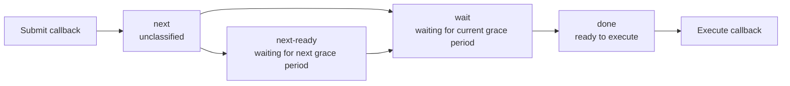
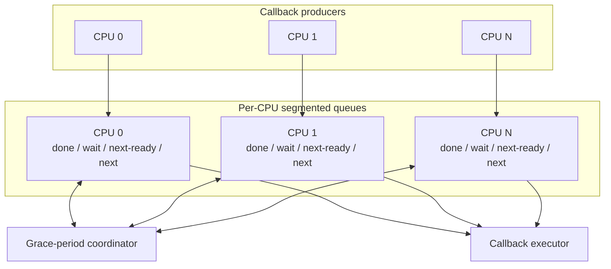
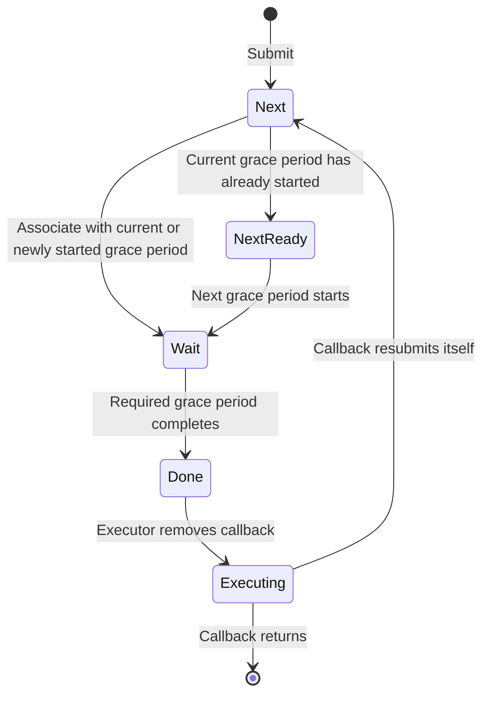
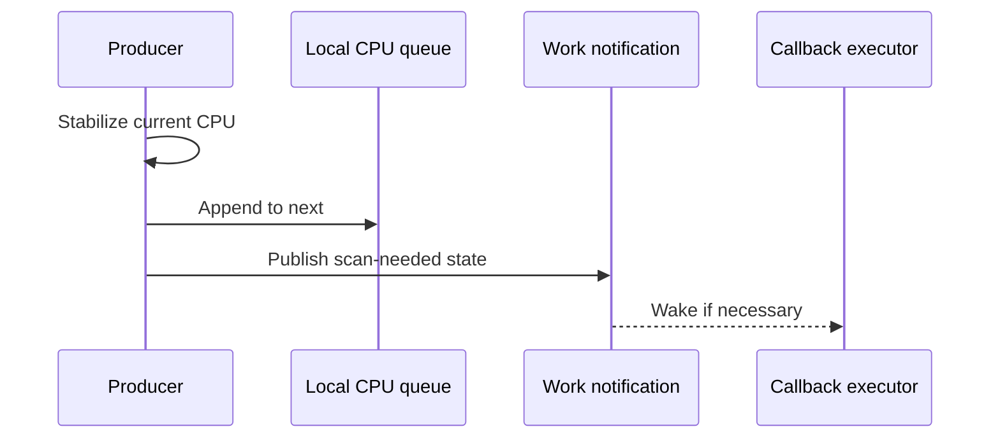
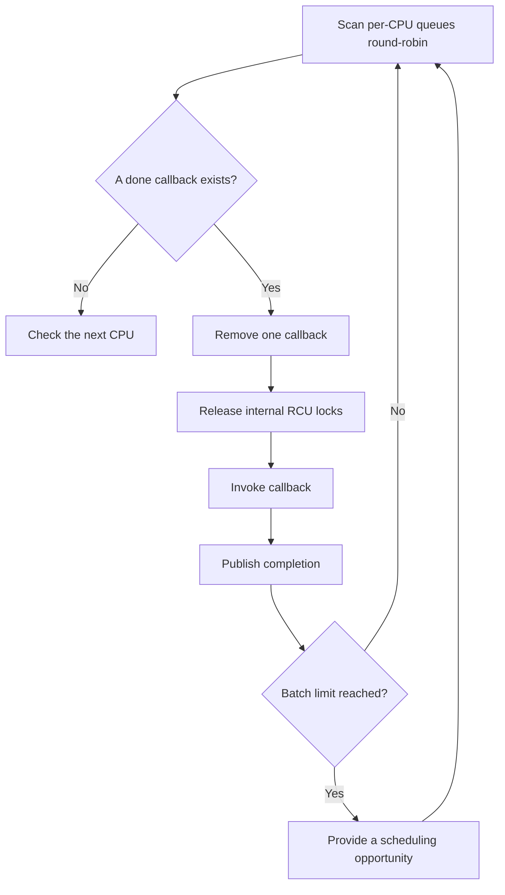
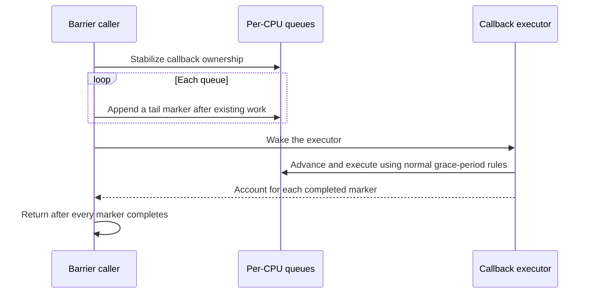
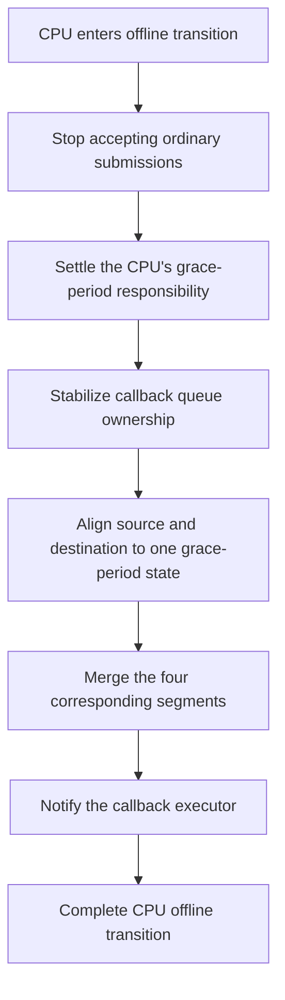
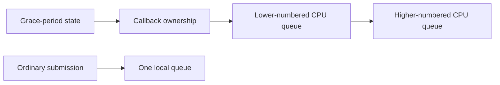

# RCU Segmented Callback Queues

## 1. Design Goals

RCU callbacks schedule deferred operations, such as resource reclamation, to run after a grace period. A scalable callback system must satisfy two requirements:

- callback submission is frequent and should not make every CPU contend for one global lock;
- a callback may run only after its required grace period has ended, including during barriers and CPU lifecycle changes.

DragonOS organizes callbacks in per-CPU segmented queues. Each CPU submits work to its local queue, the grace-period coordinator advances callback state one segment at a time, and the executor consumes ready callbacks in bounded batches.

This design adopts the central idea of Linux RCU segmented callback lists while matching the current DragonOS grace-period model. It retains one grace-period coordinator and one callback executor without introducing a multilevel RCU hierarchy, callback offloading, or additional execution paths.

## 2. Why Segmentation Is Needed

The simplest callback queue is a single global list: producers append callbacks, and the system scans the list after a grace period to find callbacks that may run. Although straightforward, this model has two problems:

1. callback submission from every CPU contends for the global queue;
2. a grace-period transition requires examining or updating callbacks individually.

A segmented queue groups callbacks that are waiting for the same grace-period progress. Segment boundaries represent callback state, so a grace-period transition moves list boundaries instead of traversing every callback in the segment.

Segmentation provides several important properties:

- submission primarily accesses data local to the current CPU;
- grace-period advancement costs scale with the number of CPUs rather than the callback backlog;
- a callback's lifecycle stage follows directly from its segment;
- barriers, migration, and observability use the same state model.

## 3. Overall Architecture

Callback processing consists of submission, coordination, and execution.

Each part has a distinct responsibility:

- **Producers** append callbacks to the current CPU's `next` segment and announce that work is available.
- **Per-CPU queues** retain callbacks and their grace-period stage, but do not decide when a grace period starts or ends.
- **The grace-period coordinator** maintains global grace-period state and advances per-CPU segments when that state changes.
- **The callback executor** consumes only the `done` segments and invokes callbacks without holding internal RCU locks.

Per-CPU queues isolate frequent writes while the single coordinator remains the authority for grace-period state. This avoids duplicating global state or introducing competing grace-period decisions merely to optimize submission.

## 4. The Four-Segment State Model

Each per-CPU callback queue contains four logical FIFO segments.

| Segment | Meaning | Executable |
|---|---|---|
| `next` | Newly submitted and not yet associated with a grace period | No |
| `next-ready` | Known to require the next grace period | No |
| `wait` | Waiting for the current grace period to complete | No |
| `done` | Its required grace period has completed | Yes |

Grace-period events drive transitions between segments:

The following invariants must always hold:

- a submitted callback is in exactly one segment or is being executed;
- only callbacks in `done` may be executed;
- submission order is preserved within a segment;
- callbacks waiting for different grace-period generations are not mixed in one waiting segment;
- no global callback execution order is guaranteed across CPUs;
- callback functions run without queue or grace-period locks held.

The four segments are four stages of one callback lifecycle, not four independent workflows. An implementation may represent them with separate local lists as long as segment movement and merging remain constant-time operations and preserve these semantics.

## 5. Submission and Grace-Period Advancement

### 5.1 Local Submission

To submit a callback, a CPU first stabilizes its execution location and then appends the callback to its local `next` segment. It subsequently publishes a persistent “scan needed” condition and wakes the callback executor when necessary.

Local submission neither starts nor advances a grace period. This keeps the frequent path short and avoids accessing global grace-period state for every callback.

Work notification is a performance mechanism that reduces unnecessary scans and wakeups. Queue and grace-period state remain the source of correctness. Even when notifications are coalesced, the executor must be able to rediscover outstanding work from persistent state.

### 5.2 Whole-Segment Advancement

After the grace-period coordinator observes new callbacks, it associates the `next` segment with an appropriate grace period:

- if no grace period is active, callbacks move to `wait` and a new grace period is requested;
- if an active grace period can no longer cover the callbacks, they move to `next-ready` for the following grace period;
- when a grace period completes, its `wait` segment moves as a whole to `done`;
- when the following grace period starts, `next-ready` moves as a whole to `wait`.

The coordinator must establish the grace-period event before moving queue segments according to that event. A callback racing with a scan boundary may conservatively wait for a later grace period, but it must never be associated with a grace period that cannot cover it.

This rule—waiting longer is safe, waiting too little is not—preserves RCU safety without expensive synchronization between every producer and the global coordinator.

## 6. Callback Execution and Fairness

DragonOS uses one logical execution owner to consume the `done` segments of all CPUs. A single execution owner avoids introducing parallel callback semantics and simplifies the barrier's treatment of callbacks that are already executing.

The executor combines round-robin selection with bounded batches:

1. begin scanning after the CPU at which the previous scan stopped;
2. remove one callback from a `done` segment and record that the queue has a callback in progress;
3. release all internal RCU locks before invoking the callback;
4. publish completion after the callback returns;
5. provide a scheduling opportunity after reaching the batch limit, then continue with remaining work.

Round-robin selection prevents a CPU with a continuous callback stream from monopolizing the executor. Bounded batches prevent large backlogs from denying other kernel tasks a scheduling opportunity. A callback must still obey the constraints of its execution context; batching cannot eliminate latency caused by one slow callback.

## 7. RCU Barriers

Waiting for a grace period to end is different from waiting for all previously submitted callbacks to finish. A completed grace period proves that old readers have left, but callbacks may still remain in `done`. An RCU barrier must additionally wait for callback execution.

Segmented queues implement a barrier with a tail marker for each queue. The barrier appends a special callback after the unfinished work in every relevant queue, then waits until all markers execute. The queue prefix before each marker must therefore have finished.

The barrier snapshot boundary for a queue is the instant, under that queue's synchronization, at which the barrier inserts a marker or confirms that no unfinished work exists:

- callbacks before the marker belong to the barrier; new submissions after it do not;
- a callback already removed from a queue but not yet returned is still unfinished and cannot be ignored merely because the list is empty;
- markers follow the same segment transitions as ordinary callbacks and cannot bypass a grace period;
- a marker is placed after existing work instead of unconditionally requiring an extra grace period.

Concurrent barrier calls must serialize their snapshots and marker lifetimes. Barrier scanning must also exclude CPU queue migration. Otherwise, old callbacks could move from an unscanned source queue to a destination queue that the barrier has already scanned, causing the barrier to miss them.

## 8. CPU Lifecycle and Queue Migration

Taking a CPU offline changes callback queue ownership but must not change the grace-period requirements of its callbacks. The offline sequence first prevents the CPU from accepting new ordinary work, removes its responsibility from future grace periods, and then migrates its unexecuted callbacks to a CPU that still participates in RCU.

Migration follows these principles:

- `done`, `wait`, `next-ready`, and `next` are merged with their corresponding segments; a pending callback never becomes executable merely because it moved;
- source and destination queues are aligned against the same grace-period state;
- queue migration and barrier scanning share one callback-ownership synchronization domain;
- a callback already executing does not migrate, and its source queue continues to record its completion;
- queue storage outlives the CPU's online lifetime, so completion bookkeeping remains safe after the CPU goes offline;
- the migration destination comes from RCU's participating CPU set, not from a broader online state with different semantics or update timing.

CPU lifecycle state is the sole source of truth for queue ownership. The callback subsystem does not maintain a second online/offline state that could diverge during a concurrent offline transition.

## 9. Concurrency Model

Segmented callback queues use three synchronization domains:

- **Grace-period state** protects grace-period start, completion, and the participating CPU set.
- **Callback ownership** coordinates barrier-wide snapshots with CPU queue migration.
- **Local queues** protect each CPU's segmented lists and execution state.

A control path that enters multiple domains follows one direction: stabilize grace-period state and callback ownership before accessing local queues in a deterministic order. Ordinary submission accesses only one local queue and never reverses into a global domain.

This ordering serves both correctness and maintainability. A new control path that follows the same hierarchy cannot create a reverse lock dependency with an existing path.

Work publication also follows the rule “publish a persistent condition before sending a wakeup.” Wakeups may be coalesced or race with the executor's sleep check. The executor therefore rechecks queue and grace-period state before sleeping to close the lost-wakeup window. Waiting segments blocked by an active grace period are not currently runnable work and must not make the executor spin.

## 10. Correctness Boundaries

### 10.1 Duplicate Submission

The same callback node cannot be submitted again while it is queued. The executor clears the queued state before invoking the callback, allowing a callback to resubmit its own node while it runs. The new submission receives a new queue position and grace-period classification.

### 10.2 Ordering Guarantees

FIFO order is retained within each local segment, and segment advancement preserves that order. Callbacks on different CPUs have no global submission or completion order. A caller that requires a global completion boundary uses an RCU barrier rather than relying on incidental execution order.

### 10.3 Memory Visibility

Queue synchronization publishes callback contents and list relationships. The grace-period protocol orders the end of read-side critical sections before callback eligibility. Completion of barrier markers ensures that a barrier returns after the callbacks it covers have returned.

Atomic state used to reduce scans or wakeups is only a hint. It cannot by itself prove callback lifetime, grace-period completion, or barrier completion.

### 10.4 Failure and Degradation

Callback submission does not require dynamic allocation, so memory pressure cannot prevent a prepared callback from entering a queue. A large backlog increases queueing latency, but bounded batches and round-robin selection preserve scheduling opportunities. CPU offline and executor startup paths follow the same state machine and must not bypass normal grace-period rules by marking pending callbacks complete early.

## 11. Observability

Debugging facilities can expose the lengths of all four segments and whether a callback is currently executing for each CPU, together with an aggregate view. Such a snapshot answers two questions:

- which CPUs hold most of the callback backlog;
- whether the backlog is waiting for a grace period, unclassified, or already executable.

Debug snapshots do not participate in correctness and need not be globally linearizable. Observing one local queue at a time avoids introducing a system-wide pause solely for diagnostics. A single open operation should present stable text so that partial reads do not combine data from different points in time.

## 12. Design Trade-offs

The current design deliberately retains the following boundaries:

- per-CPU queues reduce submission contention, while one grace-period coordinator remains authoritative;
- one logical callback execution owner avoids parallel callback semantics;
- fixed bounded batches and round-robin fairness are used without an additional time-budget scheduler;
- multilevel RCU nodes, callback offloading, lazy callbacks, and multiple executors are not introduced;
- no global callback sequence is maintained; tail-marker barriers express cross-queue completion boundaries.

These boundaries localize callback submission costs while restricting cross-CPU coordination to lower-frequency grace-period transitions, barriers, and CPU lifecycle events. If measurements later show that the single coordinator or executor is a bottleneck, the corresponding layer can be extended based on evidence rather than adopting the full complexity of Linux Tree RCU in advance.
