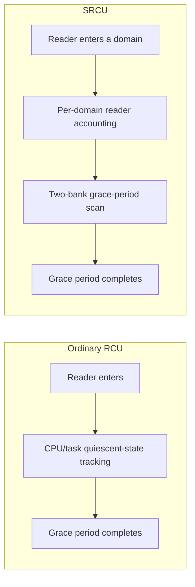
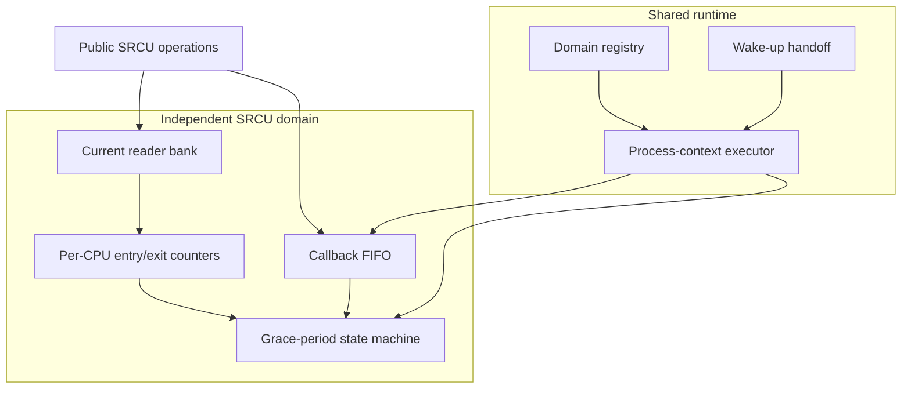
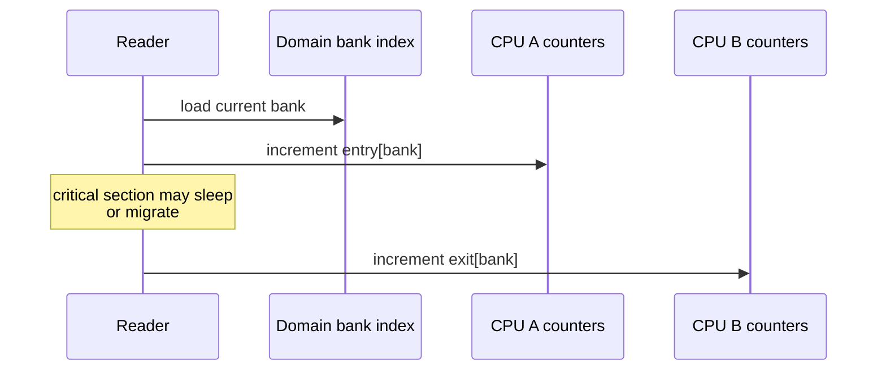
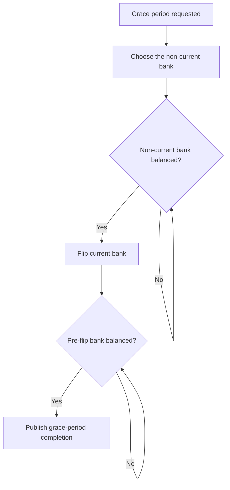
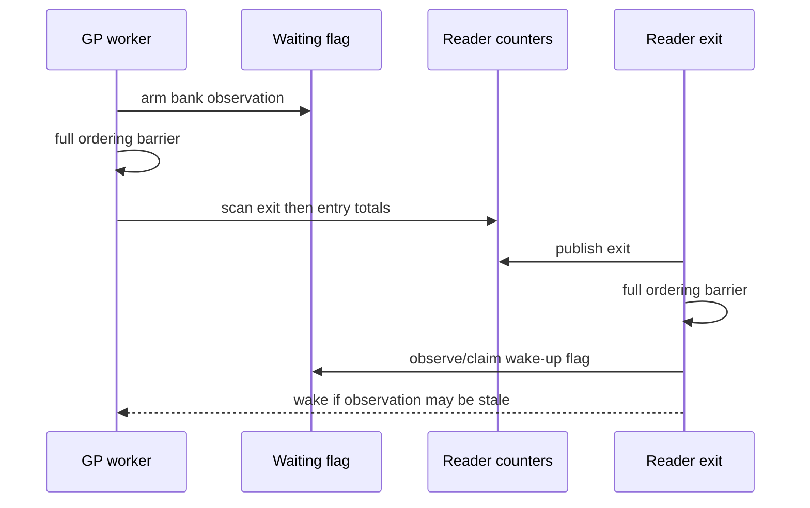
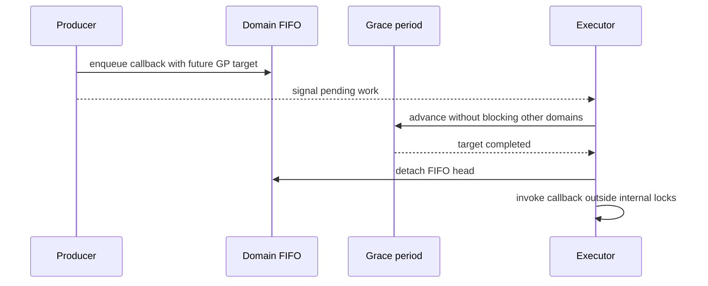
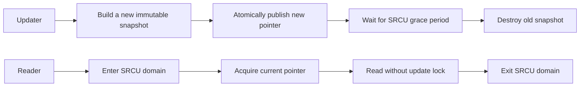
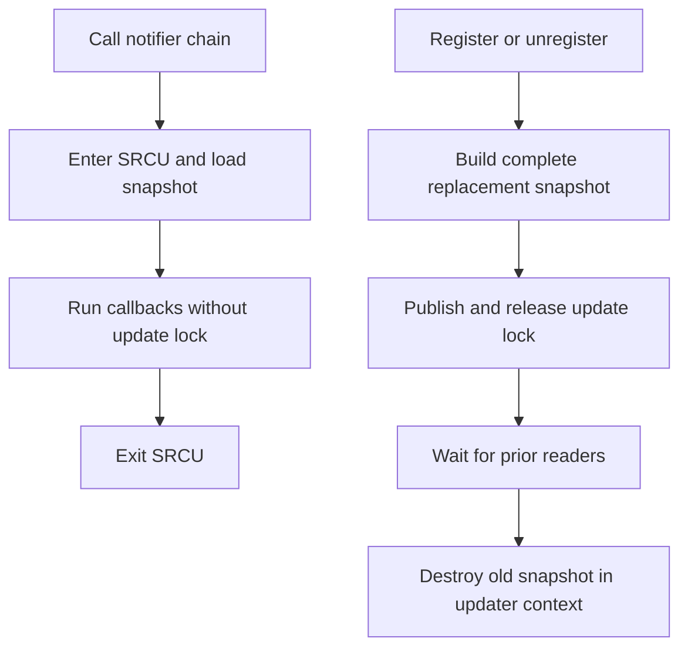
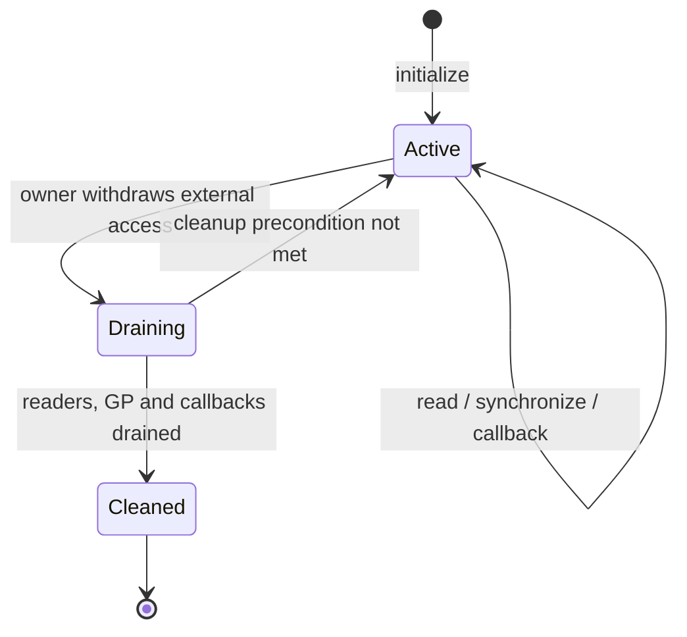

# DragonOS SRCU 设计原理

## 1. 概述

SRCU（Sleepable Read-Copy Update）是一种面向读多写少场景的同步机制。它保留了 RCU
“读者直接访问、更新者延迟回收”的基本思想，同时允许读侧临界区被抢占、迁移 CPU，甚至主动
睡眠。

DragonOS 的 SRCU 语义以 Linux 6.6 为基准，但实现结构针对 DragonOS 当前规模保持精简。本文
解释其稳定的设计原理、正确性不变量和集成方式，不描述容易随实现演进而变化的函数位置、调度
参数或调试输出格式。

SRCU 适合以下场景：

- 数据读取频繁，而注册、替换或删除很少发生；
- 读者需要跨越可能睡眠的调用，例如阻塞通知链；
- 读者不能持有自旋锁，也不能依赖普通 RCU 的不可睡眠读侧；
- 更新者需要明确知道旧版本何时不再被任何既有读者使用。

SRCU 不是普通 RCU 的替代品。不能睡眠的极短读侧通常更适合普通 RCU；需要频繁写入的数据也
不适合以 SRCU 快照方式维护。

## 2. 普通 RCU 与 SRCU 的区别

普通 RCU 通过 CPU 或任务经过静止状态来判断旧读者已经离开。这要求读侧遵守相应 flavor 的
上下文规则。SRCU 不推断静止状态，而是让读者在所属保护域中显式登记进入和退出。

两者最重要的边界如下：

| 属性 | 普通 RCU | SRCU |
|---|---|---|
| 读侧睡眠 | 取决于 flavor，通常不允许 | 允许 |
| 读侧迁移 CPU | 取决于实现和 flavor | 允许 |
| 宽限期范围 | 通常由全局 flavor 管理 | 每个 SRCU 域独立 |
| 读侧成本 | 通常更低 | 显式计数与必要屏障 |
| 典型用途 | 调度器、网络快速路径 | 通知链、可睡眠回调、配置快照 |

## 3. 语义保证与使用约束

一个 SRCU 保护域提供以下保证：

1. 读锁成功取得后，读者看到的对象在匹配解锁前不会被更新者回收；
2. 在一次宽限期开始前已经进入，或者已经选择旧计数槽的读者，都会被该宽限期等待；
3. 宽限期开始后持续到来的新读者不会无限延迟当前宽限期；
4. 一个域中的慢读者不会阻塞另一个域的宽限期；
5. 异步回调只会在其目标宽限期完成后执行；
6. barrier 返回时，其线性化点之前提交到该域的回调均已执行完毕。

调用者同时必须遵守以下约束：

- 每次读锁都必须与同一域的匹配解锁配对；
- 同步等待和 barrier 只能从可睡眠上下文调用；
- 不能在同一域的读侧临界区内等待该域的宽限期；
- 域销毁前必须撤销所有外部可达入口，并排空读者、宽限期和回调；
- NMI/MCE 等无法满足普通 SRCU 记账和屏障要求的上下文不能使用该 API。

“在同域读侧等待同域宽限期”会等待当前任务自己退出，因此属于 API 误用。实现可以提供诊断，
但正确性不能依赖诊断一定捕获所有非法调用。

## 4. 总体架构

DragonOS SRCU 分为保护域、读侧记账、宽限期状态机和共享执行器四个职责层次：

各层职责保持清晰：

- **保护域**拥有自己的读者计数、宽限期序列和回调顺序；
- **读侧**只登记进入和退出，不推动全局状态，也不分配内存；
- **宽限期状态机**只根据本域计数决定进展，不依赖普通 RCU 的静止状态；
- **共享执行器**负责推进所有活动域并调用已就绪回调，但不改变域之间的隔离性。

共享执行器避免为每个域创建线程；域内状态仍然独立，因此共享的是执行资源，而不是宽限期条件。

## 5. 读侧记账

### 5.1 两组计数

每个域维护两组读者计数，以下称为 bank 0 和 bank 1。域中还有一个当前 bank 索引。读者进入时：

1. 读取当前 bank；
2. 在当前 CPU 对应的进入计数中登记；
3. 返回携带 bank 信息的 cookie。

读者退出时，根据 cookie 在当前 CPU 对应的退出计数中登记。进入和退出可以发生在不同 CPU；
更新者对所有可能 CPU 的计数求和，因此任务迁移不会导致读者丢失。

某个 bank 在所有 CPU 上满足“进入总数等于退出总数”时，该 bank 中没有未完成读者。计数采用累计
值而不是增减同一个共享值，可以减少 CPU 间对同一缓存行的争用，并自然支持迁移。

### 5.2 Cookie 与生命周期

读锁返回的 cookie 记录本次进入所选择的 bank。cookie 必须绑定所属域，并且不能被转移给另一
任务代为解锁。这样的类型约束能够防止重复解锁、错域解锁以及域在读者仍存活时被安全代码销毁。

读侧是 infallible 的基础路径：它不获取全局锁、不等待、不分配内存。调试用的任务本地跟踪只
用于发现常见误用，不能改变合法读侧的成功条件。

## 6. 两阶段宽限期

只翻转一次 bank 并等待旧 bank 清空是不够的。考虑一个读者已经读取旧索引、但尚未递增进入计数
的窗口：更新者可能错误地认为旧 bank 已空。因此，一个完整宽限期需要两个扫描阶段。

两个阶段分别解决不同问题：

1. **复用前扫描**：先确认非当前 bank 已清空，使它可以安全成为新读者使用的 bank；
2. **翻转后扫描**：切换索引后等待原当前 bank 清空，覆盖宽限期前已存在以及已经取得旧索引的
   读者。

翻转以后到来的读者进入新 bank，不再延长当前宽限期。因此，只要旧读者最终退出，更新者就能
取得进展，不会被连续新读者饿死。

多个同时到来的同步请求可以合并到同一个未来宽限期。宽限期进行过程中到来的、不能由当前周期
覆盖的请求则指向下一个周期。序列号比较使用回绕安全的半区规则。

## 7. 内存排序

计数相等只是数值条件；SRCU 的正确性还依赖读者、索引翻转和更新者之间的内存顺序。实现必须
建立以下 happens-before 关系：

- 读侧临界区中的访问不能移动到进入登记之前；
- 读侧临界区中的访问不能移动到退出登记之后；
- 更新者扫描计数时，不能看到一次退出却遗漏与之对应的进入；
- 已读取旧索引但尚未登记的读者，必须被翻转前后的屏障链覆盖；
- 宽限期完成之后的旧对象回收，必须发生在所有被覆盖读者退出之后；
- callback 和 barrier 的完成发布，必须让提交者与等待者观察到回调的副作用。

可以将关键关系理解为一个 Dekker 风格的握手：更新者先声明自己正在观察某个 bank，再扫描计数；
读者先发布退出，再检查是否有更新者等待。如果更新者没有看到退出，读者就必须看到等待标志并
唤醒更新者；如果读者没有看到等待标志，更新者就必须在随后的扫描中看到退出。

具体使用何种原子指令属于实现细节，但上述关系是架构无关的不变量；任何性能优化都必须先证明
仍在 x86_64 和弱内存序架构上保持这些关系。

## 8. 唤醒与进展保证

当宽限期发现目标 bank 仍有读者时，执行器不能忙等。它为该 bank 建立等待状态，然后去处理其他
域或进入休眠。最后一批相关读者退出时负责触发唤醒。

唤醒协议必须同时避免两类错误：

- **丢唤醒**：读者恰好在执行器准备休眠时退出；
- **唤醒风暴**：同一 bank 的大量读者退出时重复发送无意义通知。

协议保留一个不会因瞬时通知而丢失的工作指示，并让退出者原子地认领一次唤醒责任。事件先于
等待登记发生时，等待谓词可以直接观察到工作；事件后发生时，负责认领的退出者唤醒执行器。
这样既闭合了“检查条件—进入休眠”之间的竞态窗口，也限制了重复通知。

执行器按轮次访问已注册域，每次只为一个域执行有界工作，并在域之间提供调度点。因此：

- 慢读者只让所属域停止在当前阶段；
- callback flood 不会永久占用执行器；
- 已经接纳的 GP 和 callback 推进不依赖临时内存分配；
- 中断上下文只提交持久事件，真正的 GP 推进和 callback 调用发生在进程上下文。

## 9. 异步回调与 barrier

`call_srcu()` 类操作把回调加入域内 FIFO，并为它关联一个未来宽限期。执行器只有在该目标完成后
才把回调从队列摘除并调用。

侵入式 callback head 在排队、即将调用和空闲之间具有明确的所有权状态。回调被摘除不等于调用者
已经重新获得所有权；只有进入回调的明确交接点之后，容器才可以重新排队或释放。这一边界防止
同一 head 被并发重用而形成悬空队列节点。

SRCU 回调共享同一个执行资源，因此回调必须保持有界且不得进行无界阻塞。需要睡眠或可能触发
复杂析构的工作，应由回调转交给专用工作队列或留在更新者上下文；这与“通知链中的业务回调可
以睡眠”是两个不同的执行上下文约束。

由于所有域的宽限期和回调都由该共享执行器推进，SRCU 延迟回调不能同步等待任何 SRCU 域的
宽限期、barrier 或 cleanup；即使目标是另一个域，等待也会阻塞唯一能够推进目标域的执行器。
需要这种依赖的工作必须先转交给独立执行上下文。

在当前的域内串行 FIFO 模型下，barrier 将其线性化点之前的提交视为一个连续前缀，并等待该前缀
全部完成。实现可以用提交与完成序列表示这个边界；关键语义是覆盖所有早先回调，同时不等待线
性化点之后持续到来的提交。

如果未来将同一域的 callback 改为并行执行，就必须同步重设 barrier 协议；不能继续把最大完成
序号当作连续完成前缀。

## 10. 更新与对象回收模式

SRCU 最常见的使用方式是发布不可变快照：

更新路径必须遵循“先完成所有可能失败的准备，再发布”的事务边界。指针一旦发布，后续同步和旧
对象处理必须保证完成，不能向调用者返回一个看似未提交的普通错误。

旧对象的最终析构也属于设计的一部分：

- 简单、确定为非阻塞的内部对象可以由 SRCU callback 延迟释放；
- 可能执行任意析构逻辑的用户对象应在可睡眠的更新者上下文释放；
- 如果异步快照仍可能持有被删除对象，注销路径必须先排空这些回收项，再执行最终析构。

这避免把未知的析构成本放到共享 SRCU 执行器上。

## 11. 通知链集成

SRCU 通知链使用不可变的有序回调快照。调用侧进入 SRCU 域后直接遍历，不持有更新锁，因此回调
可以睡眠。DragonOS 的快照是完整的 COW 对象；无论增加还是删除元素，发布后都必须等待宽限期，
才能在更新者上下文释放旧快照。这样可以保证任意用户析构不会进入共享 SRCU callback 执行器。

- 更新锁只串行化快照构造与发布，发布后立即释放；宽限期等待和旧快照析构都在锁外完成；
- 所有可能失败的分配都在发布前完成，失败路径也保留外部所有权，避免在更新锁内执行最终用户析构；
- 注册和注销都是可睡眠的更新操作，不能从同一通知链的 callback 内读取侧自修改，否则会等待自身；
- 注销返回时，旧读者已经退出，目标对象的最终析构发生在注销调用者上下文。

DragonOS 的 reboot notifier 是该模式的实际使用者。选择真实消费者而不是构造演示接口，可以让
SRCU 的睡眠读侧语义、注销保证和生命周期边界接受持续的系统测试。

## 12. Tracepoint 集成

Tracepoint 是另一个典型的读多写少消费者。回调集合以不可变快照发布，命中路径在一个共享的
tracepoint SRCU 域中读取快照并直接遍历：

- 命中路径不分配内存，不克隆共享所有权，也不持有注册锁；
- 注册和注销由更新锁串行构造新快照；
- 注销返回前等待 SRCU 宽限期，保证旧 callback 不再执行；
- 普通 callback 触发 raw callback 时复用已有的 SRCU 临界区，避免重复记账；
- callback 内同步修改同一个 tracepoint 会等待自身，因此必须拒绝；
- static key 仍负责在没有消费者时绕过整个命中路径。

Linux tracepoint 同时存在由不同 RCU flavor 保护的调用路径。DragonOS 当前路径统一由 SRCU 保护；
如果未来加入 NMI 或另一种读侧 flavor，必须明确分流，并在注销时等待所有实际存在的保护域，不能
假设一次 SRCU 同步覆盖其他 flavor。

## 13. 域生命周期

动态 SRCU 域采用外部独占的生命周期：

cleanup 消费域的 owner，从类型层面阻止成功清理后继续使用。成功清理要求：

- 两个 bank 均没有未完成读者；
- 没有进行中或待请求的宽限期和同步等待者；
- callback FIFO 已空，且没有 callback 正在执行；
- 执行器不再持有该域的临时观察引用。

条件不满足时，cleanup 返回仍然有效的 owner，调用者可以先完成正确的 drain 顺序后重试。基础
SRCU 不实现可与新读者并发竞争的隐式 close；需要并发关闭的上层必须先提供自己的 admission gate。
这使职责清晰，也避免在 SRCU 核心中引入无法证明的半关闭状态。

静态长寿命域不执行动态 cleanup，但仍必须在任何消费者可达之前完成显式初始化。

## 14. 扩展性与设计取舍

DragonOS 使用平坦的 per-CPU 计数和共享执行器。这一选择适合当前 CPU 规模，并具有较低维护成本：

- 域之间的正确性状态完全独立；
- 读侧不需要树形遍历或动态分配；
- callback 执行资源可以共享；
- CPU 上下线不要求迁移计数，只需保证所有可能 CPU 的历史分片仍会被扫描。

Linux Tree SRCU 中面向大型 NUMA 系统的层次节点、自适应 small/big 模式、callback offload 和复杂
调优策略不属于当前必需语义。只有性能数据证明平坦扫描成为瓶颈时，才应引入层次化；优化不能
改变本文描述的域隔离、两阶段扫描、回收和 barrier 不变量。

## 15. 可观测性与验证原则

SRCU 的观测接口应回答“为什么某个域没有进展”，而不是暴露内部布局。稳定、有诊断价值的信息
包括：

- 域是否活动、当前 bank 和宽限期阶段；
- 请求与完成的宽限期序列；
- 两个 bank 的进入/退出汇总；
- callback 是否排队或正在执行。

验证应同时覆盖确定性状态转换和并发压力：

- 嵌套读者、睡眠和跨 CPU 迁移；
- 翻转窗口中的延迟登记读者；
- 连续新读者不能饿死旧宽限期；
- 多域隔离；
- callback 恰好一次、自重排队和 barrier 边界；
- 注册、注销、调用并发下的通知链生命周期；
- tracepoint 注册/注销、static key 与 SMP 命中；
- 序列号回绕和内存排序 litmus；
- CPU 上下线与弱内存序架构构建/运行。

压力测试用于扩大交错覆盖，但不能替代对两阶段扫描和内存排序的确定性证明。

## 16. 核心不变量清单

评审或修改 SRCU 时，应优先验证以下不变量：

1. 一个域的读者不会参与另一个域的 GP 完成条件；
2. 读者可以在进入与退出之间睡眠和迁移；
3. 非当前 bank 在复用前必须为空；
4. bank 翻转后的第二次扫描必须覆盖已取得旧索引的读者；
5. GP 等待不忙等，且 reader/worker 握手不会丢唤醒；
6. 已接纳工作在内存压力下仍能推进；
7. callback 在所有内部锁之外调用，并且只调用一次；
8. barrier 只等待其线性化点之前的连续 FIFO 前缀；
9. 发布后不存在可恢复的半提交错误路径；
10. 任意用户对象的最终析构不会意外落到共享 SRCU 执行器；
11. cleanup 只有在读者、GP、callback 和执行器引用全部排空后才能成功；
12. 调试和性能优化不能改变读侧语义或内存排序。

## 17. 参考资料

- [DragonOS issue #2230](https://github.com/DragonOS-Community/DragonOS/issues/2230)
- [Linux v6.6 `include/linux/srcu.h`](https://github.com/torvalds/linux/blob/v6.6/include/linux/srcu.h)
- [Linux v6.6 `kernel/rcu/srcutree.c`](https://github.com/torvalds/linux/blob/v6.6/kernel/rcu/srcutree.c)
- [Linux v6.6 `kernel/notifier.c`](https://github.com/torvalds/linux/blob/v6.6/kernel/notifier.c)
- [Linux v6.6 `kernel/tracepoint.c`](https://github.com/torvalds/linux/blob/v6.6/kernel/tracepoint.c)
