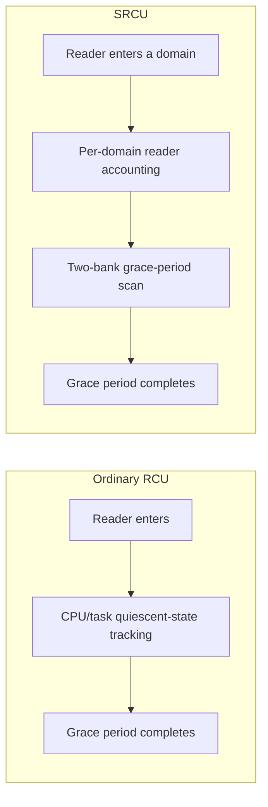
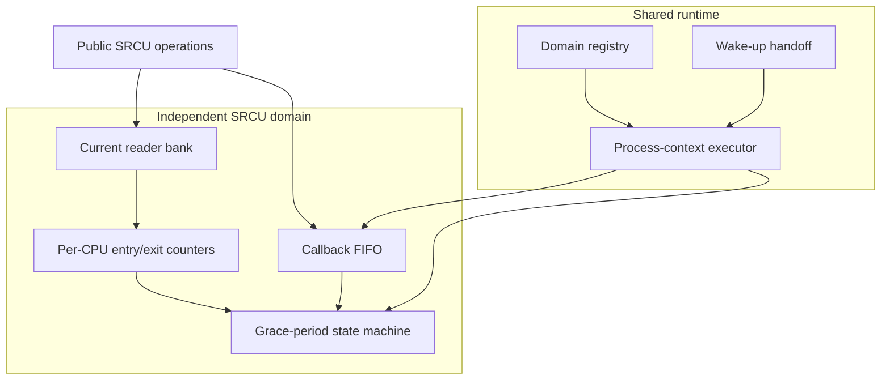
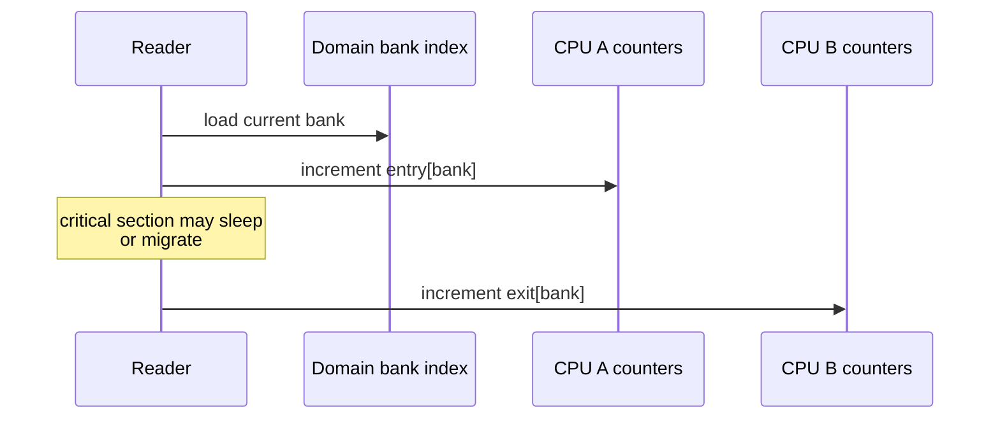
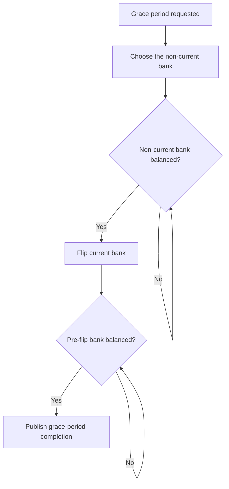
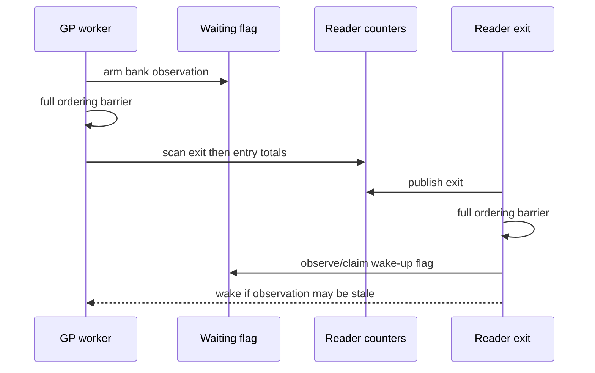
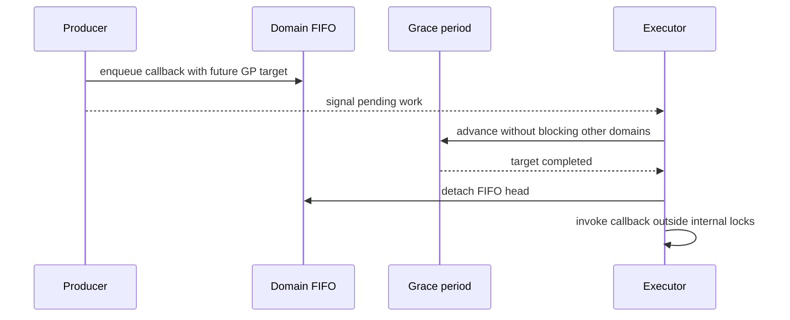
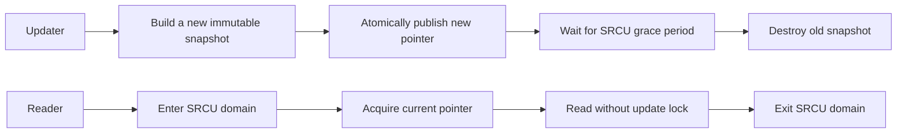
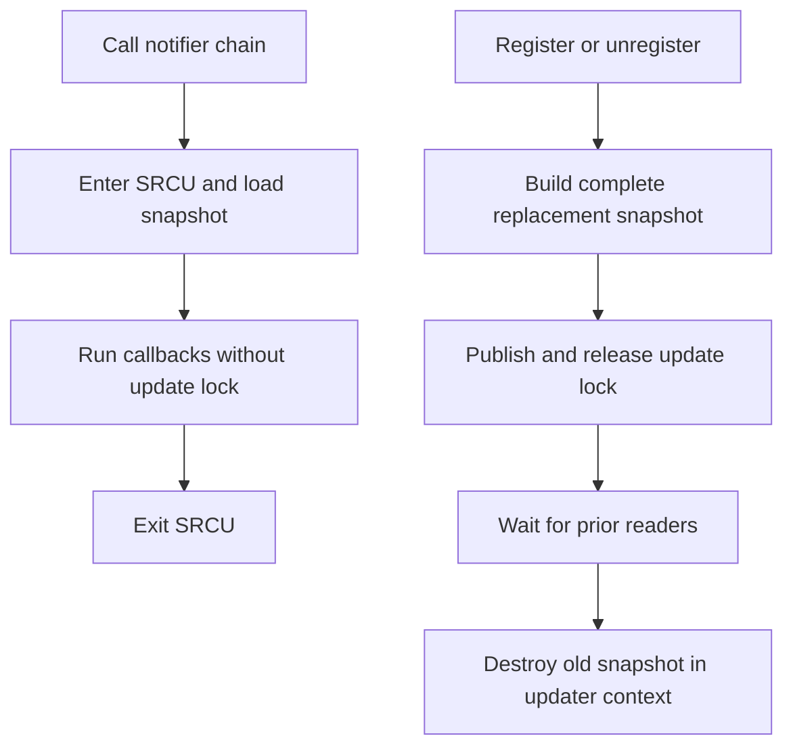
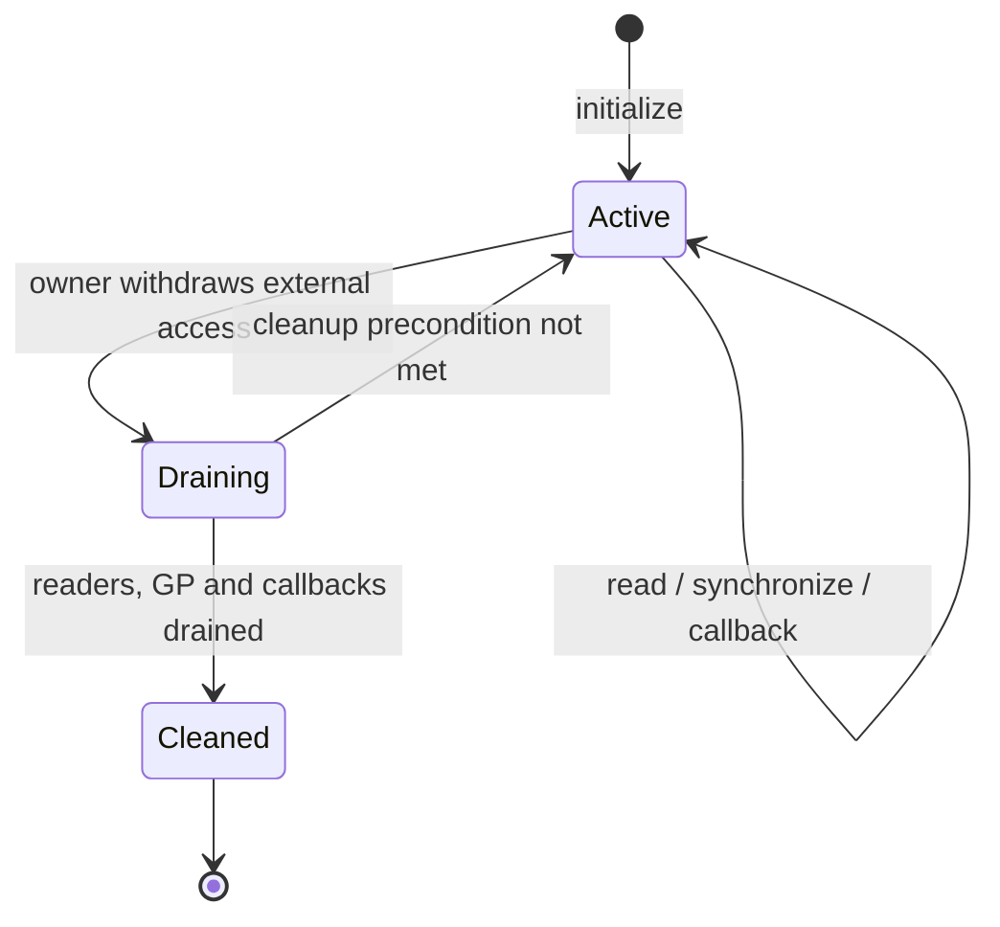

# DragonOS SRCU Design Principles

## 1. Overview

SRCU (Sleepable Read-Copy Update) is a synchronization mechanism for
read-mostly workloads. It preserves the basic RCU model—readers access data
directly while updaters defer reclamation—but allows a read-side critical
section to be preempted, migrate between CPUs, or sleep voluntarily.

DragonOS follows the semantics of Linux 6.6 while keeping the implementation
appropriate for the current scale of the system. This document describes the
stable principles, correctness invariants, and integration patterns. It
intentionally avoids source locations, tuning constants, and diagnostic
formats that are likely to evolve.

SRCU is a good fit when:

- reads are frequent while registration, replacement, and removal are rare;
- a reader must cross a call that may sleep, such as a blocking notifier;
- readers cannot hold a spinlock or use a non-sleepable ordinary-RCU flavor;
- an updater must know when no pre-existing reader can still use an old
  version.

SRCU does not replace ordinary RCU. Very short, non-sleepable read-side paths
usually belong to ordinary RCU, and write-heavy data is usually a poor fit for
SRCU snapshot publication.

## 2. Ordinary RCU and SRCU

Ordinary RCU determines that old readers have departed by observing CPU or
task quiescent states. Its readers must therefore follow the context rules of
the selected RCU flavor. SRCU does not infer quiescent states. Instead, every
reader explicitly records entry and exit in its protection domain.

The most important differences are:

| Property | Ordinary RCU | SRCU |
|---|---|---|
| Sleeping in a read-side section | Flavor-dependent, usually forbidden | Allowed |
| CPU migration in a read-side section | Flavor- and implementation-dependent | Allowed |
| Grace-period scope | Usually managed by a global flavor | Independent per SRCU domain |
| Read-side cost | Usually lower | Explicit accounting and ordering |
| Typical use | Scheduler and networking fast paths | Notifier chains, sleepable callbacks, configuration snapshots |

## 3. Guarantees and Usage Constraints

An SRCU protection domain provides these guarantees:

1. once a reader has acquired a read lock, the object it observes is not
   reclaimed before the matching unlock;
2. a grace period waits for readers that entered before it began, including
   readers that already selected the old counter bank;
3. a continuous stream of readers arriving after the grace period began does
   not postpone that grace period indefinitely;
4. a slow reader in one domain does not delay another domain;
5. an asynchronous callback runs only after its target grace period;
6. when a barrier returns, every callback submitted before the barrier's
   linearization point has completed.

Callers must also obey these constraints:

- every read lock must be paired with an unlock from the same domain;
- synchronous waits and barriers require a sleepable context;
- code must not wait for a domain while inside a read-side section of that
  same domain;
- before destroying a domain, its owner must withdraw all externally
  reachable entry points and drain readers, grace periods, and callbacks;
- contexts such as NMI or MCE that cannot satisfy ordinary SRCU accounting and
  ordering requirements must not use the API.

Waiting for a domain from inside the same domain's read-side section waits for
the current task itself and is therefore API misuse. The implementation may
diagnose common cases, but correctness must not depend on diagnostics catching
every invalid call.

## 4. Architecture

DragonOS SRCU separates four responsibilities: protection domains,
read-side accounting, the grace-period state machine, and a shared executor.

The division of responsibility is deliberate:

- a **domain** owns its reader counters, grace-period sequence, and callback
  ordering;
- a **reader** records entry and exit only; it neither drives global state nor
  allocates memory;
- the **grace-period state machine** uses only counters from its own domain and
  does not depend on ordinary-RCU quiescent states;
- the **shared executor** advances all active domains and invokes ready
  callbacks without weakening isolation between domains.

Sharing the executor avoids one thread per domain. What is shared is execution
capacity, not a grace-period completion condition.

## 5. Read-Side Accounting

### 5.1 Two Counter Banks

Each domain maintains two reader-counter banks, called bank 0 and bank 1, and
an index selecting the current bank. A reader enters by:

1. loading the current bank;
2. recording an entry in that bank's counter for the current CPU;
3. returning a cookie that carries the selected bank.

On exit, the reader records an exit in the bank named by the cookie, using the
current CPU's counter. Entry and exit may occur on different CPUs. The updater
sums counters across all possible CPUs, so task migration cannot lose a
reader.

A bank has no outstanding readers when its total entry count equals its total
exit count across all CPUs. Cumulative entry and exit counters avoid having all
CPUs update one shared value and naturally support migration.

### 5.2 Cookies and Lifetime

The read-lock cookie records the bank selected by one entry. It is bound to
its domain and must not be handed to another task for unlocking. These type
and ownership rules prevent duplicate unlocks, cross-domain unlocks, and safe
code destroying a domain while a reader still exists.

The fundamental read-side path is infallible. It takes no global lock, does
not wait, and does not allocate. Per-task debug tracking is only a diagnostic
aid for common misuse; it must not change whether a valid reader can enter.

## 6. The Two-Phase Grace Period

Flipping the bank once and waiting for the old bank is not sufficient. A
reader may have loaded the old index but not yet incremented its entry counter.
Without an additional phase, the updater could incorrectly decide that the
old bank is empty.

The phases solve different problems:

1. **scan before reuse**: verify that the non-current bank is empty before it
   becomes the bank for new readers;
2. **scan after the flip**: wait for the previously current bank, covering
   both pre-existing readers and readers that had already obtained the old
   index.

Readers arriving after the flip use the new bank and no longer extend the
current grace period. The updater therefore makes progress once old readers
eventually depart, even under a continuous stream of new readers.

Concurrent synchronization requests may coalesce onto one future grace
period. A request that cannot be covered by the period already in progress
targets the following period. Sequence comparisons use a wrap-safe half-range
rule.

## 7. Memory Ordering

Equal counters are only a numerical condition. Correctness also depends on
ordering between readers, the bank flip, and the updater. The implementation
must establish these happens-before relationships:

- accesses inside a read-side section cannot move before entry accounting;
- accesses inside a read-side section cannot move after exit accounting;
- a counter scan cannot observe an exit while missing its corresponding entry;
- the ordering around the bank flip must cover a reader that loaded the old
  index but has not yet recorded entry;
- reclamation after grace-period completion must occur after every covered
  reader has exited;
- callback and barrier completion must publish callback side effects to the
  corresponding submitter or waiter.

The central relationship can be viewed as a Dekker-style handshake. The
updater announces that it is observing a bank before scanning counters. A
reader publishes its exit before checking whether an updater is waiting. If
the updater misses the exit, the reader must observe the wait flag and wake the
updater; if the reader misses the wait flag, the updater's subsequent scan must
observe the exit.

The exact atomic instructions are implementation details. These relations are
architecture-independent invariants, and an optimization must prove that they
remain valid on both x86_64 and weakly ordered architectures.

## 8. Wake-Ups and Progress

When a grace period finds readers in its target bank, the executor must not
busy-wait. It marks the bank as being observed, then visits other domains or
sleeps. The last relevant readers to leave are responsible for waking it.

The wake-up protocol must prevent both:

- **lost wake-ups**, when a reader exits just as the executor prepares to
  sleep;
- **wake-up storms**, when many readers from one bank exit together.

The protocol retains a work indication that cannot be lost with a transient
notification, and lets an exiting reader atomically claim responsibility for
one wake-up. If the event precedes waiter registration, the wait predicate sees
the work directly. If it follows registration, the reader that claims the
responsibility wakes the executor. This closes the race between checking the
condition and sleeping while also limiting redundant notifications.

The executor visits registered domains in rounds, performs bounded work for one
domain at a time, and provides scheduling points between domains. Consequently:

- a slow reader stalls only its own domain;
- a callback flood cannot permanently monopolize the executor;
- progress of an accepted grace period or callback does not depend on a new
  temporary allocation;
- interrupt context publishes a persistent event, while grace-period progress
  and callback invocation occur in process context.

## 9. Asynchronous Callbacks and Barriers

A `call_srcu()`-style operation appends a callback to the domain FIFO and
associates it with a future grace period. The executor detaches and invokes the
callback only after that target completes.

An intrusive callback head has explicit ownership states while queued, about
to be invoked, and idle. Detaching the head does not by itself return ownership
to the submitter. Only an explicit handoff at callback entry permits the
container to be queued again or destroyed. This boundary prevents concurrent
reuse from leaving a dangling node in the FIFO.

SRCU callbacks share one execution resource, so they must remain bounded and
must not block without a bound. Work that needs to sleep or can trigger complex
destruction should be handed to a dedicated workqueue or retained in updater
context. This is distinct from the rule that application callbacks invoked by
an SRCU notifier chain may sleep: the two run in different execution contexts.

Because the shared executor advances grace periods and callbacks for every
domain, an SRCU deferred callback must not synchronously wait for any SRCU
domain's grace period, barrier, or cleanup. Waiting on a different domain still
blocks the only executor that can advance that domain. Such dependencies must
first be handed to an independent execution context.

Under the current per-domain serial FIFO model, a barrier treats submissions
before its linearization point as one contiguous prefix and waits for that
prefix to complete. An implementation may represent the boundary with submitted
and completed sequences. The essential semantics are to cover every earlier
callback without waiting for submissions that continue after the linearization
point.

If callbacks from one domain are ever made parallel, the barrier protocol must
be redesigned at the same time. A maximum completed sequence would no longer
represent a contiguous completed prefix.

## 10. Update and Reclamation Pattern

The most common SRCU integration publishes immutable snapshots:

The update path must complete every fallible preparation step before
publication. Once a pointer has been published, synchronization and disposal
of the old object must be guaranteed to finish; the operation must not return
an ordinary error that falsely suggests no commit occurred.

Final destruction is also part of the design:

- a simple internal object known to be non-blocking may be reclaimed by an
  SRCU callback;
- an object with arbitrary destructor behavior should be released in the
  sleepable updater context;
- if older asynchronous snapshots can still retain a removed object, the
  removal path must drain those reclamation callbacks before final destruction.

This rule keeps unknown destructor cost out of the shared SRCU executor.

## 11. Notifier-Chain Integration

An SRCU notifier chain publishes an immutable, ordered callback snapshot. A
caller enters the SRCU domain and walks the snapshot without holding the update
lock, so notifier callbacks may sleep. DragonOS uses complete copy-on-write
snapshots: after either insertion or removal, the updater waits for a grace
period before releasing the old snapshot in its own context. Arbitrary user
destructors therefore never run in the shared SRCU callback executor.

- the update lock covers snapshot construction and publication only; the
  updater releases it before waiting for a grace period or destroying data;
- every fallible allocation precedes publication, and an external ownership
  pin prevents error cleanup from becoming a final user destructor under the
  update lock;
- registration and unregistration are sleepable updates and cannot modify the
  same chain from one of its notifier callbacks, because that would wait for
  the current reader itself;
- when unregistration returns, prior readers have exited and final destruction
  of the removed object occurs in the unregistering task.

The DragonOS reboot notifier is a real user of this pattern. Integrating a
real subsystem rather than adding a demonstration interface continuously
exercises sleepable readers, unregister guarantees, and lifetime boundaries.

## 12. Tracepoint Integration

Tracepoints are another read-mostly user. Callback sets are published as
immutable snapshots, and the hit path reads and walks a snapshot inside one
shared tracepoint SRCU domain:

- the hit path allocates no memory, clones no shared ownership, and takes no
  registration lock;
- an update lock serializes construction of new snapshots;
- unregistration waits for an SRCU grace period before returning, ensuring
  that the old callback has stopped executing;
- when a normal callback reaches raw callbacks, it reuses the existing SRCU
  critical section rather than repeating accounting;
- synchronously modifying the same tracepoint from its callback would wait for
  itself and must be rejected;
- a static key still bypasses the entire hit path when there are no consumers.

Linux tracepoints contain paths protected by different RCU flavors. Current
DragonOS tracepoint paths use SRCU consistently. If an NMI path or another
read-side flavor is added, it must be separated explicitly, and unregistration
must wait for every protection domain actually in use. One SRCU synchronization
cannot be assumed to cover another flavor.

## 13. Domain Lifetime

A dynamic SRCU domain uses an externally exclusive lifetime:

Cleanup consumes the domain owner so successfully cleaned state cannot be used
again through safe code. Successful cleanup requires:

- no outstanding reader in either bank;
- no active or requested grace period and no synchronization waiter;
- an empty callback FIFO and no callback being invoked;
- no temporary observation reference held by the executor.

If a condition is not met, cleanup returns a still-valid owner. The caller can
perform the correct drain sequence and retry. Core SRCU does not implement an
implicit close racing with new readers. A subsystem that needs concurrent
shutdown must first provide its own admission gate. This keeps responsibilities
clear and avoids an unprovable half-closed state in SRCU itself.

Long-lived static domains do not perform dynamic cleanup, but they must still
be initialized explicitly before any consumer becomes reachable.

## 14. Scalability and Design Trade-Offs

DragonOS uses flat per-CPU accounting and a shared executor. This fits the
current CPU scale and keeps maintenance cost low:

- correctness state remains independent between domains;
- readers need neither tree traversal nor dynamic allocation;
- callback execution resources can be shared;
- CPU hotplug does not require moving counters, provided historical shards for
  all possible CPUs remain part of the scan.

Linux Tree SRCU includes hierarchical nodes, adaptive small/big modes,
callback offloading, and tuning for large NUMA systems. Those mechanisms are
not required semantics here. Hierarchy should be introduced only when
measurements show that flat scanning is a bottleneck, and it must preserve the
domain-isolation, two-phase-scan, reclamation, and barrier invariants described
in this document.

## 15. Observability and Validation

SRCU observability should answer “why is this domain not making progress?”
rather than expose internal layout. Stable diagnostic concepts include:

- whether a domain is active, its current bank, and its grace-period phase;
- requested and completed grace-period sequences;
- aggregate entry and exit counts for both banks;
- whether callbacks are queued or executing.

Validation should combine deterministic transitions with concurrent stress:

- nested readers, sleeping, and CPU migration;
- a reader delayed between loading the bank and recording entry;
- continuous new readers without starvation of an old grace period;
- isolation between domains;
- exactly-once callbacks, callback requeue, and barrier boundaries;
- notifier registration, unregistration, and invocation races;
- tracepoint registration, static keys, and SMP hits;
- sequence wraparound and memory-ordering litmus tests;
- CPU hotplug and build or runtime checks on weakly ordered architectures.

Stress testing broadens interleaving coverage, but it cannot replace a
deterministic argument for the two-phase scan and memory ordering.

## 16. Core Invariant Checklist

Reviews and changes to SRCU should start with these invariants:

1. readers from one domain never participate in another domain's grace-period
   completion condition;
2. a reader may sleep and migrate between entry and exit;
3. the non-current bank is empty before reuse;
4. the second scan after a bank flip covers readers that already obtained the
   old index;
5. grace-period waiting does not busy-wait, and the reader/worker handshake
   cannot lose a wake-up;
6. accepted work continues to make progress under memory pressure;
7. a callback runs exactly once and outside every internal lock;
8. a barrier waits only for the contiguous FIFO prefix submitted before its
   linearization point;
9. no recoverable partial-commit error remains after publication;
10. final destruction of an arbitrary user object does not accidentally run
    in the shared SRCU executor;
11. cleanup succeeds only after readers, grace periods, callbacks, and executor
    references have drained;
12. diagnostics and performance optimizations do not change read-side
    semantics or memory ordering.

## 17. References

- [DragonOS issue #2230](https://github.com/DragonOS-Community/DragonOS/issues/2230)
- [Linux v6.6 `include/linux/srcu.h`](https://github.com/torvalds/linux/blob/v6.6/include/linux/srcu.h)
- [Linux v6.6 `kernel/rcu/srcutree.c`](https://github.com/torvalds/linux/blob/v6.6/kernel/rcu/srcutree.c)
- [Linux v6.6 `kernel/notifier.c`](https://github.com/torvalds/linux/blob/v6.6/kernel/notifier.c)
- [Linux v6.6 `kernel/tracepoint.c`](https://github.com/torvalds/linux/blob/v6.6/kernel/tracepoint.c)
