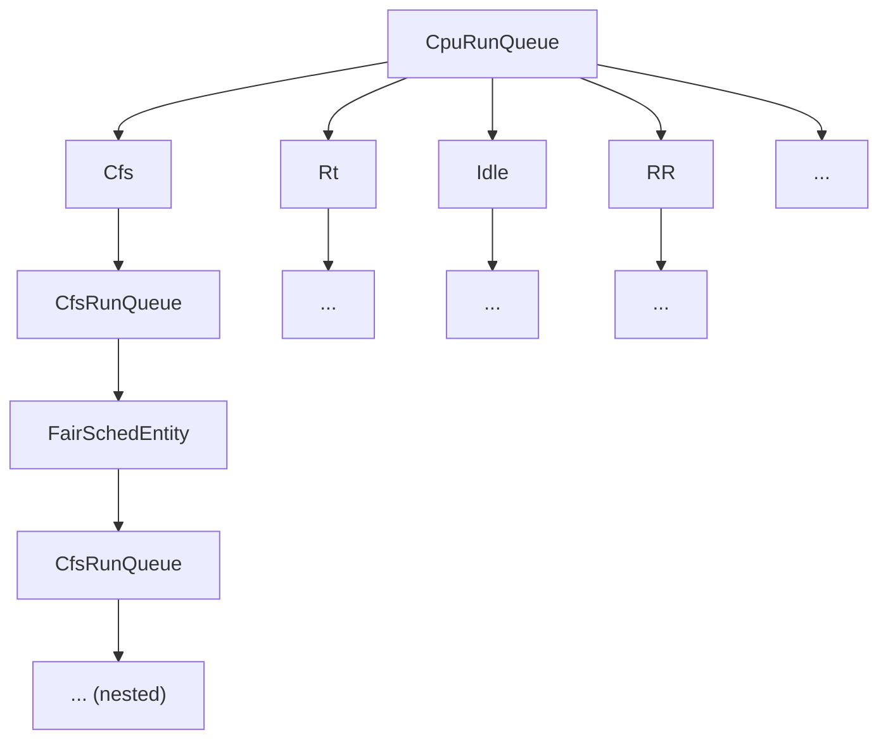
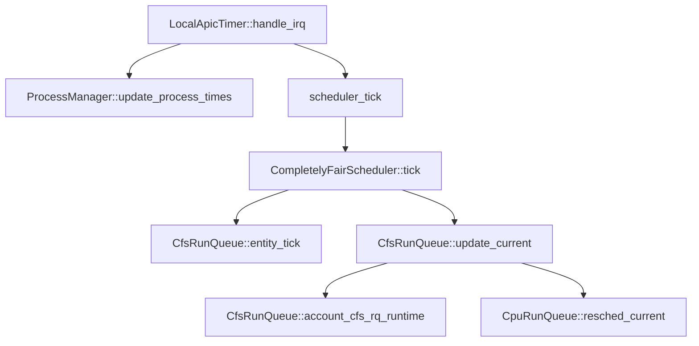

# APIs Related to Process Scheduler

 This section defines the APIs related to process scheduling in DragonOS, which are the interfaces for the system to perform process scheduling. It also abstracts the Scheduler trait to allow specific scheduler implementations.

## Introduction to Scheduler

 Generally, a system handles multiple requests at the same time, but its resources are limited and prioritized. Scheduling is the method used to coordinate each request's usage of these resources.

## Overall Architecture

The entire scheduling subsystem is organized as a **tree**. Each CPU manages one such tree, and that CPU's `CpuRunQueue` is the root. Under each `CpuRunQueue` are subtrees for different scheduling policies; the scheduler walks into the matching subtree to make a decision. The overall structure is:

This layout makes it easier to decouple the scheduling subsystem and add more policies.

## Important Structures

- `Scheduler`: the interface each scheduling algorithm exposes to the upper layer. Implementing a new policy only requires providing this set of APIs.
- `CpuRunQueue`: the per-CPU run queue. It dispatches according to the current policy and is the root of the scheduling subtree.
  - **Important fields**
    - `lock`: a process lock. After entering a specific policy, the scheduler still needs to read `CpuRunQueue`. CFS keeps a `CpuRunQueue` reference, so once the outer path holds the lock, inner objects must be able to access it without taking it again. An object lock would deadlock because the outer path already holds `CpuRunQueue`. See [CpuRunQueue::self_lock and its comments](https://code.dragonos.org.cn/xref/DragonOS/kernel/src/sched/mod.rs?r=dd8e74ef0d7f91a141bd217736bef4fe7dc6df3d#360).
    - `cfs`: root of the CFS subtree. See the completely fair scheduler documentation.
    - `current`: the process currently running on this CPU.
    - `idle`: the idle process of this CPU.

## Scheduling Flow

A successful schedule happens in two ways: an explicit call to `__schedule` or `schedule`, or a timer interrupt that decides the current task has used up its time.

- **Voluntary schedule**
  - `__schedule` and `schedule`:
    - `__schedule`: actually picks the next task according to the current policy.
    - `schedule`: a wrapper around `__schedule`. It requires the task to have released all in-kernel resources, i.e. `preempt_count` must be 0; otherwise it **panics**.
    - Both functions take a `SchedMode` that controls this schedule:
      - `SchedMode::SM_NONE`: the current process yielded and will **not** be requeued until something wakes it. Used by semaphores, wait queues, and other wake-up paths.
      - `SchedMode::SM_PREEMPT`: the current process was **preempted** and **will** be put back on the run queue.

- **Timer-driven schedule**

  When a timer interrupt arrives, the scheduler updates accounting and decides whether another schedule is needed. The main call stack is:

  - `LocalApicTimer::handle_irq`: interrupt handler
    - `ProcessManager::update_process_times`: update the current process's time accounting
    - `scheduler_tick`: scheduler tick entry
      - `CompletelyFairScheduler::tick`: CFS tick entry
        - `CfsRunQueue::entity_tick`: tick every scheduling entity
        - `CfsRunQueue::update_current`: update the running task's runtime and check whether it expired
          - `CfsRunQueue::account_cfs_rq_runtime`: account the queue's runtime
          - `CpuRunQueue::resched_current`: if the previous step expired, set `NEED_SCHEDULE` on the process
  - Leaving the interrupt: if the current process has `NEED_SCHEDULE`, call `__schedule`.
