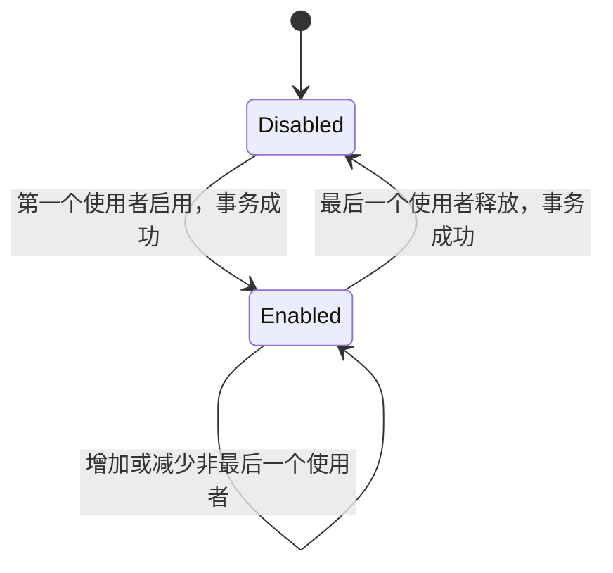
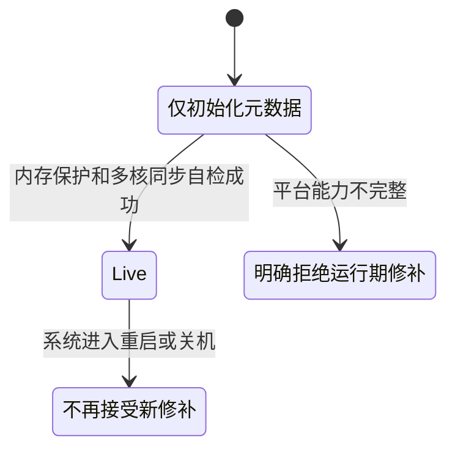

# DragonOS 运行时文本修补：原理、使用与安全边界

## 概述

运行时文本修补（Text Patching）是 DragonOS 在内核运行期间安全调整少量指令的基础能力。它主要服务于 static key：当追踪、性能分析等功能关闭时，相关判断可以保持接近零开销；功能开启后，内核再把对应执行路径切换到启用状态。

这项能力解决的核心问题不是“如何写入一段内存”，而是如何在多核系统中安全地修改所有处理器都可能正在执行的内核代码。DragonOS 将代码修改、处理器同步、内存权限和功能生命周期统一纳入一次受控事务，避免处理器观察到不完整指令或不一致状态。

当前版本在 **x86_64** 上提供运行期支持。RISC-V 和 LoongArch64 会在必要的多核同步与内存保护设施完整之前保持关闭，不会退回到不安全的直接写入方式。

### 如何阅读本文

- 如果你是使用 tracefs、perf 等工具的用户，可以重点阅读“用户可感知的变化”和“架构支持状态”；
- 如果你正在开发 tracepoint 或其他 static-key 使用者，需要理解“整体方案”“面向内核开发者的使用原则”和“系统生命周期”；
- 如果你在移植新处理器架构，需要同时满足事务、多核取指同步、W^X 和失败原子性，不能只实现指令写入。

## 为什么需要它

static key 的目标是让关闭状态尽可能便宜。例如，未启用的 tracepoint 不应在高频路径上反复读取开关变量并执行条件分支，而应直接沿正常路径运行。只有开关状态变化时，内核才调整一次对应指令。

在单核启动早期，直接替换尚未并发执行的指令相对简单；系统进入多核运行后，情况完全不同：

- 其他处理器可能正在执行或预取目标位置；
- 代码页不应为了修改而长期保持可写；
- 数据写入完成不代表其他处理器已经刷新了取指状态；
- 功能的逻辑状态、回调注册状态和实际指令必须保持一致；
- 更新失败不能留下部分生效的代码或错误的引用计数。

因此，运行时文本修补必须是一项由内核统一管理的系统能力，而不能由各个 tracepoint 或性能事件自行修改代码。

## 整体方案

一次文本修补分为准备、协调、提交和发布四个阶段：

### 1. 准备与完整校验

内核先收集本次更新涉及的全部位置，并确认：

- 目标属于允许修改的内核正文区域；
- 现场指令仍与预期旧状态一致；
- 修改项之间不存在重叠；
- 目标没有落入文本修补自身依赖的关键路径；
- 当前系统状态和调用上下文允许执行同步事务。

所有可能正常返回的错误都在真正写入前处理。只要准备阶段失败，本次事务就不会修改任何指令，也不会发布新的 static-key 状态。

### 2. 多核协调

x86_64 后端会让其他在线处理器进入一个短暂、不可被本次修补影响的同步点。只有确认所有目标处理器都已到达后，发起处理器才进入提交阶段。

同步点只用于低频控制操作，不位于 tracepoint 的日常执行路径。因而，修补操作本身需要付出一次跨处理器协调成本，但功能关闭时的高频路径不会增加额外读取或分支。

### 3. 受控写入与 W^X

内核正文保持只读且可执行。需要更新时，DragonOS 使用专门预留的、短生命周期的“可写但不可执行”映射访问同一物理页，完成后立即撤销该映射。

这遵循 W^X 原则：一个虚拟映射不会同时具有可写和可执行权限。普通子系统无法借用这些映射，它们只属于文本修补事务，并且不会在事务结束后残留。

### 4. 取指同步与状态发布

写入完成后，每个参与处理器都必须执行架构要求的取指同步，并向发起处理器确认完成。随后其他处理器才恢复正常执行，static key 的逻辑状态才对外发布。

这个顺序保证：

- 成功返回后，不会再有处理器因陈旧取指状态新进入旧路径；
- 代码修改失败时，功能状态仍保持原值；
- 并发的开启和关闭操作按统一顺序执行，不会互相穿插。

文本修补把“第一条指令开始写入”视为提交点。提交点之前，处理器未能按时到达同步点、现场状态变化或权限检查失败都可以安全终止，且不会留下修改。提交点之后则不能把部分更新作为普通错误返回；内核必须完成剩余同步。如果出现无法继续完成的内部不变量破坏，只能进入受控停止状态，避免在未知指令状态下继续运行。

## static key 与 tracepoint

文本修补目前最重要的使用者是 tracepoint static key。多个使用者可以共同启用一个 tracepoint，只有第一个使用者到来时才切换执行路径；最后一个使用者离开时才恢复关闭路径。

引用状态只在文本修补成功后更新。如果切换失败，原有使用者、回调和指令状态均保持不变。

需要特别注意：处理器取指同步不是回调生命周期的宽限期。某个处理器可能在同步开始前已经进入回调。DragonOS 通过回调快照的强引用继续保存在途资源，确保注销动作不会释放仍在使用的数据。

## 用户可感知的变化

对普通应用程序，文本修补不引入新的系统调用或配置步骤。它改善的是已有追踪和性能分析功能在多核环境中的可靠性：

- 运行期启用或关闭 tracepoint 时，不再直接改写正在执行的代码；
- 功能关闭时仍保留 static key 的低开销路径；
- 不支持安全修补的平台会明确拒绝运行期切换，而不是冒险继续；
- 关闭性能事件时，可能睡眠的清理工作由安全的内核工作线程完成，不在任意对象析构上下文中等待处理器同步。

用户态工具应把“不支持运行期切换”视为平台能力限制。它不表示追踪数据损坏，也不会触发不安全的兼容回退。

## 面向内核开发者的使用原则

### 适用场景

文本修补适用于低频切换、但关闭状态位于高频路径的内核功能，例如 tracepoint 和未来经过评审的 static-key 使用者。

它不等同于通用热补丁框架，也不应用于：

- 任意函数体替换；
- 模块重定位；
- 动态生成代码；
- 高频配置更新；
- 不可屏蔽异常路径中可能执行的 x86 目标。

### 上下文要求

发起更新的路径必须允许睡眠和等待处理器同步。硬中断、不可屏蔽异常、持有自旋锁或禁止抢占的路径不能发起文本修补。

static-key 声明需要明确审计目标是否可能从 NMI 或 MCE 路径到达。当前 x86_64 协调机制只能暂停可屏蔽的执行流，因此无法证明安全的目标不得接入该后端。

### 生命周期要求

消费者应遵循以下顺序：

1. 准备并发布新路径需要的回调和资源；
2. 成功启用 static key；
3. 正常运行；
4. 成功关闭 static key，阻止新的执行者进入；
5. 等待或保留已经在途的回调资源，再完成释放。

对象析构不能直接执行文本修补。DragonOS 的性能事件关闭路径会预先准备释放请求，并把需要等待的工作交给可睡眠的专用工作线程。

### 错误处理

调用者必须处理“当前平台不可用”“上下文不允许”或“准备阶段校验失败”等结果，且不得自行退回直接写内核正文。

如果可信的 static-key 元数据与现场代码不一致，这通常意味着内核不变量已经被破坏。此类错误不能作为普通配置失败忽略，更不能在未知代码状态下继续运行。

## 系统生命周期

文本修补具有明确的系统状态：

- **Early**：内核仍在初始化，只建立元数据和必要基础设施；
- **Live**：平台已通过内存权限和全处理器同步检查，可以接受运行期事务；
- **Unavailable**：平台缺少必要能力，所有运行期请求都以失败结束；
- **Quiesced**：系统正在停止，已开始的事务完成后不再接受新事务，现有资源保留到处理器停止。

DragonOS 当前没有运行期 CPU 热插拔。x86_64 只在所有启动处理器均已上线并通过同步自检后进入 Live，随后在线处理器集合保持稳定。未来加入 CPU 热插拔时，新处理器必须先同步到当前文本版本，才能进入在线状态。

## 架构支持状态

| 架构 | 当前状态 | 说明 |
| --- | --- | --- |
| x86_64 | 可用 | 支持多核协调、受控写映射和全处理器取指同步 |
| RISC-V | 暂不可用 | 需要补齐可靠的多核启动、逻辑 CPU 到 hart 的拓扑映射、远程取指同步和内核 W^X |
| LoongArch64 | 暂不可用 | 需要补齐页表权限、fixmap、IPI、多核同步，并消除可写执行映射暴露 |

“暂不可用”是安全门禁，而不是功能降级。只有某架构能够提供与 x86_64 等价的事务、权限和完成语义后，才会启用运行期修补。

## 安全与性能保证

当前方案建立以下对外保证：

- 处理器只会执行完整的旧指令或完整的新指令；
- 准备阶段失败不会留下部分修改；
- 内核正文不会因为修补而变成可写执行映射；
- 成功返回前，所有在线处理器均完成架构要求的取指同步；
- static-key 状态不会领先于实际指令发布；
- 功能关闭路径不增加额外的原子变量读取或软件条件分支；
- 不满足安全前提的平台和调用上下文会明确失败。

跨处理器同步会增加启用和关闭操作的延迟。这是有意的安全成本，发生在低频控制面，不影响关闭状态的日常执行性能。

## 与 Linux 的关系

本方案遵循 Linux static key 和运行时文本修改的核心职责划分：统一串行修改、提交前校验、严格管理写权限，并在代码更新后完成架构要求的处理器同步。

DragonOS 当前选择了适合现有内核基础设施的同步处理器方案，而没有直接引入 Linux 更复杂的断点辅助文本修补、完整 CPU hotplug 或 livepatch 框架。这样既满足 static key 的安全要求，也避免为尚不存在的使用场景增加额外机制。若未来的测量数据表明切换延迟成为实际瓶颈，再基于同一安全契约评估更复杂的优化方案。

## 设计边界与后续演进

当前实现是一项专门服务于 static key 的内核基础能力，而不是任意代码重写框架。其边界来自现阶段已经能够证明和测试的安全条件：目标是预先生成的短指令、切换发生在低频控制面、目标不可从 NMI/MCE 到达，并且在线处理器集合在运行期间保持稳定。

这组边界让 DragonOS 能在不过度引入复杂机制的前提下，完整解决多核 static-key 切换的正确性问题。后续能力扩展必须继续满足相同原则：

- 如果增加新的指令类型或消费者，需要证明旧状态校验、批量提交和失败原子性仍然成立；
- 如果支持运行期 CPU 热插拔，需要让处理器上线、离线与文本事务共享同一个在线集合一致性协议；
- 如果支持 NMI/MCE 可达目标，需要采用能够安全处理不可屏蔽并发执行的专用方案，不能放宽当前审计要求；
- 如果启用 RISC-V 或 LoongArch64，需要先补齐对应架构的内存权限、处理器拓扑与远程取指同步能力；
- 如果未来切换延迟成为经测量确认的性能问题，可以优化协调协议，但不能牺牲 W^X、事务发布顺序或回调生命周期保证。

## 延伸阅读

- [Tracepoints](tracepoint.md)
- [Kprobe](kprobe.md)
- [eBPF](eBPF.md)
- [DragonOS Issue #2201](https://github.com/DragonOS-Community/DragonOS/issues/2201)
