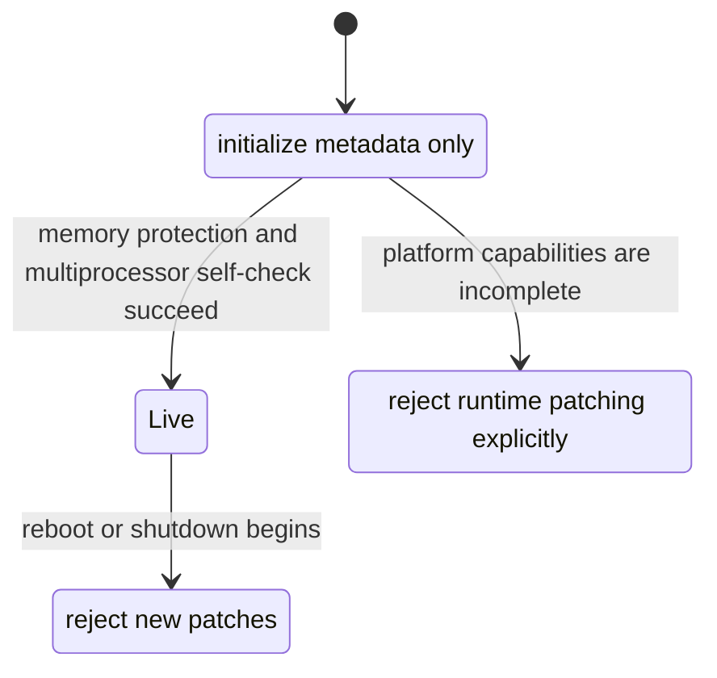

::: info
**Translation Notice**

This document is an English translation of `kernel/trace/text_patching.md`. If the two versions differ, the Chinese source document is authoritative.
:::

# DragonOS Runtime Text Patching: Principles, Usage, and Safety Boundaries

## Overview

Runtime text patching is the DragonOS kernel facility for safely changing a small number of instructions while the kernel is running. Its primary consumer is the static-key mechanism: when tracing, profiling, or a similar feature is disabled, the associated check can remain nearly free; when the feature is enabled, the kernel switches the corresponding execution path.

The central problem is not simply how to write memory. It is how to modify kernel code that may be executing concurrently on multiple processors. DragonOS treats code modification, processor synchronization, memory permissions, and feature lifecycle as one controlled transaction, preventing processors from observing incomplete instructions or inconsistent state.

The current release supports runtime text patching on **x86_64**. RISC-V and LoongArch64 remain disabled until their required multiprocessor synchronization and memory-protection facilities are complete. They never fall back to unsafe direct writes.

### How to Read This Document

- If you use tools such as tracefs or perf, focus on “User-Visible Changes” and “Architecture Support.”
- If you develop tracepoints or other static-key consumers, read “Overall Design,” “Guidelines for Kernel Developers,” and “System Lifecycle.”
- If you are porting DragonOS to a new processor architecture, you must provide transactional updates, multiprocessor instruction-fetch synchronization, W^X, and failure atomicity—not merely an instruction-writing primitive.

## Why It Is Needed

A static key is intended to make the disabled state as inexpensive as possible. For example, a disabled tracepoint should not repeatedly load a flag and take a conditional branch on a hot path. The normal path should execute directly, and the kernel should adjust the relevant instruction only when the feature state changes.

Replacing an instruction early during single-processor boot is comparatively simple because the target is not yet executing concurrently. Once the system is running on multiple processors, several additional constraints apply:

- another processor may be executing or prefetching the target location;
- code pages must not remain writable merely to support updates;
- completing a data write does not mean that other processors have synchronized instruction fetch;
- the logical feature state, callback registration, and actual instruction must agree;
- a failed update must not leave partially applied code or an incorrect reference count.

Runtime text patching must therefore be a kernel-wide facility. Individual tracepoints and performance events must not modify executable text on their own.

## Overall Design

A text-patching transaction has four phases: preparation, coordination, commit, and publication.

### 1. Preparation and Complete Validation

The kernel first collects every location involved in the update and verifies that:

- each target belongs to an approved kernel-text region;
- the instruction at each location still matches the expected old state;
- update ranges do not overlap;
- no target belongs to a critical path required by text patching itself;
- the current system state and calling context permit a synchronized transaction.

Every failure that can be returned normally is handled before the first instruction is changed. If preparation fails, the transaction changes neither the instructions nor the published static-key state.

### 2. Multiprocessor Coordination

On x86_64, the backend brings every other online processor to a short synchronization point that cannot itself be affected by the current patch. The initiating processor enters the commit phase only after every target processor has arrived.

This synchronization point is used only for infrequent control operations. It is not part of normal tracepoint execution. Enabling or disabling a feature therefore incurs one cross-processor coordination operation, while the disabled hot path gains no additional loads or branches.

### 3. Controlled Writes and W^X

Kernel text remains read-only and executable. During an update, DragonOS accesses the same physical page through dedicated, short-lived mappings that are writable but not executable. These mappings are removed immediately after the update.

This follows the W^X principle: no virtual mapping is both writable and executable. Ordinary subsystems cannot borrow the text-patching mappings. They belong exclusively to a transaction and cannot remain mapped after it ends.

### 4. Instruction-Fetch Synchronization and State Publication

After the write, every participating processor performs the architecture-required instruction-fetch synchronization and acknowledges completion. Only then may the other processors resume normal execution and the new static-key state become visible.

This ordering guarantees that:

- after a successful return, no processor can newly enter the old path because of stale instruction-fetch state;
- if code modification fails, the logical feature state remains unchanged;
- concurrent enable and disable operations execute in one global order and cannot interleave.

Text patching treats the first instruction write as the commit point. Before that point, failure to gather all processors, a change in expected state, or a permission-check failure can safely abort without leaving modifications. After the commit point, a partial update cannot be returned as an ordinary error: the kernel must finish the remaining synchronization. If an internal invariant prevents completion, the kernel enters a controlled fail-stop state rather than continuing with unknown instruction state.

## Static Keys and Tracepoints

The principal current consumer of text patching is the tracepoint static key. Multiple consumers may share one tracepoint. The execution path changes only when the first consumer enables it, and it returns to the disabled path only when the last consumer leaves.

```mermaid
stateDiagram-v2
    [*] --> Disabled
    Disabled --> Enabled: first consumer enables; transaction succeeds
    Enabled --> Enabled: add a consumer or remove a non-final consumer
    Enabled --> Disabled: final consumer releases; transaction succeeds
```

Reference state changes only after text patching succeeds. If the switch fails, the prior consumer, callback, and instruction states remain intact.

Instruction-fetch synchronization is not a callback grace period. A processor may already have entered a callback before synchronization begins. DragonOS retains strong references in callback snapshots so that unregistering a callback cannot free data still used by an in-flight invocation.

## User-Visible Changes

Text patching adds no new system call or configuration step for ordinary applications. It improves the reliability of existing tracing and profiling facilities on multiprocessor systems:

- enabling or disabling a tracepoint at runtime no longer directly overwrites code that other processors may be executing;
- the disabled path retains the low overhead expected from static keys;
- a platform that cannot patch safely rejects runtime switching instead of proceeding unsafely;
- when a performance event is closed, cleanup that may sleep is performed by a safe kernel worker rather than waiting for processor synchronization in an arbitrary object-destruction context.

User-space tools should interpret “runtime switching is unsupported” as a platform capability limitation. It does not imply corrupted trace data, and it does not trigger an unsafe compatibility fallback.

## Guidelines for Kernel Developers

### Appropriate Uses

Text patching is intended for kernel features that switch infrequently but place a disabled check on a hot path, such as tracepoints and future reviewed static-key consumers.

It is not a general-purpose hot-patching framework and must not be used for:

- arbitrary function-body replacement;
- module relocation;
- dynamically generated code;
- high-frequency configuration changes;
- x86 targets that can execute in a non-maskable exception path.

### Context Requirements

The update path must be allowed to sleep and wait for processor synchronization. Hard-interrupt and non-maskable-exception paths, as well as paths holding a spinlock or running with preemption disabled, cannot initiate text patching.

Every static-key declaration must include an explicit audit of whether its target is reachable from an NMI or MCE path. The current x86_64 coordination mechanism can pause only maskable execution. A target whose safety cannot be established must not use this backend.

### Lifecycle Requirements

A consumer must use the following order:

1. prepare and publish the callbacks and resources required by the new path;
2. enable the static key successfully;
3. operate normally;
4. disable the static key successfully so no new invocations enter;
5. wait for, or retain resources for, callbacks already in flight before completing release.

Object destruction must not perform text patching directly. The DragonOS performance-event close path prepares a release request in advance and delegates work that may wait to a dedicated sleepable worker.

### Error Handling

Callers must handle results such as “unavailable on this platform,” “invalid calling context,” and “preparation validation failed.” They must never fall back to writing kernel text directly.

If trusted static-key metadata disagrees with the instruction currently present, a kernel invariant has probably been violated. This condition cannot be ignored as an ordinary configuration failure, and execution must not continue with unknown code state.

## System Lifecycle

Text patching has an explicit system state:

- **Early**: the kernel is still initializing and only establishes metadata and required infrastructure;
- **Live**: the platform has passed memory-permission and all-processor synchronization checks and may accept runtime transactions;
- **Unavailable**: the platform lacks required capabilities, so every runtime request fails without modifying code;
- **Quiesced**: the system is stopping; transactions already in progress finish, no new transaction starts, and existing resources remain alive until processors stop.

DragonOS currently has no runtime CPU hotplug. x86_64 enters Live only after all boot processors are online and pass the synchronization self-check. The online processor set then remains stable. When runtime hotplug is added, a new processor must synchronize to the current text version before becoming online.

## Architecture Support

| Architecture | Current status | Description |
| --- | --- | --- |
| x86_64 | Available | Provides multiprocessor coordination, controlled writable mappings, and all-processor instruction-fetch synchronization |
| RISC-V | Unavailable for now | Requires reliable multiprocessor startup, logical-CPU-to-hart topology, remote instruction-fetch synchronization, and kernel W^X |
| LoongArch64 | Unavailable for now | Requires page-table permissions, fixmap, IPI and multiprocessor synchronization, and removal of writable executable mapping exposure |

“Unavailable for now” is a safety gate, not a degraded operating mode. Runtime text patching is enabled on an architecture only after it can provide transaction, permission, and completion guarantees equivalent to those on x86_64.

## Safety and Performance Guarantees

The current design provides the following external guarantees:

- a processor executes either the complete old instruction or the complete new instruction;
- a preparation failure leaves no partial update;
- patching never turns kernel text into a writable and executable mapping;
- before a successful return, every online processor completes the required instruction-fetch synchronization;
- static-key state is never published ahead of the actual instruction;
- the disabled path adds no atomic-variable load or software conditional branch;
- unsupported platforms and invalid calling contexts fail explicitly.

Cross-processor synchronization increases enable and disable latency. This is a deliberate safety cost on an infrequent control path and does not affect steady-state performance while the feature is disabled.

## Relationship to Linux

The design follows the core separation of responsibilities used by Linux static keys and runtime text modification: serialize updates globally, validate before commit, strictly control write permissions, and perform the architecture-required processor synchronization after changing code.

DragonOS currently uses a processor-rendezvous design suited to its existing kernel infrastructure. It does not import Linux's more complex breakpoint-assisted text patching, full CPU-hotplug framework, or livepatch framework. This satisfies static-key safety requirements without adding mechanisms for use cases DragonOS does not yet have. If measurement later shows switching latency to be a real bottleneck, a more complex optimization can be evaluated under the same safety contract.

## Design Boundaries and Future Evolution

The current implementation is a kernel facility specifically for static keys, not an arbitrary code-rewriting framework. Its boundaries reflect the safety conditions DragonOS can currently prove and test: targets are short instructions generated in advance, switching occurs on an infrequent control path, targets are unreachable from NMI/MCE, and the online processor set remains stable at runtime.

These boundaries let DragonOS fully solve multiprocessor static-key correctness without introducing unnecessary mechanisms. Future extensions must preserve the same principles:

- a new instruction type or consumer must preserve old-state validation, batched commit, and failure atomicity;
- runtime CPU hotplug must make processor online/offline transitions participate in the same online-set consistency protocol as text transactions;
- NMI/MCE-reachable targets require a dedicated mechanism that is safe against non-maskable concurrent execution rather than a relaxation of the current audit requirement;
- RISC-V or LoongArch64 support requires architecture memory permissions, processor topology, and remote instruction-fetch synchronization first;
- if switching latency becomes a measured performance problem, the coordination protocol may be optimized without weakening W^X, transactional publication order, or callback-lifecycle guarantees.

## Further Reading

- [Tracepoints](tracepoint.md)
- [Kprobe](kprobe.md)
- [eBPF](eBPF.md)
- [DragonOS Issue #2201](https://github.com/DragonOS-Community/DragonOS/issues/2201)

