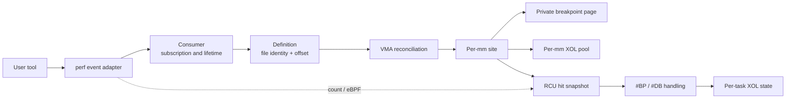
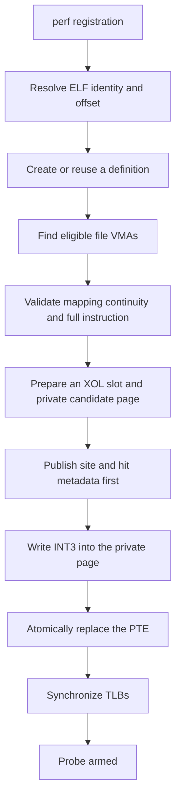
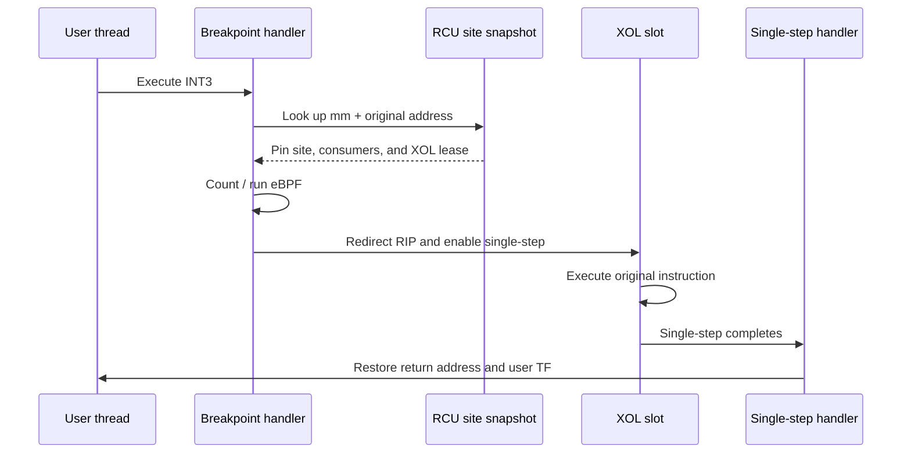
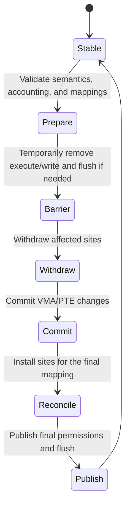

# Uprobe: Dynamic Probes for User Space

Uprobes observe instructions in user-space ELF files and shared libraries. A user selects a file and offset through a perf event; when a target process reaches that instruction, DragonOS can count the hit or run an attached eBPF program.

::: warning
Four ideas form the core mental model:

1. A probe is defined by **file identity and file offset**, not by one process's virtual address.
2. The breakpoint is written only to a **private page in the target address space**. The page cache is never patched.
3. The replaced instruction runs from an **XOL (execute out of line)** area so that the program can continue normally.
4. Publication, withdrawal, and VMA changes follow strict concurrency ordering, preventing an orphan breakpoint with no matching metadata.
:::

## Current scope

| Capability | Status |
| --- | --- |
| Entry probes in ELF files and shared libraries | Supported |
| Task-scoped and system-wide perf events | Supported |
| Hit counting and eBPF callbacks | Supported |
| User-space execution on x86_64 | Supported |
| Uretprobes (return probes) | Not yet supported |
| Perf sampling and ring buffers | Not yet supported |

This document focuses on architecture and correctness principles. It does not repeat the generic perf ABI, the eBPF instruction set, or user-tool documentation.

## Architecture at a glance

The architecture separates five ownership domains:

- A **definition** identifies and analyzes an instruction by canonical file identity and offset.
- A **consumer** represents an observer. One definition may have task-scoped and system-wide consumers.
- A **site** represents an armed virtual address in one address space. Multiple consumers at the same address share the site.
- The **XOL pool** stores executable copies of original instructions. A lease pins a slot and its page until execution has completed.
- The **hit snapshot and task state** serve the exception hot path without allocation or an address-space write lock.

::: info
A consumer is not a site. One system-wide consumer can create sites in many processes, while one site can serve many consumers. This distinction is essential when reasoning about fork, exec, close, and concurrent registration.
:::

## From registration to an armed breakpoint

### 1. Locate instructions in file coordinates

The same shared object may be mapped at different virtual addresses. A definition therefore stores a canonical inode identity and file offset, not a process address. Reconciliation combines that coordinate with each VMA's file offset to derive the actual probe address.

This supports ASLR and lets one system-wide probe apply to multiple address spaces.

### 2. Install only in eligible mappings

New installation requires a private, executable-capable, file-backed, non-writable mapping. Shared or writable mappings allow instruction bytes to change without kernel mediation and are not a stable basis for a new breakpoint.

Instructions may cross a page or an adjacent VMA. Installation then verifies that every byte belongs to a continuous range of the same file and that the mapping identity remains stable throughout preparation.

### 3. Privatize the breakpoint page

DragonOS never writes `INT3` into the page cache, which would unexpectedly modify every process mapping the file. Instead, it prepares a private page for the target address space, replaces only the first byte at the probe address, and atomically swaps that address space's PTE.

### 4. Publish metadata before exposing INT3

The most important ordering rule is:

> Before any CPU can observe `INT3`, all site, participant, and XOL metadata required by the exception handler must already be visible.

Only after publication does DragonOS replace the PTE and perform a synchronous TLB flush. Fallible work is kept before this boundary; after it, the commit consists only of operations prepared to succeed.

## How one hit executes

### Why XOL is necessary

Temporarily restoring the instruction in place is unsafe: another CPU in the same process may reach the address while its contents are changing.

XOL copies the original instruction into a dedicated executable slot. The exception handler redirects the user RIP there and uses x86 single-step completion to resume at the address after the original instruction. RIP-relative instructions receive a reachable relocation slot. Control-flow and system instructions that cannot be moved safely are rejected during registration.

### User-visible context remains original

The XOL address is an implementation detail. eBPF, signals, and rseq must observe the logical probe address rather than the slot. If rseq needs to redirect execution to an abort handler, DragonOS first terminates the active XOL state and then publishes the new user RIP, so a later `#DB` cannot overwrite the redirect.

## VMA changes and transaction boundaries

`mmap`, `munmap`, `mprotect`, `mremap`, `madvise`, fork, and exec can all change mappings on which probes depend. An address-space write lock alone does not stop another CPU in the same process from fetching instructions, so reconciliation cannot rely on locking alone.

DragonOS organizes sensitive changes into these conceptual phases:

Not every operation needs every phase, but all operations preserve these invariants:

::: warning
- **No orphan breakpoint:** if user space can execute `INT3`, matching hit metadata and an XOL lease exist.
- **The page cache stays clean:** breakpoints exist only in private per-mm pages.
- **Withdrawal has a completion barrier:** the original byte and TLB rendezvous complete before the site leaves the hit index.
- **Readers outlive resources:** admitted callbacks, RCU readers, and active XOL execution finish before consumer, BPF, or slot storage is freed.
:::

### Fork

A private COW page can make a child inherit a parent's `INT3`, even though task-scoped perf events do not inherit. DragonOS first performs strict child sanitization to remove inherited breakpoints, then replays system-wide consumers on a best-effort basis. The child therefore never executes a breakpoint for which it has no hit metadata.

### Exec

Exec replaces the address space. Active consumers owned by the current task can be replayed into the new image; consumers owned by unrelated tasks must not force a full VMA scan. Epoch publication, the task index, and file reverse mappings form a handshake with concurrent enable, ensuring that the new image is not missed.

### Close and withdrawal

When the last perf file reference closes, DragonOS synchronously closes admission for new installation and new callbacks. A sleepable control path then drains existing readers and withdraws sites. Byte restoration is conditional: the old byte is written only if the location still contains `INT3`, so closing an event does not overwrite a byte that user space wrote after making the mapping writable.

## Lifetime summary

| Object | Scope | Main responsibility | Safe release point |
| --- | --- | --- | --- |
| Definition | File identity + offset | Store and analyze the canonical instruction | No consumer references remain |
| Consumer | Perf event | Scope, epoch, count, and eBPF | Admission is closed and readers are drained |
| Site | One mm + virtual address | Shared breakpoint and participant set | Byte restored, TLB synchronized, and hit index withdrawn |
| XOL lease | Site or active hit | Pin slot and page lifetime | After `#DB`, abort, or task exit |
| Task XOL state | Current task | Connect `#BP`, XOL, `#DB`, signals, and rseq | State returns to Idle |

## Performance model

| Path | Design priority |
| --- | --- |
| `#BP` / `#DB` hit path | No allocation, sleeping, or address-space write lock; use RCU snapshots and task-local state |
| Register, enable, disable, close | Allocation, locking, and TLB synchronization are allowed; coordinate by file, VMA, and site |
| VMA system calls | Fast rejection when no relevant consumer exists; build transactions and barriers only when required |

The hit path necessarily visits every active participant at a site because each consumer must receive the event. Control-path snapshots use structural sharing and exact indexes to avoid quadratic behavior with many consumers at one address or many offsets in one file.

## Linux-compatible boundaries and limitations

- Installation during ordinary mapping reconciliation is **best effort**. Resource pressure, mapping changes, or instruction mismatch do not turn an otherwise successful `mmap` or fork into a failure. Explicit perf event creation or enable still reports relevant errors.
- New installation rejects writable and shared mappings. A private existing site may survive a pure `mprotect` transition that adds write permission. If user space overwrites `INT3`, the probe naturally stops hitting, and close will not overwrite the new byte.
- A definition is a stable snapshot taken during initial analysis. As on Linux, self-modifying code or external file modification while a probe is active does not guarantee live XOL re-analysis. Mapping-identity changes do trigger withdrawal or reconciliation.
- User-space uprobes currently execute only on x86_64 and reject instructions that cannot safely use XOL. Uretprobes are not implemented yet.

## Suggested source-reading order

When continuing into the source, follow responsibilities rather than the raw call graph:

1. the perf layer for file descriptors, event state, counting, and eBPF;
2. consumers and definitions for file coordinates, scope, and epochs;
3. reconciliation and sites for mapping definitions into each mm;
4. XOL and exception handling for transparent hit execution;
5. fork, exec, and VMA transactions for concurrency and lifetime closure.

This order establishes the ownership model before introducing exception and page-table details.
