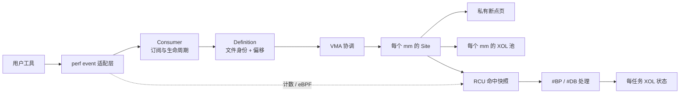
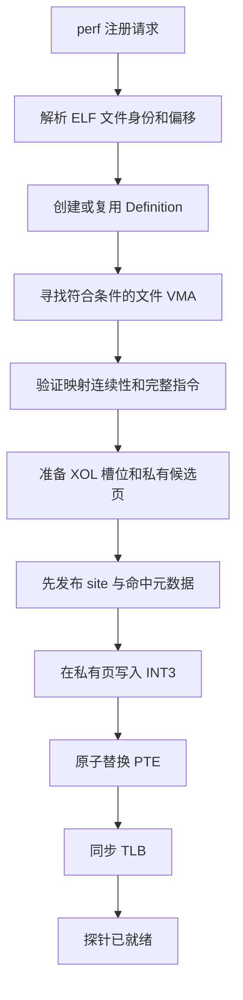
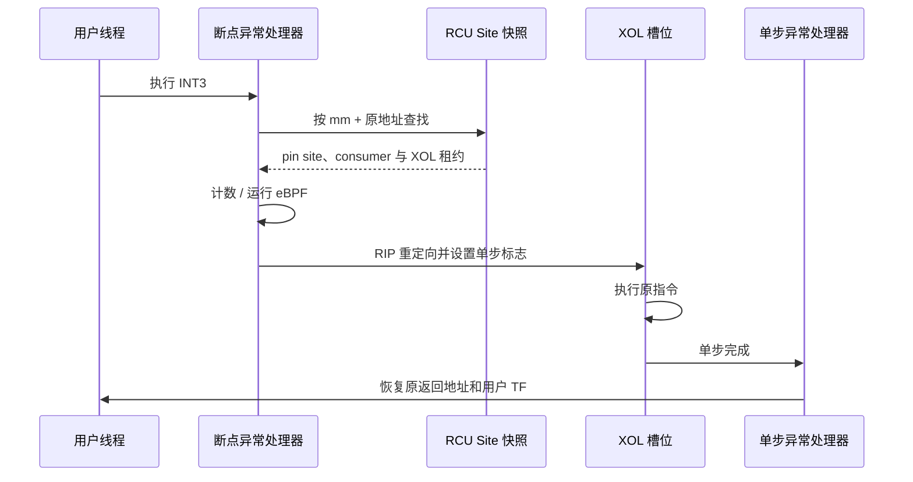
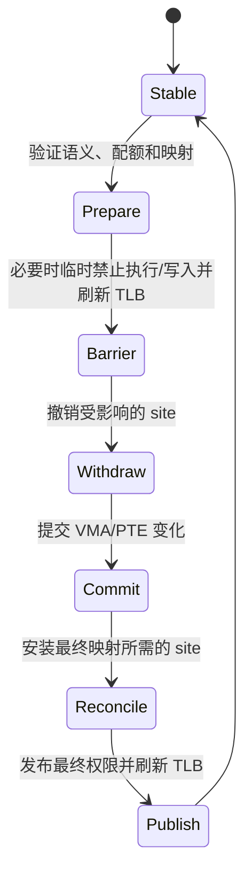

# Uprobe：用户态动态探针

Uprobe 允许观察一个用户态 ELF 文件或共享库中的指令。用户通过 perf event 指定文件和偏移；当目标进程执行到该位置时，DragonOS 可以累计命中次数，或运行附着的 eBPF 程序。

:::{important}
理解 DragonOS uprobe，只需要先记住四件事：

1. 探针由**文件身份和文件偏移**定义，而不是由某个进程里的虚拟地址定义。
2. 断点只写入目标地址空间的**私有副本页**，绝不修改文件页缓存。
3. 被替换的原指令在 **XOL（Execute Out of Line）** 区域执行，因此程序能够继续运行。
4. 探针的发布、撤销以及 VMA 变化都遵循严格的并发顺序，避免出现“有断点、无元数据”的孤立状态。
:::

## 当前支持范围

| 能力 | 状态 |
| --- | --- |
| ELF/共享库入口探针 | 支持 |
| task-scoped 与 system-wide perf event | 支持 |
| 命中计数与 eBPF 回调 | 支持 |
| x86_64 用户态执行 | 支持 |
| uretprobe（函数返回探针） | 暂不支持 |
| perf sampling/ring buffer | 暂不支持 |

本文重点说明架构和正确性原理。perf event 的通用 ABI、eBPF 指令集及用户工具用法不在这里展开。

## 整体架构

这套设计把不同职责分开：

- **Definition（定义）**描述“文件中的哪条指令”。它使用规范化的文件身份和偏移，并保存一次经过分析的指令快照。
- **Consumer（订阅者）**描述“谁想观察它”。一个定义可以有多个 task-scoped 或 system-wide consumer。
- **Site（站点）**描述“这个地址空间中的哪个虚拟地址已经布置断点”。同一地址的多个 consumer 共享一个 site。
- **XOL 池**保存原指令的可执行副本。每个活动执行都持有租约，保证槽位在退出单步执行前不会被回收。
- **命中快照与任务状态**服务异常热路径，使 `#BP`/`#DB` 处理无需分配内存，也无需获取地址空间写锁。

:::{note}
Consumer 与 site 不是同一个对象。一个 system-wide consumer 可能对应很多进程中的 site；同一个 site 也可能服务多个 consumer。这个区分是理解 fork、exec、关闭和并发注册的关键。
:::

## 从注册请求到可命中的断点

### 1. 用文件坐标定位指令

同一个共享库可以映射到不同虚拟地址。Definition 因此不保存某个进程的地址，而是保存规范化 inode 身份和文件偏移。协调层再根据每个 VMA 的文件偏移，计算该地址空间中的实际探针地址。

这样既支持 ASLR，也能让一个 system-wide 探针复用于多个地址空间。

### 2. 只在合格映射中安装

新安装只考虑可执行、私有、文件支持且不可写的映射。共享或可写映射允许用户在没有内核协调的情况下直接修改指令，不适合作为新断点的稳定基础。

跨页或跨相邻 VMA 的指令也可以被探测，但安装时必须确认所有指令字节来自同一文件的连续区间，并且映射身份在准备期间没有变化。

### 3. 私有化断点页

DragonOS 不会把 `INT3` 写入页缓存，否则所有映射该文件的进程都会被意外修改。内核为目标地址空间准备一个私有页面副本，只替换探针位置的第一个字节，然后原子地替换该地址空间的 PTE。

### 4. 元数据先于断点可见

这是最重要的发布顺序：

> 在任何 CPU 能看到 `INT3` 之前，异常处理所需的 site、参与者和 XOL 元数据必须已经可见。

发布完成后才替换 PTE，并进行同步 TLB 刷新。失败操作尽量放在此边界之前；越过边界后只执行已经准备好的、不可失败的提交步骤。

## 一次命中如何执行

### 为什么需要 XOL

命中断点后，不能简单地在原地址临时恢复指令再执行：同一进程的其他 CPU 可能同时经过该地址，看到的内容会随时变化。

XOL 把原指令复制到地址空间中的专用可执行槽位。异常处理器把用户 RIP 重定向到槽位，并借助 x86 单步异常在指令完成后恢复到原指令的下一地址。对于 RIP-relative 指令，分配器会选择可重定位的槽位；无法安全搬运的控制流或系统指令会在注册阶段被拒绝。

### 用户看到的仍是原始执行上下文

XOL 地址是内核实现细节。eBPF、信号和 rseq 等需要用户逻辑指令地址的机制，应观察原探针地址，而不是槽位地址。如果 rseq 要求跳转到 abort handler，内核会先终止当前 XOL 状态，再发布新的用户 RIP，避免后续 `#DB` 覆盖该跳转。

## VMA 变化与事务边界

`mmap`、`munmap`、`mprotect`、`mremap`、`madvise`、fork 和 exec 都可能改变探针所依赖的映射。单纯持有地址空间写锁并不能阻止同一进程中其他 CPU 取指，因此协调不能只依靠锁。

DragonOS 将关键变化组织为以下阶段：

不同系统调用不一定需要每个阶段，但必须保持以下不变量：

:::{important}
- **绝不出现孤立断点：** 用户能执行 `INT3` 时，命中元数据和 XOL 租约一定存在。
- **页缓存不被修改：** 断点只存在于每个地址空间的私有页中。
- **撤销有完成屏障：** 恢复原字节并完成 TLB rendezvous 后，才从命中索引撤除 site。
- **资源释放晚于读者：** 已进入的回调、RCU 读者和活动 XOL 完成后，才能释放 consumer、BPF 和槽位。
:::

### fork

私有 COW 页可能让子进程继承父进程的 `INT3`，但 task-scoped perf event 默认不继承。DragonOS 会先严格清除子地址空间中继承的断点，再以 best-effort 方式为 system-wide consumer 重放探针。这样子进程不会遇到没有命中元数据的断点。

### exec

exec 会替换整个地址空间。属于当前任务且仍活动的 consumer 可以应用到新映像；其他任务的 consumer 不应导致无关 exec 扫描全部 VMA。成功提交前后通过 epoch、任务索引和文件反向映射形成握手，保证并发 enable 不会漏掉新映像。

### 关闭与撤销

最后一个 perf 文件引用关闭时，DragonOS 先同步关闭“新安装”和“新回调”的准入门，再由可睡眠的控制路径等待已有读者退出并撤销 site。恢复原字节是条件性的：只有当前位置仍是 `INT3` 时才写回，避免覆盖用户在映射变为可写后自行写入的新字节。

## 生命周期一览

| 对象 | 所属范围 | 主要职责 | 何时可以释放 |
| --- | --- | --- | --- |
| Definition | 文件身份 + 偏移 | 保存并分析规范指令 | 没有 consumer 引用时 |
| Consumer | perf event | scope、epoch、计数与 eBPF | 关闭准入并排空读者后 |
| Site | 单个 mm + 虚拟地址 | 共享断点及参与者集合 | 恢复字节、TLB 同步并撤索引后 |
| XOL lease | site/活动命中 | 固定槽位和页面生命周期 | `#DB`、中止或任务退出后 |
| Task XOL state | 当前任务 | 连接 `#BP`、XOL、`#DB` 与信号/rseq | 回到 Idle 后 |

## 性能模型

| 路径 | 设计重点 |
| --- | --- |
| `#BP` / `#DB` 命中热路径 | 无内存分配、无睡眠、无地址空间写锁；使用 RCU 快照和任务本地状态 |
| 注册、enable、disable、close | 允许分配、锁和 TLB 同步；按文件/VMA/site 精确协调 |
| VMA 系统调用 | 无相关 consumer 时快速跳过；有探针时才建立事务和发布屏障 |

命中路径必须遍历该 site 的活动参与者，因为每个 consumer 都需要收到事件。控制路径使用结构共享快照和精确索引，避免在大量同址 consumer 或大量文件偏移下出现二次复杂度。

## Linux 兼容边界与限制

- 普通映射上的探针安装是 **best-effort**。资源不足、映射变化或指令不匹配不会把原本成功的 `mmap`/fork 变成失败；显式创建或启用 perf event 时仍会报告相应错误。
- 新安装拒绝可写或共享映射。已安装的私有 site 在纯 `mprotect` 增加写权限后可以保留；用户若覆盖 `INT3`，后续自然不再命中，关闭时也不会覆盖用户的新字节。
- 指令定义在首次分析时形成稳定快照。与 Linux 一样，探针活动期间的自修改代码或外部文件修改不保证让 XOL 实时重新分析；映射身份发生变化时则会撤销或重新协调。
- 当前只在 x86_64 上执行用户态 uprobe，并拒绝无法安全进行 XOL 的指令。uretprobe 尚未实现。

## 建议的阅读顺序

若要继续阅读源码，建议按职责而不是按调用栈展开：

1. perf 层：理解文件描述符、事件状态、计数与 eBPF 的边界；
2. consumer/definition：理解文件坐标、scope 和 epoch；
3. reconcile/site：理解 VMA 如何变成每个 mm 的断点；
4. XOL 与异常处理：理解一次命中的透明执行；
5. fork/exec/VMA 事务：理解并发和生命周期闭环。

这种顺序能先建立所有权模型，再进入异常和页表细节。
