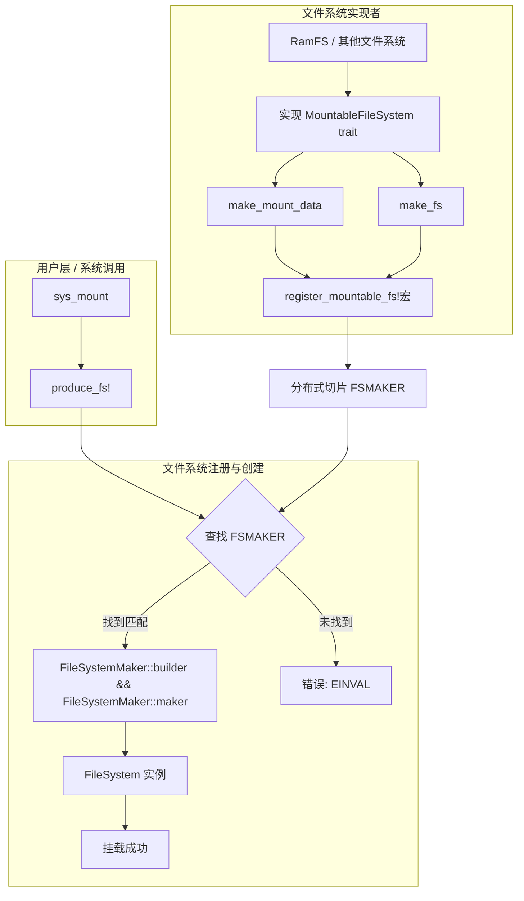

:::{note}
**AI Translation Notice**

This document was automatically translated by `hunyuan-turbos-latest` model, for reference only.

- Source document: kernel/filesystem/vfs/mountable_fs.md

- Translation time: 2025-06-29 09:58:15

- Translation model: `hunyuan-turbos-latest`

Please report issues via [Community Channel](https://github.com/DragonOS-Community/DragonOS/issues)

:::

:::{note}
Author: Zhuang Kaiye

Email: <sparkhhhhhhhhhh@outlook.com>
:::

# Design



## Process Description:

- A specific file system (e.g., `RamFS`) registers its creation logic with `FSMAKER` by implementing `MountableFileSystem trait` and using the `register_mountable_fs!` macro.
- Users request to mount a file system via the `sys_mount` system call.
- `sys_mount` calls the `produce_fs` function, passing the file system type, raw mount data, and source path.
- `produce_fs` traverses the global `FSMAKER` array to find a FileSystemMaker matching the requested file system type name.
- If found, it first calls `maker.builder` (which internally invokes the specific file system's `make_mount_data` method) to process the raw data and generate an optional `mount_data` object.
- Next, it calls `maker.build` (which internally invokes the specific file system's `make_fs` method), passing the mount_data generated in the previous step, thereby creating the file system instance.
- The successfully created file system instance (`Arc<dyn FileSystem>`) is returned and used for subsequent mount operations.
- If no matching file system type is found, an error is returned.

## Additional Notes

Currently, DragonOS supports mounting the following file systems: `ramfs`, `ext4`, and `vfat`. When mounting disk files in DragonOS, note the following:

- Since the system cannot directly determine the file system type of a disk, the target partition's file system type must be explicitly known before mounting.
- The mount operation requires specifying the corresponding disk device name (located under /dev).
- These disk device files are generated by modifying the `tools/run-qemu.sh` startup script to load the prepared disk image files into the system. Examples of virtio disk device naming include `vda1` and `vdb1`. The device names of disks in DragonOS are automatically assigned based on the order in which images are loaded in `run-qemu.sh` (a, b, c, etc.), with numbers indicating partition numbers.

Therefore, to mount a disk currently, you can modify the `test-mount-ext4` executable to mount the specified disk file with the corresponding file system format. Below is an example of the mount operation:

```Rust
use core::ffi::{c_char, c_void};
use libc::{mount, MS_BIND};
use std::fs;
use std::path::Path;

fn main() {
    let ext4_path = Path::new("mnt/ext4");
    let dir = fs::create_dir_all(ext4_path);
    if dir.is_err() {
        panic!("mkdir /mnt/ext4 fail.");
    }

    // 硬盘名称，由传入顺序决定
    let source = b"/dev/vdb1\0".as_ptr() as *const c_char;
    let target = b"/mnt/ext4\0".as_ptr() as *const c_char;
    // 文件系统类型
    let fstype = b"ext4\0".as_ptr() as *const c_char;
    let flags = MS_BIND;
    let data = std::ptr::null() as *const c_void;
    let _ = unsafe { mount(source, target, fstype, flags, data) };

    println!("Mount successfully!");
}
```

As for disk image creation, you can run `sudo bash tools/make_fs_image.sh` to simultaneously create disk images for `ext4` and `fat`. After entering the system, two additional disk files (`vdb1` and `vdc1`) will appear in the dev directory. You can then execute the `test-mount-ext4` and `test-mount-fat` test programs to verify the setup.
