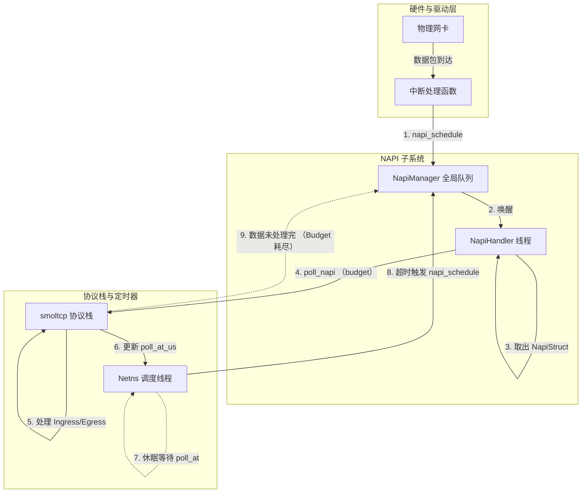

:::{note}
**AI Translation Notice**

This document was automatically translated by `hunyuan-turbos-latest` model, for reference only.

- Source document: kernel/net/napi_and_netns_poll.md

- Translation time: 2026-01-07 14:52:23

- Translation model: `hunyuan-turbos-latest`

Please report issues via [Community Channel](https://github.com/DragonOS-Community/DragonOS/issues)

:::

# Design Documentation of NAPI and NetNamespace Polling Mechanism in DragonOS

This document explains the design and implementation of the NAPI (New API) mechanism and NetNamespace polling scheduling mechanism in the current network subsystem of DragonOS.

## 1. Mechanism Overview

DragonOS adopts a **"Event-Driven + Precise Timing"** hybrid driving model for network packet processing. The system uses separate kernel threads to handle "packet reception tasks triggered by hardware interrupts" and "protocol stack timing tasks," achieving efficient response to network traffic and rational scheduling of CPU resources.

The core design consists of two main parts:
1. **NAPI Subsystem**: Responsible for high-throughput network packet reception and transmission processing, using a "Bounded Polling" mechanism.
2. **NetNamespace Scheduler**: Responsible for managing the protocol stack's time events (such as TCP retransmission), acting as a precise timer.

## 2. Core Component Design

### 2.1 NAPI Subsystem (`kernel/src/driver/net/napi.rs`)

NAPI is the core packet reception mechanism in the DragonOS network driver layer.

*   **NapiStruct**:
    Each network interface card (NIC) that supports NAPI (`Iface`) is bound to an `NapiStruct` structure. It maintains the state of the NAPI instance (such as the `SCHED` scheduling bit) and weight (`weight`).
    *   **Weight (Weight)**: Defines the maximum number of data packets allowed to be processed within a single scheduling cycle (Budget) for this interface, preventing a single NIC from monopolizing the CPU.

*   **Global NAPI Manager (Global NapiManager)**:
    *   Currently implemented as a singleton (`GLOBAL_NAPI_MANAGER`).
    *   Maintains a global `napi_list` pending queue.
    *   Provides the `napi_schedule()` interface: called by the NIC interrupt handling function to add the NAPI instance to the queue and wake up the processing thread.

*   **NAPI Processing Thread (`napi_handler`)**:
    *   This is a dedicated kernel thread, initialized during system startup.
    *   **Working Logic**: Continuously retrieves scheduled NAPI instances from `napi_list`, and calls their `poll()` method.
    *   **Cyclic Scheduling**: If `poll()` returns `true` (indicating the Budget is exhausted but there are still packets), the thread will put the instance back at the end of the queue, waiting for the next round of scheduling.

### 2.2 NetNamespace Scheduler (`kernel/src/process/namespace/net_namespace.rs`)

Each network namespace (NetNamespace) has an independent polling thread (`netns_poll`), which in the current design mainly serves as a **"Timer"** and **"Fallback Scheduler"**.

*   **Precise Timing**:
    This thread maintains the `poll_at_us` (next time point that needs to be processed) of all NICs within the namespace. It calculates the nearest deadline (Deadline) and performs precise sleep (`wait_event_timeout`).

*   **Timeout Trigger**:
    When the sleep times out (i.e., the protocol stack timing event arrives, such as TCP RTO), this thread **does not** directly process the packets but calls `napi_schedule()`, distributing the tasks to the NAPI thread for execution. This ensures that the heavy protocol stack processing logic is uniformly handled by the NAPI thread.

### 2.3 Bounded Polling (Bounded Polling)

The polling interface `poll_napi(budget)` adapted for NAPI is implemented in `kernel/src/driver/net/mod.rs`.

*   **Logic**:
    1.  Calls the `poll_ingress_single` of `smoltcp` to process the receive queue, with the number of loops limited by `budget`.
    2.  Executes a `poll_egress` to advance the send queue.
    3.  Updates the `poll_at_us` timestamp for reference by the NetNamespace scheduler.
*   **Features**: Ensures that the execution time of each scheduling is controllable, avoiding long interrupt closures or thread starvation.

## 3. Workflow Illustration

The current system's network processing data flow and control flow are as follows:

## 4. Current Implementation Status

As of the current version, the network mechanism of DragonOS has the following implementation characteristics:

1.  **Single-Queue NAPI Management**:
    *   The current `NapiManager` is globally unique, and all CPUs share the same pending queue.
    *   The Linux-style Per-CPU NAPI queue has not been implemented yet (TODO is left in the code).

2.  **Thread Model**:
    *   `napi_handler`: Responsible for specific packet processing and protocol stack advancement, is a compute-intensive thread.
    *   `netns_poll`: Responsible for time management and event distribution, is an IO/Sleep-intensive thread.

3.  **Driver Support**:
    *   Drivers such as Virtio-Net, Veth, and Loopback have been integrated into this mechanism, actively calling `napi_schedule` during interrupts or packet sending.

4.  **Smoltcp Adaptation**:
    *   Through `IfaceCommon`, `smoltcp` is encapsulated, converting the unbounded `poll()` into a bounded `poll_napi()` adapted for NAPI.
