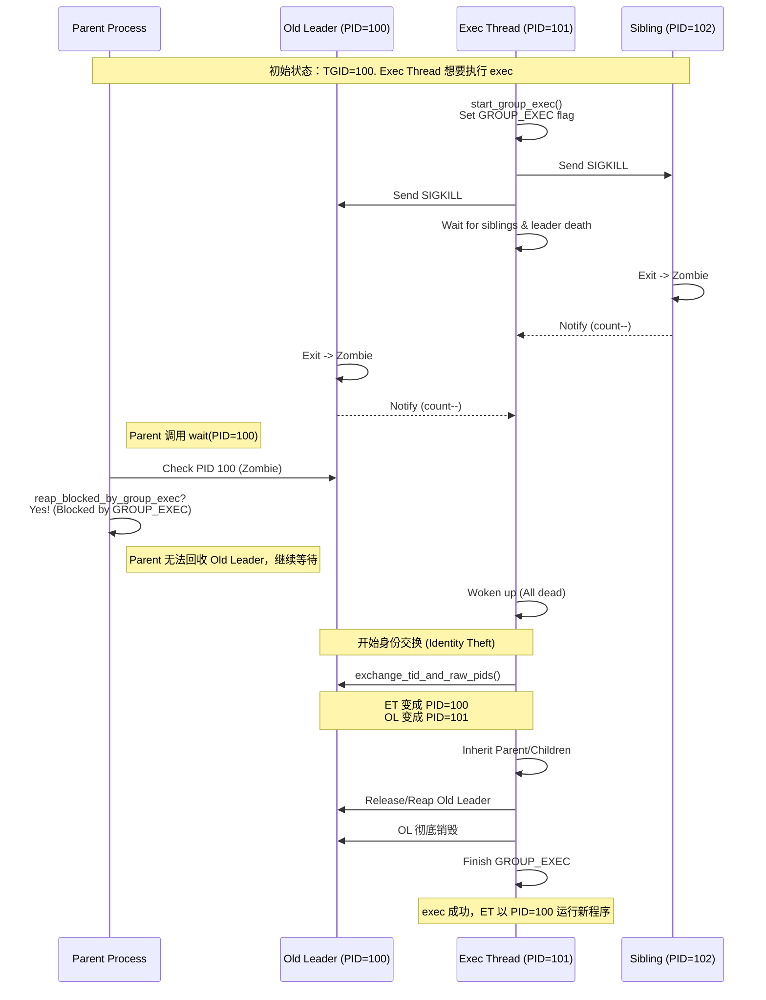

:::{note}
**AI Translation Notice**

This document was automatically translated by `hunyuan-turbos-latest` model, for reference only.

- Source document: kernel/process_management/de_thread.md

- Translation time: 2026-01-19 06:02:08

- Translation model: `hunyuan-turbos-latest`

Please report issues via [Community Channel](https://github.com/DragonOS-Community/DragonOS/issues)

:::

# Principle of DragonOS Multi-threaded Exec (De-thread) Mechanism

:::{note}

Author: longjin <longjin@dragonos.org>

:::

## 1. Overview

In the POSIX standard, the `execve` system call is used to execute a new program, replacing the current process image. For multi-threaded programs (Thread Group), POSIX requires that after `exec` succeeds:
1. **PID remains unchanged**: The process's PID (typically referring to TGID, i.e., Thread Group ID, in the kernel) must remain unchanged.
2. **Single-threaded**: All other threads in the original process group must be terminated, leaving only the thread that executed `exec` (which becomes the new single-threaded process).

If the thread executing `exec` is the leader of the thread group (main thread), the situation is relatively simple: it only needs to kill the other threads. However, if the thread executing `exec` is an ordinary thread (non-leader), the situation becomes complex: **it must "transform" into the leader, take over the original leader's PID, and clean up the original leader**. This process is called "de-threading" (De-thread).

This document details the implementation principles, processes, and concurrency control mechanisms of `de_thread` in the DragonOS kernel.

## 2. Core Challenges

1. **Identity Theft (Identity Theft)**: The non-leader thread executing `exec` (hereinafter referred to as the **Exec-Thread**) must exchange identities at the kernel level, making it appear to the user space and parent process as having the original leader's PID.
2. **Concurrency Mutual Exclusion**:
    - Two threads within the same process group may simultaneously call `exec`, or one calls `exec` while another calls `exit_group`. Only one can successfully start.
    - In the critical section of identity exchange, the process state is unstable, and it must be prevented for the parent process to see and reclaim the intermediate-state old leader via the `wait` system call.
3. **Resource Inheritance and Cleanup**: The Exec-Thread needs to inherit the parent-child process relationships, child process lists, etc., of the original leader, while also being responsible for reclaiming the resources occupied by the old leader.

## 3. Implementation Mechanism

DragonOS refers to the design of the Linux kernel but combines it with Rust's ownership and concurrency safety features in the specific implementation.

### 3.1 Key Data Structures

In the `SigHand` (signal handling structure, shared by the thread group), the following fields are introduced to manage the state:

- `SignalFlags::GROUP_EXEC`: Flag bit. Indicates that the current thread group is undergoing de-threading.
- `group_exec_task`: `Weak<ProcessControlBlock>`. Points to the thread currently executing `exec`.
- `group_exec_wait_queue`: `WaitQueue`. Used to wait for other threads in the group to exit.
- `group_exec_notify_count`: `isize`. Count of threads waiting to exit (used to wake up the waiting queue).

### 3.2 Core Process (`de_thread`)

The `de_thread` function is located in `kernel/src/process/exec.rs` and is the core of implementing this logic.

#### Phase 1: Initiation and Mutual Exclusion
1. **Lock and Mutual Exclusion**: Call `sighand.start_group_exec()`. If `GROUP_EXEC` or `GROUP_EXIT` has been set, return `EAGAIN` to ensure mutual exclusion with concurrent `exec`/`exit_group`.
2. **Set Executor**: Record the current thread in `group_exec_task` and clear `group_exec_notify_count`.
3. **Single-thread Fast Path**: If the thread group is empty (only itself), directly set `exit_signal = SIGCHLD` and end the de-threading process.

#### Phase 2: Terminate Sibling Threads
1. **Build Cleanup List**: Traverse the thread group, collecting all still-alive threads not in the exit path (including the old leader).
2. **Send Signal**: Send `SIGKILL` to each thread in the cleanup list one by one.
3. **Set Count**: Write the length of the cleanup list into `group_exec_notify_count` to wake up the waiting queue when threads exit.

#### Phase 3: Wait for Synchronization
1. **Enter Wait**: Sleep on `group_exec_wait_queue` in a killable manner.
2. **Wake-up Conditions**:
    - Traverse `group_tasks` to confirm no other threads are alive except the current thread;
    - If the current thread is not the leader, also ensure the old leader has entered the `Zombie` or `Dead` state;
    - If a fatal signal is received or the wait is interrupted, return `EAGAIN`.
    - *Note: Other threads in the exit path (`exit_notify`) will decrement the count and wake up the waiting queue; if the executor exits abnormally, it will also clean up the `GROUP_EXEC` flag in this path.*

#### Phase 4: Identity Exchange (Identity Theft)
*Only executed when the Exec-Thread is not the leader*

1. **PID/TID Exchange**: Call `ProcessManager::exchange_tid_and_raw_pids`.
    - Swap the PID mapping relationships of the two in the global process table and swap the TID/PID fields inside the PCB.
    - **Result**: The Exec-Thread obtains the original TGID, and the Old-Leader obtains a temporary PID.
2. **Signal Semantics Adjustment**:
    - The `exit_signal` of the new leader (Exec-Thread) is set to `SIGCHLD`;
    - The `exit_signal` of the Old-Leader is set to `INVALID` to avoid being treated as an ordinary child process.
3. **Structure Adjustment**: Set the Exec-Thread as the new `group_leader` and clear both sides of `group_tasks` (only one thread remains after de-threading).
4. **Relationship Inheritance**:
    - **Child Processes**: Migrate the entire `children` list of the Old-Leader to under the Exec-Thread;
    - **Parent Process**: The Exec-Thread inherits the `parent`/`real_parent` of the Old-Leader and updates `fork_parent` to itself.

#### Phase 5: Resource Cleanup
1. **Reclaim Old Leader**: If the Old-Leader is already a Zombie or Dead, the Exec-Thread directly marks it as Dead and releases the PID resource.
2. **Completion**: Regardless of success or failure, the `GROUP_EXEC` flag is ultimately cleared, and waiters are awakened.

### 3.3 Concurrency Protection: Preventing Parent Process from Incorrectly Reclaiming

This is the most delicate part of the implementation.

**Problem Scenario**:
Between Phase 3 and Phase 4, the Old-Leader has received SIGKILL and exited into a Zombie state. At this time, if the parent process calls `wait()`, it may find the Old-Leader (PID=TGID) is a Zombie and reclaim it.
If the parent process reclaims the Old-Leader **before** the Exec-Thread completes the PID exchange, the Exec-Thread will not be able to steal that PID (since the process corresponding to that PID has disappeared), or it may cause logical confusion.

**Solution**:
In the `kernel/src/process/exit.rs`'s `do_wait` logic, a check function `reap_blocked_by_group_exec` is added:

```rust
fn reap_blocked_by_group_exec(child_pcb: &Arc<ProcessControlBlock>) -> bool {
    // 如果子进程是 Leader，且标记了 GROUP_EXEC，
    // 且执行 exec 的不是它自己，那么说明它正在等待被“篡位”，父进程不能回收它。
    if !child_pcb.is_thread_group_leader() {
        return false;
    }
    if !child_pcb.sighand().flags_contains(SignalFlags::GROUP_EXEC) {
        return false;
    }
    let exec_task = child_pcb.sighand().group_exec_task();
    exec_task
        .as_ref()
        .map(|t| !Arc::ptr_eq(t, child_pcb))
        .unwrap_or(true)
}
```

This check ensures that even if the Old-Leader becomes a Zombie, as long as the `GROUP_EXEC` flag is still present and `exec_task` is not it, the parent process cannot reclaim it. This provides a protective umbrella for the Exec-Thread to safely perform the PID/TID exchange.

## 4. Flowchart



## 5. References

- **Linux Kernel Source**: `fs/exec.c` (`de_thread` function)
- **DragonOS Source**:
    - `kernel/src/process/exec.rs`
    - `kernel/src/process/exit.rs`
    - `kernel/src/ipc/sighand.rs`
