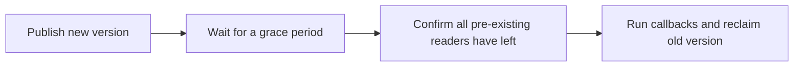
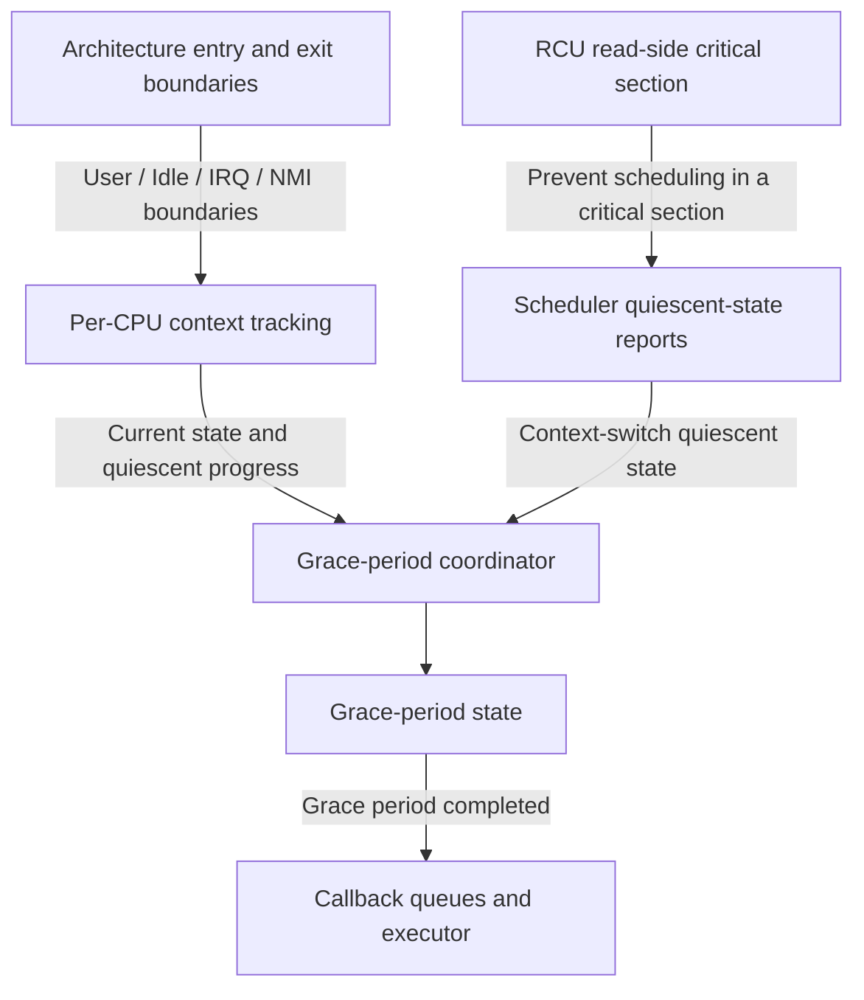
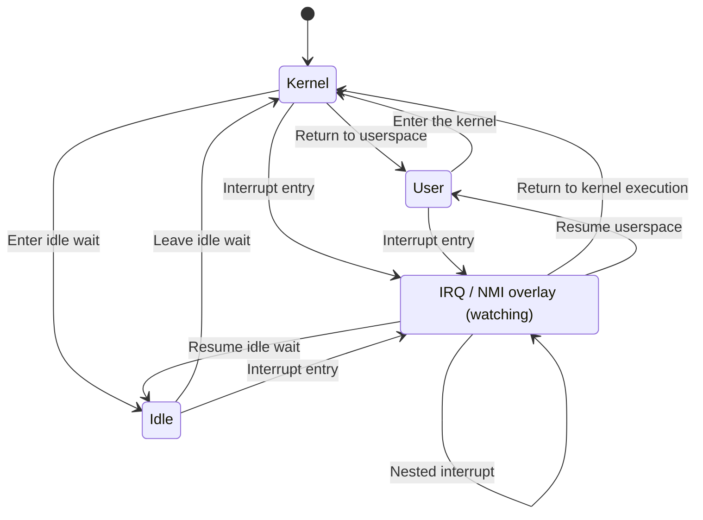
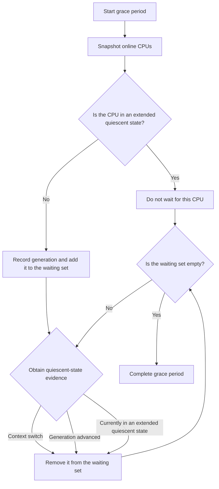
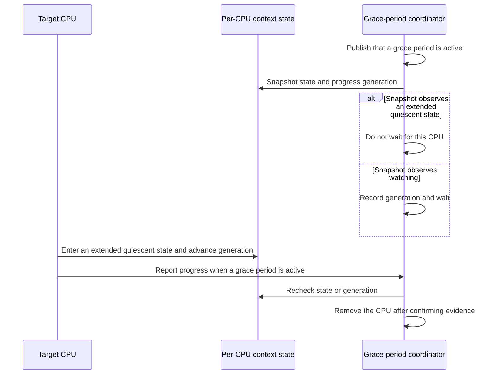
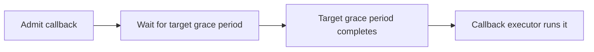

# DragonOS RCU Architecture

## 1. What RCU Solves

Read-Copy Update (RCU) lets readers access shared, read-mostly data at very low cost while an updater replaces an old version with a new one. The old version is reclaimed only after every reader that could still reference it has finished.

A typical update has three phases:

1. The updater constructs and atomically publishes a new version.
2. The system waits for a grace period, ensuring that every read-side critical section that existed before publication has ended.
3. After the grace period completes, callbacks reclaim the old version or perform other deferred work.

RCU does not guarantee that a reader observes the newest version. It guarantees that whichever version a reader observes remains valid throughout its read-side critical section, and it gives the updater a safe point at which to reclaim the old version.

## 2. DragonOS RCU Structure

DragonOS currently uses a lightweight design for non-preemptible kernel read-side critical sections. The system consists of four parts: read-side protection, CPU context tracking, grace-period coordination, and callback processing.

Each layer has a distinct responsibility:

- **Read-side protection** marks read-side critical sections and ensures that an ordinary non-preemptible reader is not scheduled away while inside one.
- **Context tracking** records whether each CPU can currently run ordinary RCU readers and whether that CPU has passed through a quiescent state.
- **Scheduler integration** treats a reliable context switch as one source of quiescent-state evidence.
- **Grace-period coordination** determines which CPUs must be waited for and collects their subsequent quiescent-state evidence.
- **Callback processing** associates callbacks with grace-period generations and runs them only after their target grace period completes.

Context tracking does not manage callbacks, grace-period state does not interpret architecture entry details, and architecture code does not decide whether a grace period is complete. This separation avoids maintaining duplicate copies of the same state in different subsystems.

## 3. Watching and Extended Quiescent States

Whether a grace period must wait for a CPU does not depend on whether the CPU is executing instructions. It depends on whether the CPU could be running an ordinary RCU read-side critical section.

DragonOS distinguishes three base CPU contexts:

- **Kernel**: the CPU may run ordinary RCU readers and is therefore RCU watching.
- **User**: the CPU is in userspace and cannot run kernel RCU readers, so it is in an extended quiescent state.
- **Idle**: the CPU is waiting while idle and cannot run ordinary RCU readers, so it is in an extended quiescent state.

IRQ and NMI execution temporarily overlays the base context. Because an interrupt executes kernel code, the CPU must be watching while an overlay is active. The CPU may return to the interrupted User or Idle extended quiescent state only after the outermost interrupt exits.

The persistent state invariants are:

- A CPU in Kernel or under any IRQ/NMI overlay must be watching.
- User and Idle are extended quiescent states only when no IRQ/NMI overlay is active.
- Entry and exit must be strictly paired, and only the outermost overlay exit may change the watching state.
- Kernel entry must restore watching before any ordinary kernel logic runs.
- Kernel exit must finish all ordinary kernel work before watching is stopped.

## 4. Quiescent States and Progress Generations

A quiescent state (QS) proves that a CPU cannot still be inside an older ordinary RCU read-side critical section at that point. Context switches, entry into User, and entry into Idle can all provide this evidence.

Each CPU maintains its own quiescent-state progress generation. Whenever a CPU crosses from watching into an extended quiescent state, that generation advances. The grace-period coordinator needs to answer only two questions:

1. Was the CPU already in an extended quiescent state when the grace period began?
2. If it was still watching, did its progress generation change afterwards?

This design avoids continuously observing every CPU action and avoids writing every high-frequency context transition into shared global state.

## 5. Grace-Period Completion

At the beginning of a grace period, the coordinator takes a consistent snapshot of online CPUs:

- A CPU already in User or Idle is not added to the waiting set.
- A CPU that is still watching is added to the waiting set together with its quiescent-state generation.
- A CPU is removed from the waiting set after it reports a reliable scheduling quiescent state or its context generation changes.
- The grace period completes when the waiting set becomes empty.

Grace-period correctness relies on two forms of proof:

- **Current-state proof**: the CPU was already in an extended quiescent state at the snapshot, so it could not hold an older ordinary RCU read-side critical section.
- **State-progress proof**: the CPU was watching at the snapshot but later crossed a quiescent state, so any read-side critical section that existed at the snapshot has ended.

Both proofs are necessary. Recording only that a CPU returned to userspace cannot identify a CPU that was already in userspace before the grace period started. Looking only at the current state misses a CPU that crossed a quiescent state and then re-entered the kernel.

## 6. Closing the Snapshot-Transition Race

A CPU may enter an extended quiescent state concurrently with grace-period startup. The design must guarantee that the coordinator eventually obtains quiescent-state evidence regardless of which operation happens first.

The concurrent protocol closes the race in both directions:

- If the CPU enters an extended quiescent state first, the later grace-period snapshot must observe the new state or generation.
- If the grace period first publishes its activity and records a watching CPU, the CPU must trigger a progress check when it subsequently enters an extended quiescent state.
- If the snapshot overlaps the transition, the coordinator sees either the complete state before the transition or the complete state after it, and a recheck closes the boundary window.
- Hints that suppress redundant reports are performance filters only; the grace-period waiting set remains the sole source of correctness.

Publishing context state, taking snapshots, and publishing grace-period activity must form an ordered and provable handshake. Any future relaxation of memory ordering requires a complete cross-architecture happens-before proof; a passing stress test alone is not sufficient evidence.

## 7. Callback Lifecycle

A callback is associated at admission time with a grace-period generation that has not yet completed.

The following principles must hold:

- A callback must not run before its target grace period completes.
- Callback order within one execution channel must remain stable.
- Context-transition paths report progress but do not directly execute arbitrary callbacks.
- Callback execution remains separate from the context state machine, preventing unknown logic from running at IRQ-disabled boundaries, idle boundaries, or while the CPU is not watching.

## 8. Architecture Integration Principles

Each CPU architecture reports reliable entry and exit boundaries to the common RCU layer:

- On entry from userspace, watching must be restored before any kernel logic that may use ordinary RCU executes.
- On return to userspace, watching may stop only after all exit work has completed.
- Entry into idle wait stops watching; waking and resuming ordinary kernel execution restores watching first.
- IRQ/NMI entry establishes a watching overlay, and the outermost exit restores the base context according to the actual return target.
- Nesting depth and return intent must come from the real entry context, not from task type or scheduler policy.

Architecture code does not keep a second copy of RCU context state and does not interpret the internal representation of the common state. This lets x86_64, RISC-V, and future architectures share the same state semantics and grace-period algorithm.

## 9. Performance and Safety Constraints

RCU is useful only when read-side and high-frequency context paths remain lightweight. DragonOS RCU follows these constraints:

- Ordinary read-side critical sections do not acquire a global lock.
- Per-CPU context transitions normally modify only local CPU state.
- Ordinary IRQ nesting and transitions that do not produce a quiescent state do not enter the global grace-period slow path.
- A CPU participates in global coordination only when it may advance an active grace period.
- High-frequency state is isolated by CPU to avoid cross-CPU writes to the same cache line.
- Context transitions do not allocate memory and do not execute callbacks.
- Invalid transitions, nesting-count errors, and read-side access while not watching must be diagnosable; the implementation must not hide caller errors by silently repairing state.

These constraints serve both performance and correctness. Reducing shared writes lowers cache contention, while a state machine with narrow responsibilities is easier to audit at concurrent boundaries.

## 10. Current Design Boundaries

DragonOS RCU currently targets ordinary non-preemptible kernel readers. The following capabilities are outside this base architecture:

- tracking preemptible RCU readers;
- Tree RCU hierarchical aggregation;
- forced quiescent states and stall detection;
- a complete RCU lifecycle protocol for CPU hotplug;
- other RCU variants such as Tasks RCU and SRCU;
- tick/nohz and virtualization time accounting, which are adjacent to context tracking but have different responsibilities.

The common model reserves state semantics for nested NMI execution. An architecture may claim complete NMI integration only after it has a functional returning NMI entry path and a safe deferred-progress protocol. Architectures without complete entry support must report that limitation explicitly rather than using unreachable hooks as a substitute for integration.

Future extensions should be driven by concrete requirements while preserving the separation between architecture boundaries, context state, grace-period coordination, and callback execution. DragonOS should not acquire the complexity of Linux Tree RCU merely to resemble its structure when that complexity has no current consumer.
