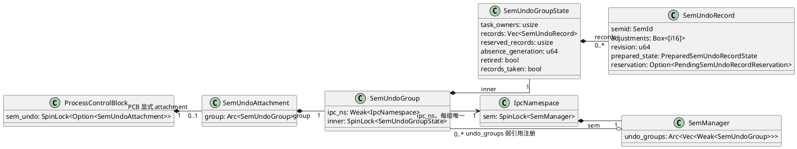
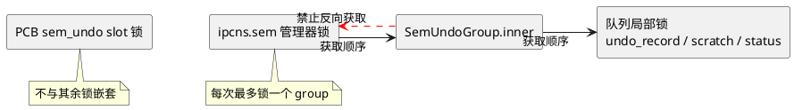
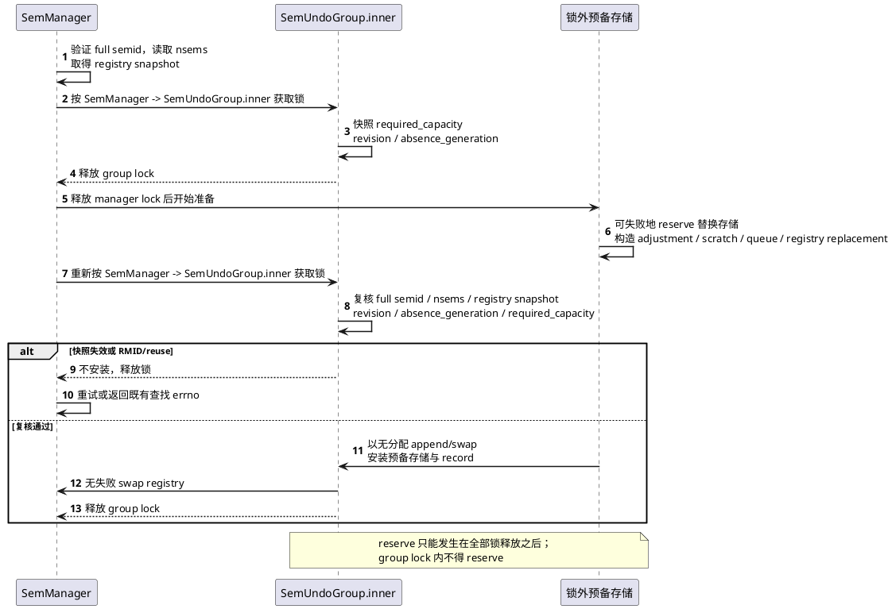
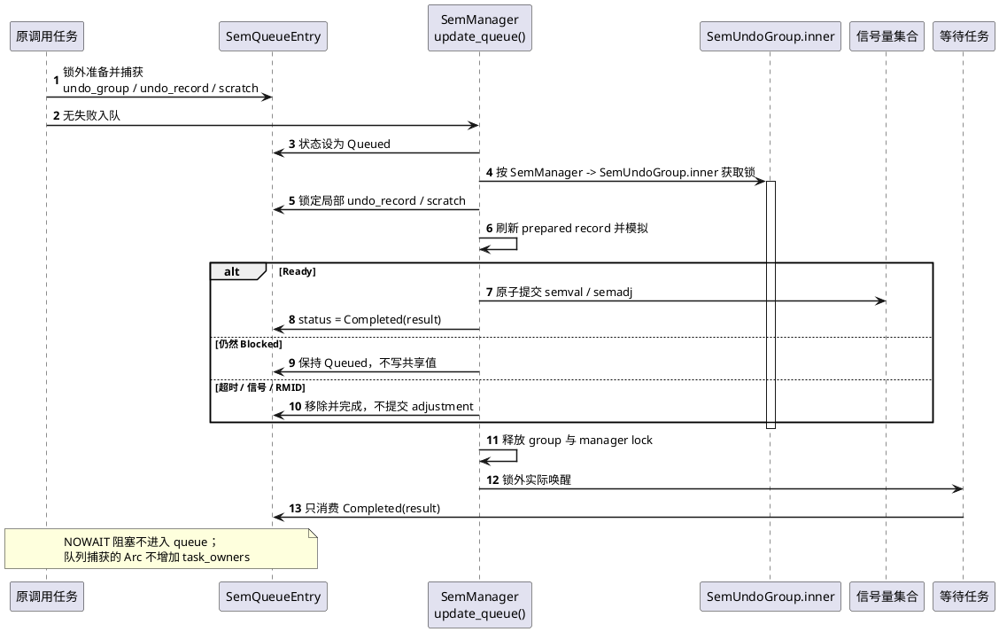
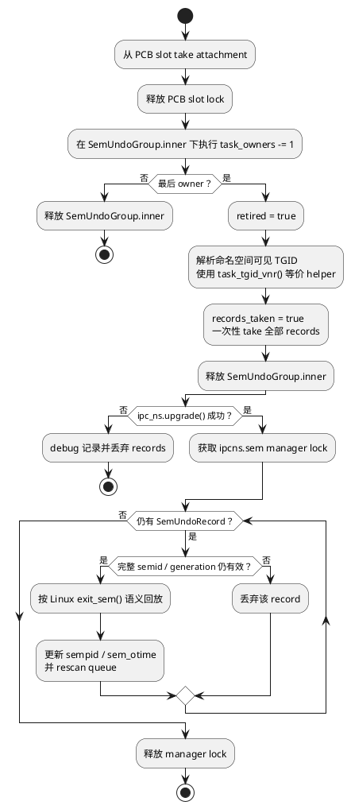
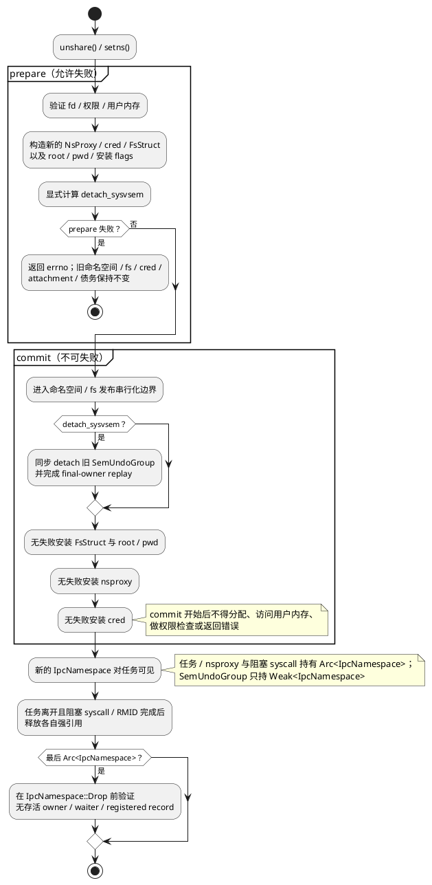

# DragonOS `SEM_UNDO` 实现规格（Linux 6.6 兼容）

## 1. 结论与范围

采用当前实现的最小可发布模型：**PCB 显式 attachment → `Arc<SemUndoGroup>`；每个 group 绑定一个 IPC namespace；`SemManager` 维护 namespace 级 `Arc<Vec<Weak<SemUndoGroup>>>` registry；record 只以完整 generation-bearing `semid` 为键。**



不引入 per-set lock、RCU 式 namespace teardown 或额外用户 ABI。为实现无分配 record publication 与 namespace/fork 事务，当前实现使用局部 prepared-record state、record reservation、final-owner `retired` 状态和预分配 RCU retirement；这些不是第二套 group/namespace 身份模型。`NsCommon.nsid` 仍只提供诊断身份。

本规格覆盖 Linux 6.6 的 `semop`/`semtimedop`、queue、`SETVAL`、`SETALL`、`IPC_RMID`、fork/clone、exec、task exit、`unshare(CLONE_SYSVSEM)`、IPC namespace unshare/setns 语义。namespace 与 fork publication 的事务修复是开放 ABI 前置条件；当前实现以 prepared namespace install、预分配 RCU retirement 和 child attachment guard 达成该前提。

在执行、等待重试、退出回放、控制操作、RMID、fork/clone、unshare/setns 和 namespace 生命周期路径实现完成后，已删除 `SEM_UNDO -> ENOSYS` 门禁；这是本实现的用户可见 publication point。后续变更不得重新引入仅部分路径可用的 ABI。

## 2. 当前实现基线

- 实现前的基线在 `kernel/src/ipc/sem.rs` 对 `SEM_UNDO` 返回 `ENOSYS`；当前最终实现已删除该门禁并接入 lifecycle accounting。
- `SemQueueEntry::new()` 的 `to_vec()` 已改为锁外 fallible 的预准备 sops copy。
- `simulate_semop()` 的临时 `HashMap` 已改为锁外预留、临界区内固定容量的 scratch。
- blocked 路径的 queue `Arc`、sops、waker/timer 和 scratch 均在 manager lock 外预准备。
- 一个 namespace 的全部 semaphore set、queue 和 ID 表仍由 `IpcNamespace.sem: SpinLock<SemManager>` 串行化。
- `SEMOPM` 是 `kernel/src/ipc/sem.rs` 的全局常量 500；不存在 namespace-local `sc_semopm`。
- namespace switch/unshare 已汇入 `PreparedNamespaceInstall`，并在 commit 前准备 RCU retirement。
- fork 已将 pidfd 安装置于 child relation publication 之前，并用 child attachment guard 覆盖 publication 区间。

## 3. Linux 6.6 行为基准

权威参考：

- [`ipc/sem.c` 数据结构](https://github.com/torvalds/linux/blob/v6.6/ipc/sem.c#L143-L166)
- [原子执行与 adjustment](https://github.com/torvalds/linux/blob/v6.6/ipc/sem.c#L630-L784)
- [queued retry](https://github.com/torvalds/linux/blob/v6.6/ipc/sem.c#L934-L1067)
- [`IPC_RMID`](https://github.com/torvalds/linux/blob/v6.6/ipc/sem.c#L1139-L1193)
- [`SETVAL`/`SETALL`](https://github.com/torvalds/linux/blob/v6.6/ipc/sem.c#L1343-L1527)
- [undo 分配与 semop 主路径](https://github.com/torvalds/linux/blob/v6.6/ipc/sem.c#L1840-L2220)
- [`copy_semundo()` / `exit_sem()`](https://github.com/torvalds/linux/blob/v6.6/ipc/sem.c#L2302-L2446)
- [UAPI 常量](https://github.com/torvalds/linux/blob/v6.6/include/uapi/linux/sem.h#L68-L91)
- [namespace clone 约束与切换](https://github.com/torvalds/linux/blob/v6.6/kernel/nsproxy.c#L151-L187)
- [`unshare()`](https://github.com/torvalds/linux/blob/v6.6/kernel/fork.c#L3378-L3460)

核心不变量：

```text
adjustment(group, semid, sem_num)
  = -Σ(该 group 成功提交且带 SEM_UNDO 的非零 sem_op)
```

对成功的 `sem_op = x`：

```text
semval' = semval + x
semadj' = semadj - x
```

必须保持：

1. 用户数组按原顺序逐项模拟；同一 `sem_num` 可重复，带/不带 `SEM_UNDO` 可混合。
2. `sem_op == 0 | SEM_UNDO` 可触发空 group/record 的惰性创建，但 adjustment 不变。
3. 每一步 `semval` 必须在 `0..=32767`；每一步 `semadj` 必须在 `-32768..=32767`，不能只检查最终净值。
4. 任一项阻塞或失败时，整个数组不修改 semval 或 semadj。
5. NOWAIT 阻塞和超时返回 `EAGAIN`，信号取消返回 `EINTR`，等待期间 RMID 返回 `EIDRM`；均不记账。
6. 普通 fork 不继承；显式 `CLONE_SYSVSEM` 共享；`CLONE_THREAD` 不隐含 `CLONE_SYSVSEM`；exec 保留。
7. 最后 task owner detach 时执行 `semval = clamp(semval + semadj, 0, 32767)`，不等待，并按 Linux `exit_sem()` 经 `do_smart_update(..., otime=1, ...)` 更新 `sem_otime`。
8. `SETVAL` 清所有 groups 对目标 semaphore 的旧 adjustment；`SETALL` 清该 set 的全部旧 adjustment。
9. `IPC_RMID` 删除 record 而不回放，waiter 得到 `EIDRM`，且清理完成后才允许低 index 复用。
10. `SEMUME`、`SEMMNU` 仅作为兼容报告字段，不作为 admission limit。

## 4. 数据模型与所有权

新增 `kernel/src/ipc/sem_undo.rs`：

```rust
pub struct SemUndoAttachment {
    group: Arc<SemUndoGroup>,
}

pub struct SemUndoGroup {
    ipc_ns: Weak<IpcNamespace>,
    inner: SpinLock<SemUndoGroupState>,
}

struct SemUndoGroupState {
    task_owners: usize,
    records: Vec<SemUndoRecord>,
    reserved_records: usize,
    absence_generation: u64,
    retired: bool,
    records_taken: bool,
}

struct SemUndoRecord {
    semid: SemId,
    adjustments: Box<[i16]>,
    revision: u64,
    prepared_state: PreparedSemUndoRecordState,
    reservation: Option<PendingSemUndoRecordReservation>,
}
```

`PreparedSemUndoRecordState` 区分已存在 record 的 revision、缺失 record 的 absence generation 和已发布 record；`PendingSemUndoRecordReservation` 仅为锁外准备保留 `records` 容量，不能成为 owner。

规则：

- queue 保存 captured `Arc<SemUndoGroup>`、预准备 `SemUndoRecord` 和 scratch；该 strong reference 只保障阻塞操作的归属与完成，不参与 `task_owners`，也不替代 PCB attachment。
- group 创建时绑定当前 `Weak<IpcNamespace>`，之后不得换绑；每条 record 因此无需重复保存 namespace 或 namespace ID。
- record 的 `semid` 必须是完整 ID，不得只保存低 index。
- adjustment buffer 长度创建后严格等于对应 set 的 `nsems`。
- `task_owners` 只由显式 share、rollback、detach 修改；禁止使用 `Arc::strong_count()`。
- attachment 的 `Drop` 不回放、不取 manager lock。所有正常路径必须显式 take/detach；debug assertion 用于发现遗漏。
- group 首次获得 record 时在所属 namespace 的 `SemManager.undo_groups` 注册一次；registry 以 snapshot replacement 为主，并可在 `Arc::get_mut()` 成功时无分配压缩 stale weak。
- 最后 owner 将 group 标记为 `retired`，一次性取走 records；retired group 拒绝新的 owner、record prepare 和 publication，`records_taken` 保证回放仅发生一次。

- `sem_undo_group() -> Option<Arc<SemUndoGroup>>`：observer。
- `ensure_sem_undo_group(ipc_ns) -> Result<Arc<_>, ENOMEM>`：二次检查并安装 `task_owners=1` 的空 group。
- `take_sem_undo_attachment() -> Option<SemUndoAttachment>`：原子清空 slot。
- child guard 的 install/rollback API；调用者不得直接改 owner 数。

普通 fork 的 child slot 初始化为 `None`。group 首次获得 record 时在所属 namespace 的 `SemManager.undo_groups` 注册一次；stale weak 通过 snapshot replacement 或独占 registry 的 `Arc::get_mut()` 路径压缩。

## 5. 锁与分配契约

联合锁约束如下：



禁止持 group lock 获取 manager lock。manager lock 下每次只锁一个 group；queue entry 的 `undo_record`、`scratch` 与 `status` 均为 entry 局部锁，必须避免反向取得 manager/group 锁。

所有用户可触发增长必须 fallible，失败映射 `ENOMEM`。共享 semval、semadj、registry 或 queue 状态修改前，所有内存与容量必须准备好。不得在 manager spinlock 内调用 `HashMap::with_capacity`、`to_vec()`、`Arc::new()` 或其他可能分配的 API。

具体准备策略：

- 使用 `Arc::try_new` 创建 group、queue entry、waker-owned 对象。
- adjustment 使用 `Vec::try_reserve_exact(nsems)`、`resize(0)`、`into_boxed_slice()`。
- simulation scratch 与 queue-owned sops 在 manager lock 外完成 fallible reserve/copy。
- group record storage 必须分阶段准备：先在 `manager -> group` 下验证并快照 `required_capacity`、record revision/absence generation，随后释放全部锁；在锁外对 replacement storage 执行 fallible reserve；再按 `manager -> group` 重新获取锁并复核 full semid、`nsems`、容量需求及准备 token。仅当复核仍成立时，才通过无分配的 `append`/`swap` 安装已准备 storage 和 record；不得在 group lock 下 reserve。
- manager registry 使用 immutable `Arc<Vec<Weak<SemUndoGroup>>>` 快照。manager lock 内只 clone 快照 `Arc` 并记录其身份；锁外 fallibly 构造“压缩 stale weak + 保留 live group + 必要时追加当前 group”的 replacement；重新获取 manager lock，只有旧快照仍 `Arc::ptr_eq` 时才无失败 swap，否则重试。当 registry 无其他 snapshot 持有者时，允许用 `Arc::get_mut()` 在 manager lock 内无分配压缩 stale weak。
- 当前 `simulate_semop()` 的 `HashMap` 已替换为锁外预留的有界 scratch；queue 的 sops copy、queue `Arc`、waker/timer 和 queue-owned scratch 也在 manager 临界区外完成。

不新增 per-set lock 或额外的通用生命周期 guard 契约；本文已定义的 child attachment guard、prepared-record reservation 和 RCU retirement 是实现所需的局部机制。性能优化必须另行设计。

## 6. group 与 record prepare

只要 sops 任一项带 `SEM_UNDO`，包括零操作，就执行 prepare。

### 6.1 group prepare

1. 读取 PCB slot；已有 group 时验证它绑定当前 IPC namespace并返回 observer。
2. 为空时，锁外 fallibly 构造 `task_owners=1` 的 candidate group。
3. 再锁 PCB slot二次检查；已有者胜出，candidate直接丢弃；否则安装 candidate attachment。
4. semop 后续失败时允许保留空 group，匹配 Linux 惰性分配行为。

### 6.2 record 与 registry prepare

1. manager lock 下以完整 semid 验证 set并读取 `nsems`，同时取得 registry snapshot；再获取 group lock，检查 record 状态并快照 `required_capacity`、revision/absence generation，然后释放全部锁。
2. 锁外构造全零 adjustment buffer、simulation/queue 所需对象以及 registry replacement；缺失 record 时同时 fallibly reserve 足以容纳快照容量的 replacement record storage。
3. 获取 manager lock，再获取 group lock；重新验证完整 semid、`nsems`、registry snapshot 和 prepared record 的 revision/absence generation。
4. 已有 record 在 prepare 后发生 `SETVAL`/`SETALL`/竞争更新时，以当前 record 内容刷新 prepared record；缺失 record 仅在 absence generation 与容量需求均一致时，才可使用锁外准备的 storage 发布。
5. registry snapshot 已变化、RMID/reuse 或 record preparation 已失效时，释放锁并重试或返回既有 checked lookup errno；不得留下半个 record/registry。
6. 所有验证通过后，无失败地 swap registry；缺失 record 通过 allocation-free `append`/`swap` 安装 prepared storage 并发布 prepared record，已有 record 则保留或刷新。该路径不得在 manager/group 临界区分配。



允许留下空 group或全零 record；不允许 record 存在而 registry 缺失，也不允许 allocation error 发生在 semval/semadj 修改后。

## 7. semop 事务与 queue

### 7.1 锁外准备

`SemManager::semtimedop()` 在获取 manager lock 前完成：

1. 现有 nsops、timeout、用户复制和 flag 校验；上限使用全局 `SEMOPM`。
2. 若含 `SEM_UNDO`，准备当前 namespace-bound group和目标 record。
3. fallibly准备容量至多为 sops 唯一 semnum数的 simulation scratch。
4. 若调用可能阻塞，fallibly准备 queue-owned sops、queue entry、waker/timer所需对象；尚不入队。

### 7.2 无分配 simulate/commit

获取 manager lock后：

1. 重新验证 full semid、semnum边界和权限；semnum越界保持先于权限检查。
2. 若需要 undo，按 `manager -> group` 查找 record。
3. 统一执行器按用户数组顺序在 scratch中模拟 semval和semadj。
4. `Ready` 时一次不可失败 commit：写最终 semval、最终 adjustment、受影响 semaphore 的 `sempid`，并更新正常成功 semop 的 `sem_otime`。
5. `Blocked` 或错误时不写任何共享值。
6. commit 后调用 queue rescan；blocked 时依据 NOWAIT/timeout立即返回或把已准备 entry无失败入队。

每个带 `SEM_UNDO` 的非零 op 使用宽类型计算：

```text
next_adjustment = current_virtual_adjustment - sem_op
```

每一步检查 `-32768..=32767`。semval每一步检查 `0..=32767`；负结果是阻塞，不是部分提交。

### 7.3 queued operation

`SemQueueEntry` 增加：

```rust
undo_group: Option<Arc<SemUndoGroup>>
undo_record: SpinLock<Option<SemUndoRecord>>
scratch: SpinLock<SemopScratch>
```



规则：

- 捕获原调用者 group，不读取 waker 的 `current_pcb()`；queue 的 `Arc` 仅保持 captured group 可用，不增加 `task_owners`。
- queue entry 保存预准备 record；retry 在 manager lock 内通过 captured group 的 prepared-record protocol 刷新、保留或发布该 record。
- `update_queue()` 复用同一无分配执行器；只有 retry 真正 `Ready` 时才同时提交 semval/semadj；sleeper 醒来只消费 `Completed(result)`，不再执行。
- NOWAIT、timeout、signal、RMID均只移除/完成 entry，不修改 adjustment。
- task exit 前阻塞 syscall必须已正常完成或取消；debug assertion验证最后 owner drain时没有该 group可提交的 queued entry。

## 8. 控制操作与 RMID

`SemManager.undo_groups` 的扫描均在 manager lock内进行；逐个 upgrade Weak、锁一个 group、处理后释放，并压缩 stale weak。registry replacement必须按第5节在锁外准备，manager临界区只做无失败 swap。

### 8.1 `SETVAL`

1. 验证 full semid、权限和值。
2. 扫描所有 live groups；若存在该 full semid record，将目标 `adjustments[semnum]` 清零。
3. 写管理员值并更新现有 `sempid`/`sem_ctime`。
4. rescan queue。

顺序必须是先清旧债、再写值、最后 rescan。被新值唤醒后提交的 `SEM_UNDO` 是新债务，不得被本次清理删除。

### 8.2 `SETALL`

用户数组复制和验证保持现有两阶段 token协议。最终 full semid token复核成功后，在同一 manager临界区清所有 groups 对该 set record的整个 adjustment slice，再写全部值、更新时间/sempid并 rescan queue。

### 8.3 `IPC_RMID`

在 manager lock内：

1. 验证 full semid/generation和权限。
2. 扫描 live groups并删除匹配 full semid的 record；不实施 adjustment。
3. 将全部 waiter完成为 `EIDRM`。
4. 从 key/ID表删除 set、更新计数。
5. 最后释放 index供复用。

旧 record不得作用于相同低 index的新 generation。

## 9. fork、clone、exec 与 exit

### 9.1 clone flags 与共享规则

- `CLONE_NEWIPC | CLONE_SYSVSEM` 在 `copy_process()` 的早期纯 flag检查阶段返回 `EINVAL`，早于 group创建或 owner变化。
- 无 `CLONE_SYSVSEM`：child slot保持 `None`。
- 有 `CLONE_SYSVSEM`：parent无 group时可惰性创建空 group并保留；group必须绑定parent当前 IPC namespace。随后为 child增加一个 owner token。
- `CLONE_THREAD` 不自动推导 `CLONE_SYSVSEM`。

### 9.2 child attachment install、rollback 与 publication

`UnpublishedSemUndoAttachmentGuard` 只表示一个尚未发布 child 的 owner token，不是 attachment状态或未来生命周期 guard；它是 fork局部回滚对象。

精确协议：

1. 完成 `CLONE_NEWIPC | CLONE_SYSVSEM` 拒绝和 child namespace创建后，在 parent group lock下增加一次 `task_owners`并创建 guard；此时 attachment尚未进入 child PCB。
2. 在任何使其他任务能通过 PID表、TGID/PGID/SID关系、线程组、parent children list、全局PCB表、pidfd、cgroup accounting或scheduler观察/运行 child 的操作之前，调用 `guard.install_into(child_pcb)`。该操作只把已准备 attachment移动到确认为空的 child slot，不分配、不失败、不获取 group lock。
3. install 后 guard仍保留 rollback authority，不得立即 disarm。
4. fork publication prerequisite 必须先独立修复：pidfd安装移到关系 publication之前，或为 PID links、thread-group live、group task、children、全局PCB、cgroup accounting等所有 side effect提供完整逆序 rollback；逐项枚举 guard创建后的每个 `?` 和显式错误返回。
5. publication commit结束点是 PID/TGID/PGID/SID attach、线程组/children插入、pidfd安装、`ProcessManager::add_pcb()`、cgroup task/accounting全部完成，且到 `copy_process()` 成功返回间不再存在可失败操作。只有此处调用 `guard.disarm()`。
6. `wake_up_new_task()` 必须晚于 disarm；可运行 child始终已经安装 attachment。
7. 任一错误先完整撤销 child publication，再由 guard从 child slot取回attachment（若已安装）并在 group lock下只减少该 unpublished owner。不得回放；parent owner仍存活，计数降到零是内核 bug。

### 9.3 exec/de-thread

- exec成功和可恢复失败都保留当前 task attachment。
- non-leader exec survivor保留自己的 attachment，不从旧 leader搬运。
- siblings和旧 leader通过各自真实 exit路径逐个detach。
- PID/TID身份交换不改变owner关系。

### 9.4 task detach 与回放

exit在 robust-list后、`exit_mm`前调用统一 detach：

1. PCB slot短锁内 `take()` attachment，释放slot锁。
2. 仅持 group lock执行 `task_owners -= 1`；非最后 owner立即返回。
3. 减到零的调用者将 group 标记为 `retired`，因此不再接受 share、prepare 或 record publication；它是唯一 drainer。
4. 解析退出者在正确 PID namespace可见的 TGID，复用 canonical `task_tgid_vnr()` 等价 helper；禁止 raw PID/TID。
5. 一次性从 retired group 取走全部 records，并以 `records_taken` 保证仅取一次；释放 group lock 后 upgrade group唯一的 namespace Weak。
6. namespace Weak 已失效时，仅 debug 记录并丢弃取出的 records，不得访问失效 namespace。
7. namespace 仍存活时，在 manager lock 下逐条回放：set 仍存在则对每个非零 adjustment 执行 `semval = clamp(semval + adjustment, 0, 32767)`，更新该 semaphore的`sempid`为退出者可见TGID、更新 `sem_otime` 并 rescan queue；set 已被 RMID 或 generation 不匹配时只丢弃 record。
8. `release()`/reap只断言slot已空，不能首次detach。



每个真实task只detach一次；不得用thread group live、leader、TGID或`Arc::strong_count()`判断最后owner。

## 10. namespace transition 的强制前置事务

当前 namespace切换不满足“全部可失败prepare → 不可失败commit”。开放 `SEM_UNDO` 前必须先建立统一 `PreparedNamespaceInstall`：

- prepare只计算并持有新 `NsProxy`、新cred、目标mount root/pwd、新或复用的`FsStruct`、安装flags及所有fd/权限/用户内存结果；不得修改PCB、fs、cred或undo attachment。
- prepare结果显式携带`detach_sysvsem`，不得由old/new `Arc::ptr_eq()`推导。
- commit在现有namespace/fs publication串行化边界内按固定顺序执行：detach并同步完成旧group回放；无失败安装fs root/pwd与FsStruct；无失败安装nsproxy；无失败安装已构造cred。
- commit开始后不得分配、访问用户内存、做权限检查或返回错误。
- pidfd setns、namespace-fd setns和unshare必须汇入同一prepare/commit helper。

具体 detach 判定：

- `unshare(CLONE_SYSVSEM)`：置位，哪怕IPC namespace不变。成功后slot为空，后续UNDO创建新group。
- `unshare(CLONE_NEWIPC)`：置位；若同时含`CLONE_SYSVSEM`仍只detach一次。
- setns：已验证的installation set包含`CLONE_NEWIPC`就置位，即使目标IPC namespace与当前是同一个`Arc`。
- 只切换UTS、NET、MNT、CGROUP或PID-for-children不detach。

任何prepare错误发生在detach之前，必须保持旧namespace、fs、cred、attachment及债务完全不变。



## 11. namespace 生命周期

当前实现不在 `IpcNamespace::Drop` 中取 manager lock、RMID set或唤醒 waiter，也不把 Drop 上下文作为 teardown 实现。依赖并验证以下生命周期约束：

1. task/nsproxy和blocked syscall持有`Arc<IpcNamespace>`；
2. group只持namespace Weak，不能延长namespace生命周期；
3. task离开IPC namespace前同步detach，最后owner回放完成后才发布新namespace；
4. blocked syscall结束或RMID完成前，其namespace强引用仍在；
5. 因此最后`Arc<IpcNamespace>`析构时不存在live task、blocked waiter、live group owner或有record的registered group。

若该不变量被后续引用路径变更打破，必须在引入明确调用者和安全上下文后增加 `destroy_all()`：在 manager lock 内对每个 set 执行“删 group records、不回放、waiter 完成 `EIDRM`、删除 ID、最后释放 index”。不得把未知 Drop 上下文当作 teardown 实现。当前 group 的 `retired`/`records_taken` 只保证 final-owner records 单次消费，不构成 namespace teardown。

## 12. errno 与失败原子性

| 条件 | 结果 | 共享状态 |
|---|---:|---|
| 空sops、负semid、非法timeout | `EINVAL` | 不变 |
| `nsops > SEMOPM` | `E2BIG` | 不变 |
| 用户复制失败 | `EFAULT` | 不变 |
| semnum越界 | `EFBIG` | 不变 |
| 权限/安全检查失败 | `EACCES`或原errno | 不变 |
| semval或semadj逐步越界 | `ERANGE` | 整组不变 |
| NOWAIT阻塞、超时 | `EAGAIN` | 不变 |
| signal取消 | `EINTR` | 不变 |
| 等待期间RMID | `EIDRM` | 不变 |
| group/record/adjustment/registry/scratch/queue分配失败 | `ENOMEM` | 不变 |
| 初始无效semid | 现有checked lookup errno，通常`EINVAL` | 不变 |
| prepare后RMID或generation变化 | `EIDRM` | 不变 |

commit必须无分配、无失败；blocked/cancelled queue不得commit；控制清账、写值和rescan处于同一manager临界区；RMID在index复用前清完record。

## 13. 历史实施分期与当前状态

以下分期记录实现时的提交边界，不再描述当前 tree 的提交状态；最终实现已经合并 ownership、namespace transaction、record accounting、ABI 开放和测试。

### 13.1 历史前置提交：process publication事务化

文件：

- `kernel/src/process/namespace/nsproxy.rs`
- `kernel/src/process/namespace/unshare.rs`
- `kernel/src/process/namespace/setns.rs`
- `kernel/src/process/fork.rs`
- 必要的 `kernel/src/process/task.rs`、cred/fs helper文件

内容：

- 引入namespace纯prepare/不可失败commit；两条setns和unshare汇流。
- 修复fork中pidfd与PID/线程组/children/global PCB/cgroup publication顺序或完整rollback。

验收：每个commit前可失败点都有测试；失败不留下半发布namespace、fs、cred、PID关系、pidfd或child。

### 13.2 历史提交1：最小undo所有权

文件：

- 新增 `kernel/src/ipc/sem_undo.rs`
- `kernel/src/ipc/mod.rs`
- `kernel/src/ipc/sem.rs`
- `kernel/src/process/task.rs`
- `kernel/src/process/fork.rs`
- `kernel/src/process/manager/exit.rs`
- `kernel/src/process/namespace/nsproxy.rs`
- `kernel/src/process/namespace/unshare.rs`
- `kernel/src/process/namespace/setns.rs`

内容：group、non-Clone attachment、PCB slot、owner计数、namespace weak registry骨架、精确child guard、fork/exec/exit/unshare/setns attach/detach；records为空。用户态仍返回`ENOSYS`。

验收：owner/observer分离，普通fork不继承，SYSVSEM共享，guard安装/回滚/publication点和namespace detach内部测试通过；独立构建通过。

### 13.3 历史提交2：完整但未发布的记账路径

文件：

- `kernel/src/ipc/sem_undo.rs`
- `kernel/src/ipc/sem.rs`
- `kernel/src/process/manager/exit.rs`
- `kernel/src/process/namespace/ipc_namespace.rs`（仅生命周期不变量或经证明必需的显式teardown）

内容：full-semid records、锁外fallible prepare、`Arc<Vec<Weak<_>>>` registry replacement、无分配simulate/commit、queue原group归属、SETVAL/SETALL/RMID清账、最后owner replay/clamp/sempid/rescan，以及namespace lifecycle不变量或经明确调用上下文实现的`destroy_all()`。该历史阶段的用户态仍返回`ENOSYS`。

验收：所有执行、replay、控制、RMID、queue、namespace lifecycle内部测试通过；manager lock内无新增分配；独立构建通过。

### 13.4 历史提交3：一次性开放ABI与测试

文件：

- `kernel/src/ipc/sem.rs`
- `user/apps/tests/dunitest/suites/normal/sysv_sem_semantics.cc`
- 同目录必要的最小syscall/helper代码
- kernel现有测试模块

内容：仅在全部 prerequisite通过后删除`SEM_UNDO -> ENOSYS`；替换`SemUndoRejected`；加入下述两层测试。禁止夹带per-set lock、namespace tunable或无关重构。

验收：格式、目标内核构建、kernel-internal目标及QEMU dunitest全部通过。

删除门禁的硬 prerequisite：立即执行、queued retry、exit replay、SETVAL/SETALL、RMID、full-ID复用保护、fork/clone owner、exec、unshare/setns（含same-Arc IPC install）、namespace lifecycle、所有prepare/rollback路径均已实现并通过内部测试。缺一项就不得开放。

## 14. 测试矩阵

测试明确分层：

- **QEMU dunitest ABI层**只使用公开syscall和pipe/eventfd/futex及`GETNCNT`/`GETZCNT`握手，不依赖sleep猜时序，不依赖内核私有failpoint。
- **kernel-internal层**可用测试allocator、指定generation ID和lock gate；注入只存在于`cfg(test)`或等价非产品构建，不新增用户调试ABI。

### 14.1 QEMU ABI（12组）

1. **基本累计与符号**：child依次`+3|UNDO`、`-1|UNDO`，退出前净+2、退出后恢复；另测初值3上的`-2|UNDO`。
2. **数组顺序与回滚**：重复semnum、混合flag；前项UNDO成功但后项NOWAIT阻塞或ERANGE时，调用后和退出后均无前缀效果。
3. **semadj边界**：分别到达32767和-32768成功，下一步越界ERANGE；单数组中间越界即使后续可抵消仍失败。
4. **queue归属与提交点**：A排队UNDO，`GETNCNT`确认；B普通操作使Ready；债务只由A退出回放。
5. **未提交路径**：timeout、signal、NOWAIT、等待期间RMID分别验证EAGAIN/EINTR/EAGAIN/EIDRM且无回放。
6. **SETVAL/SETALL**：两个独立groups、多sem清账；SETVAL仅清目标，SETALL清全set；SETVAL唤醒后形成的新债务仍回放。
7. **RMID**：成功UNDO后RMID再退出，不回放、不崩溃。generation定向复用放内部层。
8. **fork/clone owner**：普通fork不继承；`clone(CLONE_SYSVSEM|SIGCHLD)`双方操作，首个退出不回放，最后owner回放一次；不带SYSVSEM的thread flags不共享；NEWIPC|SYSVSEM返回EINVAL。
9. **exec与退出**：成功exec到同binary helper mode后退出仍回放；可恢复exec失败后债务仍在。non-leader exec/group-exit作为基础设施稳定后的同组回归，不阻塞首版独立门禁。
10. **exit clamp与唤醒**：上下界clamp；用GETNCNT/GETZCNT确认负/零waiter入队，最后owner退出改变值后waiter提交。
11. **unshare SYSVSEM**：共享owners之一unshare后，新UNDO进入新group，旧group由剩余owner结算；唯一owner unshare在syscall返回前完成旧债结算。
12. **IPC namespace与errno**：已覆盖 namespace-fd setns、pidfd setns（含 same-Arc IPC install）及 prepare 失败保持旧 attachment；回归 `EINVAL`/`E2BIG`/`EFAULT`/`EFBIG`/`EACCES`。**follow-up：补充 `unshare(CLONE_NEWIPC)` 的 QEMU ABI 用例；当前该路径仅有 kernel-internal 覆盖。**

### 14.2 kernel-internal（3组）

1. **owner/publication**：attachment不可Clone；observer不改变owner；share只加一次；每task take/detach至多一次；最后owner唯一drain；child guard在安装前、安装后、最终disarm前失败时先publication rollback再撤owner。
2. **fallible事务与竞态**：已覆盖 record reservation/capacity、stale prepared record、registry snapshot、queue retry 和 RCU retirement prepare 的失败原子性，以及 SETVAL/RMID/exit 的合法串行结果。**follow-up：为 group、adjustment、registry replacement、simulation scratch、queue Arc/sops 的 allocator failure 增加可控 failpoint，逐类验证 `ENOMEM` 与零部分状态。**
3. **ID与算法**：直接构造旧set RMID后同index新generation，旧group不污染新set；覆盖逐项semadj边界、重复semnum、混合flag、SETVAL局部清账、SETALL/RMID全record清账、stale Weak压缩；代码路径断言不读取SEMUME/SEMMNU作admission判断。

所有case独立创建并RMID自己的set。用户态不得通过不确定循环强迫ID复用，也不得尝试创建`SEMMNU + 1`对象。

## 15. 最终验收

1. ABI 已在前置事务、ownership、记账与测试路径合入后开放；后续变更不得倒退为部分 lifecycle 支持。
2. 上述已实现的 QEMU 与 kernel-internal 覆盖必须由明确构建目标通过；`unshare(CLONE_NEWIPC)` ABI 与逐类 allocator failpoint 保持为第 14 节标注的 follow-up，不得误报为已覆盖。
3. `semadj = -Σ(successful nonzero SEM_UNDO sem_op)`在立即、queued和退出路径一致；逐项边界准确。
4. blocked、errno、timeout、signal、RMID和已覆盖的 `ENOMEM` 路径均不留下semval/semadj前缀或半个registry/record/queue变更。
5. 所有用户可触发增长保持 fallible；manager lock内无动态分配。
6. 普通fork不继承，显式SYSVSEM共享，最后显式owner唯一回放；observer和 queue capture 的强引用都不影响 owner 结算。
7. child attachment在任何publication前安装，guard持续到完整不可失败publication结束；失败先撤publication再撤owner。
8. exec保留；每个真实task在robust-list后、exit_mm前只detach一次。
9. replay clamp到`[0,32767]`、使用namespace-visible TGID更新sempid、更新`sem_otime`并rescan queue。
10. SETVAL/SETALL先清旧债、再写值、后rescan；RMID删债不回放且先于index复用。
11. record只用full generation-bearing semid；定向复用测试证明旧债不污染新set。
12. queued operation归属原调用者group，只在Ready时记账；queue 保存的 `Arc` 与 prepared record 仅保障该归属，不是 task owner。
13. `unshare(CLONE_SYSVSEM)`及两条setns路径通过；setns安装same-Arc IPC namespace仍detach；prepare失败不改变旧状态。`unshare(CLONE_NEWIPC)` 的 ABI 测试为 follow-up。
14. namespace最后引用不变量经审计和debug测试维持；若将来无法满足，必须实现具备明确调用上下文的`destroy_all()`。
15. 锁依赖符合第5节：不存在`group -> manager`，PCB slot不嵌套；queue 的 `undo_record`、`scratch` 与 `status` 遵循 entry 局部锁约束。
16. `SEMUME`、`SEMMNU`不参与admission，操作数限制继续使用全局`SEMOPM`。
17. 非`SEM_UNDO`行为无回归；kernel格式、目标架构构建、kernel-internal测试和QEMU dunitest必须持续通过。

本规格已同步当前最终实现：不保留待选数据模型；局部 prepared record/reservation/revision/retired、queue strong capture 与预分配 RCU retirement 均为既定实现机制。第14节明确标注的 `unshare(CLONE_NEWIPC)` ABI 和 allocator failpoint 覆盖是 follow-up，不得作为已完成验收宣称。
