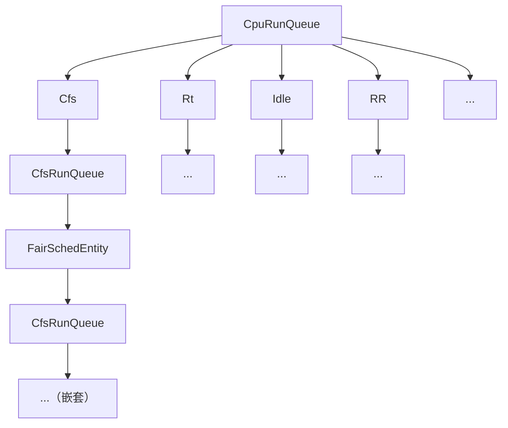
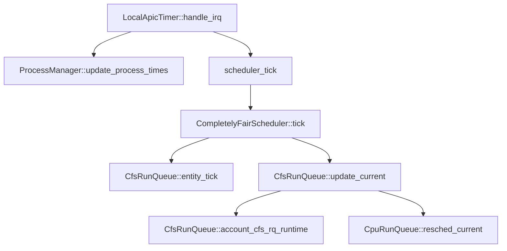

# 进程调度器相关的api

 定义了DragonOS的进程调度相关的api，是系统进行进程调度的接口。同时也抽象出了Scheduler的trait，以供具体的调度器实现。

## 调度器介绍

 一般来说，一个系统会同时处理多个请求，但是其资源是优先的，调度就是用来协调每个请求对资源的使用的方法。

## 整体架构

整个调度子系统以**树形结构**来组织，每个 CPU 都会管理这样一棵树，每个 CPU 的 `CpuRunQueue` 即可以理解为树的根节点。每个 `CpuRunQueue` 下会管理着不同调度策略的子树，根据不同的调度策略深入到对应子树中实施调度。大体结构如下：

基于这个结构，调度子系统能够更轻松地解耦以及添加其他调度策略。

## 重要结构

- `Scheduler`：各个调度算法提供给上层的接口。实现不同的调度算法，只需要向外提供这样一组接口即可。
- `CpuRunQueue`：总的 CPU 运行队列，会根据不同的调度策略来进行调度，并作为调度子系统的根节点来组织调度。
  - **重要字段**
    - `lock`：过程锁。深入到具体调度策略后的调度过程中还会需要访问 `CpuRunQueue` 中的信息；CFS 中保存了 `CpuRunQueue` 对象。需要确保在整体过程上锁后，子对象中不需要二次加锁即可访问，所以过程锁比较适合这个场景。若使用对象锁，则在对应调度策略中想要访问 `CpuRunQueue` 时需要加锁，但最外层已经将 `CpuRunQueue` 对象上锁，会导致内层永远拿不到锁。详见 [CpuRunQueue 的 self_lock 方法及其注释](https://code.dragonos.org.cn/xref/DragonOS/kernel/src/sched/mod.rs?r=dd8e74ef0d7f91a141bd217736bef4fe7dc6df3d#360)。
    - `cfs`：CFS 调度器的根节点，往下伸展为一棵子树，详见完全公平调度文档。
    - `current`：当前在 CPU 上运行的进程。
    - `idle`：当前 CPU 的 Idle 进程。

## 调度流程

一次有效的调度分两种情况：第一是主动调用 `__schedule` 或者 `schedule` 函数进行调度，第二是通过时钟中断，判断当前运行的任务时间是否到期。

- **主动调度**
  - `__schedule` 和 `schedule` 函数：
    - `__schedule`：真正执行调度。会按照当前调度策略来选择下一个任务执行。
    - `schedule`：`__schedule` 的上层封装。它需要该任务在内核中的所有资源释放干净才能进行调度，即判断当前进程的 `preempt_count` 是否为 0，若不为 0 则会 **panic**。
    - 参数：这两个函数都需要提供一个参数 `SchedMode`，用于控制此次调度的行为，可选参数主要有以下两个：
      - `SchedMode::SM_NONE`：标志当前进程没有被抢占而是主动让出，它**不会**被再次加入队列，直到有其他进程主动唤醒它。这个标志位主要用于信号量、等待队列以及一些主动唤醒场景的实现。
      - `SchedMode::SM_PREEMPT`：标志当前是被**抢占**运行的，它**会**再次被加入调度队列等待下次调度。通俗来说：它是被别的进程抢占了运行时间，有机会运行时会继续执行。

- **时钟调度**

  时钟中断到来的时候，调度系统会进行更新，包括判断是否需要下一次调度。以下为主要的函数调用栈：

  - `LocalApicTimer::handle_irq`：中断处理函数
    - `ProcessManager::update_process_times`：更新当前进程的时钟信息（统计运行时等）
    - `scheduler_tick`：调度子系统 tick 入口
      - `CompletelyFairScheduler::tick`：以 CFS 为例，此为 CFS 调度算法的 tick 入口
        - `CfsRunQueue::entity_tick`：对所有调度实体进行 tick
        - `CfsRunQueue::update_current`：更新当前运行任务的运行时间及判断是否到期
          - `CfsRunQueue::account_cfs_rq_runtime`：计算当前队列的运行时间
          - `CpuRunQueue::resched_current`：若上一步计算的时间超时则到这一步，这里会设置进程标志为 `NEED_SCHEDULE`。
  - 退出中断：退出中断时检查当前进程是否存在标志位 `NEED_SCHEDULE`，若存在则调用 `__schedule` 进行调度。

