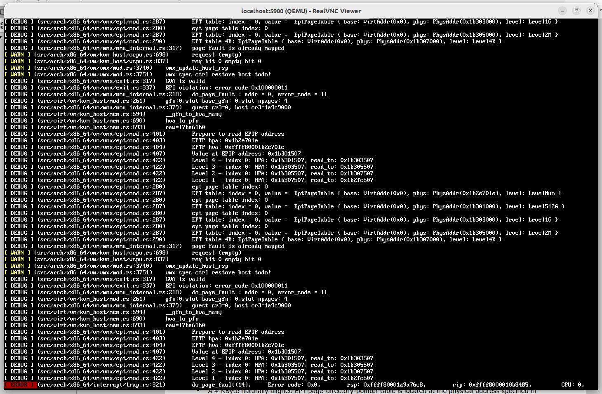
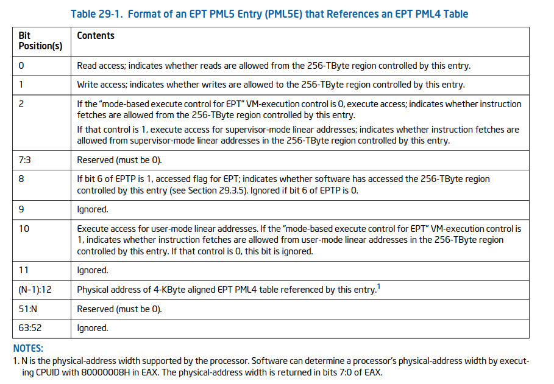

目前会给EPTP hpa: 0x1b2e701e设置一个level为levelNum的页面，其中里面存储的是PML4E的地址hpa: 0x1b301507，level为Level512G，然后根据gpa值的索引层层往下找，直到找到level为level4K hpa: 0x1b307000的页表，然后cpu会根据gpa的0-11（offset）位为索引，找到实际的hpa:0x1b2fe507。目前

ept_quit_qualification给出的是0x184，对应error_code是0x100000011，代表

- PFERR_WRITE_BIT（位 1）：

含义：写错误（Write）。如果该位为 1，表示页错误是由于写操作引起的；如果为 0，表示页错误是由于读操作引起的。
可能触发的原因：
试图写入一个只读页。
试图写入一个不存在的页（缺页错误）。

- PFERR_USER_BIT（位 2）：

含义：用户模式（User）。如果该位为 1，表示页错误发生在用户模式；如果为 0，表示页错误发生在内核模式。
可能触发的原因：
用户模式下访问了无效的内存地址。
用户模式下访问了没有权限的内存地址（例如，试图写入只读内存）。

- PFERR_GUEST_FINAL_BIT（位 32）：

含义：客户机最终错误（Guest Final）。如果该位为 1，表示页错误是由于客户机物理地址的最终翻译错误引起的。
可能触发的原因：
在虚拟化环境中，客户机操作系统试图访问一个无效的客户机物理地址。
客户机物理地址的翻译过程中出现错误。
